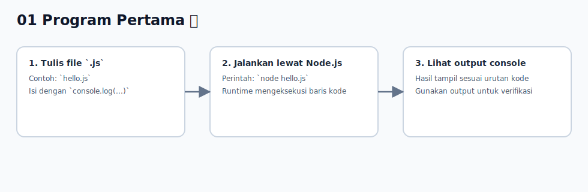

# 01 - Program Pertama

## Tujuan Pembelajaran

Setelah mempelajari bab ini, pembaca dapat:
- menjalankan file JavaScript sederhana
- memahami fungsi dasar `console.log`
- membedakan input kode dan output di console

## Konsep Utama

- menjalankan JavaScript lewat Node.js
- struktur file JavaScript paling sederhana
- menampilkan output dengan `console.log`

## Penjelasan

Program JavaScript paling sederhana adalah file `.js` yang berisi instruksi, lalu dijalankan oleh runtime JavaScript.

Untuk tahap awal, jalankan program melalui Node.js:
1. buat file, misalnya `hello.js`
2. tulis kode JavaScript
3. jalankan perintah `node hello.js`

`console.log` dipakai untuk menampilkan nilai ke console. Ini adalah alat utama saat belajar karena kita bisa melihat hasil eksekusi secara langsung.

## Visualisasi Konsep



## Contoh Kode

```javascript
console.log("Hello, JavaScript")

const name = "Andi"
console.log("Halo", name)
```

Jika disimpan sebagai `hello.js` dan dijalankan, output akan tampil di terminal.

## Analogi Singkat (Opsional)

Bayangkan program sebagai daftar instruksi ke asisten. `console.log` adalah perintah "tuliskan hasilnya di papan" agar kita bisa melihat apa yang sedang terjadi.

## Eksperimen Kode

Coba ubah isi variabel dan jumlah `console.log`, lalu jalankan ulang.

```javascript
console.log("Mulai")

const city = "Jakarta"
console.log("Kota:", city)

console.log("Selesai")
```

Pertanyaan refleksi:
1. Apa yang terjadi jika nilai `city` diubah?
2. Apa urutan output jika posisi `console.log` ditukar?

## Cakupan dan Batasan

- Dibahas di bab ini: cara membuat dan menjalankan program JavaScript dasar.
- Tidak dibahas di bab ini: detail internal runtime saat mengeksekusi baris kode.

## Latihan

1. Buat file `intro.js` yang mencetak nama kamu.
2. Tambahkan 3 `console.log` dengan teks berbeda.
3. Jalankan file tersebut dan catat urutan output.

## Ringkasan

- Program pertama JavaScript bisa dimulai dari satu file `.js`.
- `console.log` dipakai untuk melihat output saat belajar.
- Menjalankan file dengan Node.js adalah workflow dasar sebelum masuk topik berikutnya.
