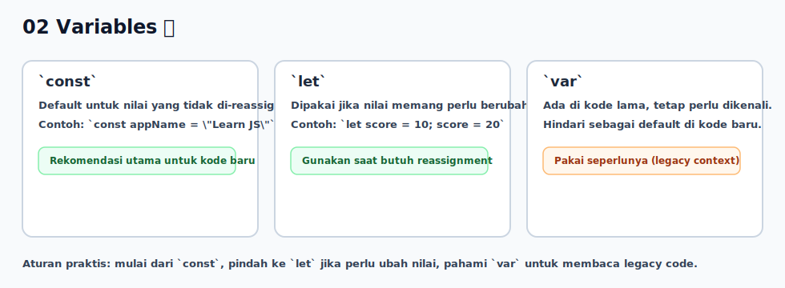

# 02 - Variables

## Tujuan Pembelajaran

Setelah mempelajari bab ini, pembaca dapat:
- mendeklarasikan variabel dengan `let` dan `const`
- mengenali penggunaan dasar `var` pada kode lama
- memahami perbedaan reassignment pada `let` dan `const`
- memilih nama variabel yang jelas dan deskriptif

## Konsep Utama

- deklarasi variabel
- inisialisasi nilai
- reassignment
- `let` dan `const`
- pengenalan `var`

## Penjelasan

Variabel adalah nama untuk menyimpan nilai agar bisa dipakai ulang di bagian kode lain.

Dua kata kunci utama yang dipakai di buku ini:
- `let`: nilai bisa diubah (reassign)
- `const`: binding tidak bisa diassign ulang

Contoh:
- `let score = 10` lalu `score = 20` adalah valid
- `const appName = "Learn JS"` lalu `appName = "X"` akan error

Gunakan `const` sebagai default. Pakai `let` jika memang butuh nilai berubah.

`var` juga ada di JavaScript dan sering muncul pada kode lama. Di level dasar:
- `var` bisa di-reassign seperti `let`
- `var` sebaiknya dihindari untuk kode baru karena perilaku scope/hoisting-nya lebih mudah memicu bug
- saat membaca kode lama, kamu tetap perlu paham `var`

## Visualisasi Konsep



## Contoh Kode

```javascript
let age = 20
age = 21

const userName = "Sita"
var city = "Bandung"
city = "Jakarta"

console.log(age)      // 21
console.log(userName) // Sita
console.log(city)     // Jakarta
```

## Analogi Singkat (Opsional)

Variabel seperti label pada kotak. `let` berarti isi kotak boleh diganti, sedangkan `const` berarti label harus tetap menunjuk ke kotak yang sama.

## Eksperimen Kode

Coba ubah nilai pada `let`, lalu coba assign ulang `const` dan lihat error-nya.

```javascript
let level = 1
level = 2

const course = "JavaScript Dasar"
// course = "JavaScript Lanjutan" // uncomment untuk melihat error

console.log(level)
console.log(course)
```

Pertanyaan refleksi:
1. Kenapa `level` bisa berubah tetapi `course` tidak?
2. Kapan sebaiknya kamu memakai `let`?

Contoh tambahan `var` (pengenalan):

```javascript
if (true) {
  var message = "halo"
}

console.log(message) // "halo"
```

Catatan: contoh di atas menunjukkan `var` tidak mengikuti block scope seperti `let`/`const`.

## Cakupan dan Batasan

- Dibahas di bab ini: deklarasi dan penggunaan `let`/`const`, serta pengenalan `var`.
- Tidak dibahas di bab ini: detail hoisting, function scope `var`, dan perilaku runtime mendalam (dibahas di buku 02).

## Latihan

1. Buat variabel `city` dengan `const` dan isi nama kota.
2. Buat variabel `counter` dengan `let`, lalu ubah nilainya 2 kali.
3. Buat variabel `legacyCount` dengan `var`, lalu ubah nilainya sekali.
4. Cetak semua variabel ke console.

## Ringkasan

- Variabel menyimpan nilai agar kode mudah dibaca dan dikelola.
- `const` dipakai sebagai default, `let` dipakai saat nilai perlu berubah.
- `var` tetap perlu dikenali untuk membaca kode lama, tetapi untuk kode baru gunakan `let`/`const`.
- Penamaan variabel yang jelas membantu mencegah bug dasar.
