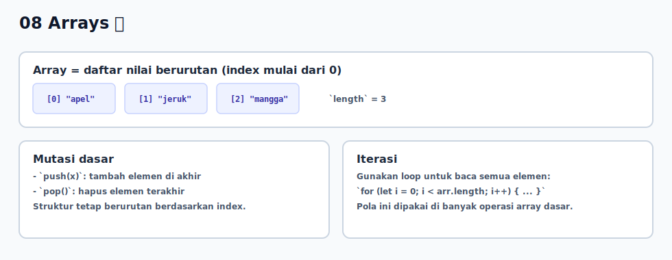

# 08 - Arrays

## Tujuan Pembelajaran

Setelah mempelajari bab ini, pembaca dapat:
- membuat dan mengakses array
- menambah atau menghapus elemen array
- melakukan iterasi array dengan loop dasar

## Konsep Utama

- membuat array
- akses elemen dengan index
- mutasi array (`push`, `pop`)
- iterasi array

## Penjelasan

Array adalah struktur data untuk menyimpan banyak nilai dalam satu variabel.

Ciri penting:
- index dimulai dari `0`
- panjang array bisa berubah
- satu array bisa berisi tipe data berbeda (meski untuk pemula lebih baik konsisten)

Method dasar yang sering dipakai:
- `push`: tambah elemen di akhir
- `pop`: hapus elemen terakhir

## Visualisasi Konsep



## Contoh Kode

### Contoh 1 - Dasar Membuat dan Mengakses Array

```javascript
const fruits = ["apel", "jeruk", "mangga"]

console.log(fruits[0]) // apel
console.log(fruits[1]) // jeruk
console.log(fruits.length) // 3
```

### Contoh 2 - Mutasi Array dengan push dan pop

```javascript
const numbers = [1, 2, 3]

numbers.push(4)
console.log(numbers) // [1, 2, 3, 4]

numbers.pop()
console.log(numbers) // [1, 2, 3]
```

### Contoh 3 - Mini Kasus: Hitung Total Nilai

```javascript
const scores = [80, 75, 90, 85]
let total = 0

for (let i = 0; i < scores.length; i++) {
  total += scores[i]
}

const average = total / scores.length
console.log("Total:", total)
console.log("Rata-rata:", average)
```

## Analogi Singkat (Opsional)

Array seperti rak dengan beberapa slot bernomor. Kamu mengambil atau mengganti isi berdasarkan nomor slot (index).

## Eksperimen Kode

Ubah isi array lalu cek hasil iterasi.

```javascript
const colors = ["merah", "hijau", "biru"]
colors.push("kuning")

for (let i = 0; i < colors.length; i++) {
  console.log(i, colors[i])
}
```

Pertanyaan refleksi:
1. Kenapa elemen pertama ada di index `0`?
2. Apa perbedaan `length` sebelum dan sesudah `push`?

## Cakupan dan Batasan

- Dibahas di bab ini: array dasar, mutasi sederhana, dan iterasi dengan loop.
- Tidak dibahas di bab ini: method lanjutan (`map`, `filter`, `reduce`) secara mendalam.

## Latihan

1. Buat array `hobbies` berisi 3 hobi.
2. Tambahkan 1 hobi baru lalu hapus elemen terakhir.
3. Cetak semua isi array menggunakan `for`.

## Ringkasan

- Array menyimpan banyak nilai dalam satu variabel.
- Akses elemen memakai index mulai dari `0`.
- `push` dan `pop` adalah operasi dasar untuk mengubah isi array.
