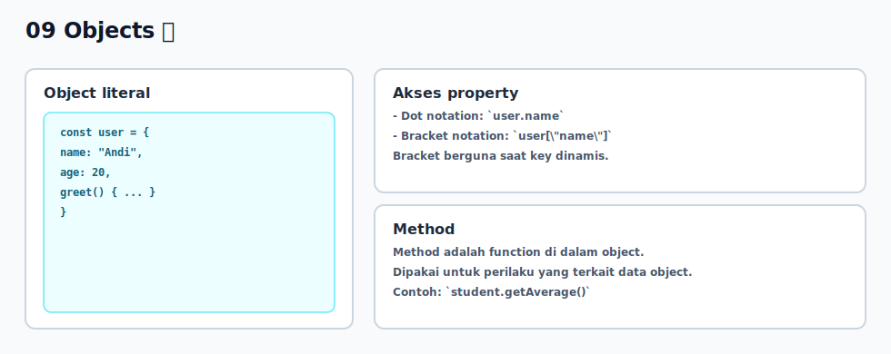

# 09 - Objects

## Tujuan Pembelajaran

Setelah mempelajari bab ini, pembaca dapat:
- membuat object literal sederhana
- membaca dan mengubah property object
- menambahkan method dasar pada object

## Konsep Utama

- object literal
- property
- method
- akses property (dot notation dan bracket notation)

## Penjelasan

Object dipakai untuk mengelompokkan data yang saling terkait dalam satu entitas.

Contoh umum: data pengguna (`name`, `age`, `email`) lebih tepat disimpan dalam object daripada variabel terpisah.

Cara akses property:
- dot notation: `user.name`
- bracket notation: `user["name"]`

Method adalah function yang disimpan sebagai property object.

## Visualisasi Konsep



## Contoh Kode

### Contoh 1 - Dasar Object Literal

```javascript
const user = {
  name: "Andi",
  age: 20,
  isActive: true
}

console.log(user.name) // Andi
console.log(user.age)  // 20
```

### Contoh 2 - Ubah dan Tambah Property

```javascript
const product = {
  title: "Notebook",
  price: 25000
}

product.price = 30000
product.stock = 50

console.log(product)
// { title: 'Notebook', price: 30000, stock: 50 }
```

### Contoh 3 - Mini Kasus: Method pada Object

```javascript
const student = {
  name: "Rina",
  scores: [80, 90, 85],
  getAverage() {
    let total = 0
    for (let i = 0; i < this.scores.length; i++) {
      total += this.scores[i]
    }
    return total / this.scores.length
  }
}

console.log("Nama:", student.name)
console.log("Rata-rata:", student.getAverage())
```

## Analogi Singkat (Opsional)

Object seperti kartu profil. Satu kartu berisi beberapa informasi terkait tentang satu hal, dan bisa punya aksi tertentu lewat method.

## Eksperimen Kode

Coba akses property dengan dot dan bracket notation.

```javascript
const book = {
  title: "Belajar JavaScript",
  author: "Syahputra"
}

console.log(book.title)
console.log(book["author"])

book.year = 2026
console.log(book)
```

Pertanyaan refleksi:
1. Kapan bracket notation lebih berguna daripada dot notation?
2. Apa keuntungan menyimpan data terkait dalam satu object?

## Cakupan dan Batasan

- Dibahas di bab ini: object dasar untuk menyimpan data dan method sederhana.
- Tidak dibahas di bab ini: prototype chain, descriptor, class internals.

## Latihan

1. Buat object `car` dengan property `brand`, `year`, dan `color`.
2. Ubah satu property dan tambahkan property baru `isElectric`.
3. Tambahkan method `getInfo()` yang mengembalikan string ringkas tentang mobil.

## Ringkasan

- Object mengelompokkan data yang saling terkait.
- Property bisa diakses, diubah, dan ditambah.
- Method memungkinkan object menyimpan perilaku sederhana.
