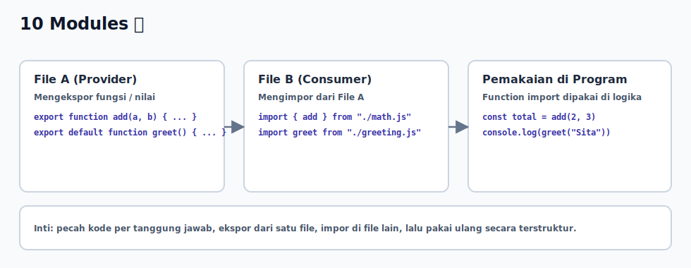

# 10 - Modules

## Tujuan Pembelajaran

Setelah mempelajari bab ini, pembaca dapat:
- memahami alasan memecah kode ke beberapa file
- menggunakan `export` dan `import` dasar
- menyusun modul kecil yang mudah dipakai ulang

## Konsep Utama

- module file
- named export
- named import
- default export (dasar)

## Penjelasan

Modules membantu kita memecah program besar menjadi file-file kecil dengan tanggung jawab jelas.

Keuntungan utama:
- kode lebih rapi
- fungsi bisa dipakai ulang di file lain
- kolaborasi tim lebih mudah karena struktur jelas

Alur dasar:
1. file A mengekspor value/function
2. file B mengimpor value/function tersebut
3. file B menggunakan hasil import dalam logika program

## Visualisasi Konsep



## Contoh Kode

### Contoh 1 - Named Export dan Import

`math.js`
```javascript
export function add(a, b) {
  return a + b
}

export function multiply(a, b) {
  return a * b
}
```

`app.js`
```javascript
import { add, multiply } from "./math.js"

console.log(add(2, 3))      // 5
console.log(multiply(2, 3)) // 6
```

### Contoh 2 - Default Export

`greeting.js`
```javascript
export default function greet(name) {
  return `Halo, ${name}`
}
```

`main.js`
```javascript
import greet from "./greeting.js"

console.log(greet("Sita")) // Halo, Sita
```

### Contoh 3 - Mini Kasus: Modul Utility Harga

`price-utils.js`
```javascript
export function calculateDiscount(price, percent) {
  return price * (percent / 100)
}

export function calculateFinalPrice(price, percent) {
  return price - calculateDiscount(price, percent)
}
```

`checkout.js`
```javascript
import { calculateFinalPrice } from "./price-utils.js"

const total = 150000
const finalTotal = calculateFinalPrice(total, 10)

console.log("Total akhir:", finalTotal) // 135000
```

## Analogi Singkat (Opsional)

Module seperti lemari dengan laci terpisah. Setiap laci menyimpan alat tertentu, lalu kamu ambil alat yang diperlukan tanpa mencampur semua alat di satu tempat.

## Eksperimen Kode

Coba tambah satu function baru di file modul, lalu import dan pakai di file utama.

`string-utils.js`
```javascript
export function toUpper(text) {
  return text.toUpperCase()
}
```

`run.js`
```javascript
import { toUpper } from "./string-utils.js"

console.log(toUpper("belajar module"))
```

Pertanyaan refleksi:
1. Apa manfaat memisahkan `math.js` dan `app.js`?
2. Kapan sebaiknya pakai named export dibanding default export?

## Cakupan dan Batasan

- Dibahas di bab ini: konsep module dasar dengan `export` dan `import`.
- Tidak dibahas di bab ini: module graph, circular dependency, dan evaluasi module mendalam.

## Latihan

1. Buat file `converter.js` yang mengekspor function `toKilometer(meter)`.
2. Import function itu di `index.js` lalu tampilkan hasil konversi.
3. Tambahkan satu function export lain, misalnya `toMeter(kilometer)`.

## Ringkasan

- Module memecah kode jadi bagian kecil yang fokus.
- `export` membagikan value/function dari satu file.
- `import` memakai value/function tersebut di file lain.
