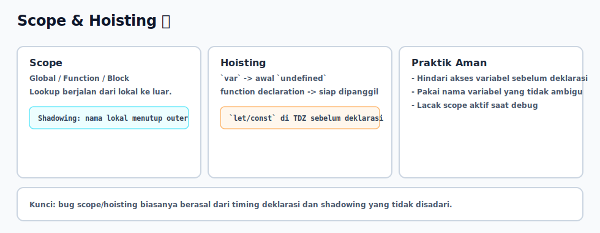

# Scope dan Hoisting

## Tujuan Pembelajaran

Setelah mempelajari topik ini, pembaca dapat:
- menjelaskan scope sebagai batas akses identifier
- memahami efek hoisting pada `var`, `let`, `const`, dan function declaration
- menghindari error akibat TDZ dan shadowing yang tidak disengaja

## Konsep Utama

- scope (`global`, `function`, `block`)
- hoisting
- TDZ (Temporal Dead Zone)
- shadowing

## Penjelasan

Scope menentukan di mana variabel bisa diakses.

Hoisting menjelaskan fase persiapan context sebelum eksekusi baris kode:
- function declaration: siap dipanggil lebih awal
- `var`: diinisialisasi awal dengan `undefined`
- `let`/`const`: di-hoist tetapi belum boleh diakses sebelum deklarasi (TDZ)

TDZ sering menyebabkan `ReferenceError` saat variabel `let/const` diakses terlalu cepat.

## Diagram Konsep (Opsional)



## Contoh Kode

### Contoh 1 - Hoisting `var` vs TDZ `let`

```javascript
console.log(a) // undefined
var a = 10

// console.log(b) // ReferenceError
let b = 20
```

### Contoh 2 - Function Declaration Hoisting

```javascript
sayHello() // Halo

function sayHello() {
  console.log("Halo")
}
```

### Contoh 3 - Mini Kasus: Shadowing yang Menipu Debug

```javascript
const config = "global-config"

function setup() {
  var config = "local-config"
  console.log("Di setup:", config)
}

setup()
console.log("Di global:", config)
```

## Analogi Singkat (Opsional)

Creation phase seperti menyiapkan daftar meja sebelum kantor buka. `var` dapat meja kosong (`undefined`), sedangkan `let/const` mejanya ada tapi masih tertutup sampai waktu deklarasinya tiba.

## Eksperimen Kode

Aktifkan baris yang dikomentari, lalu lihat perbedaan error dan output.

```javascript
function run() {
  // console.log(total)
  let total = 5
  console.log(total)
}

run()
```

Pertanyaan refleksi:
1. Kenapa `var` bisa terbaca `undefined` tapi `let` langsung error?
2. Kapan shadowing membuat bug sulit dilacak?

## Common Misconception (Opsional)

- Hoisting bukan berarti baris kode dipindah secara fisik ke atas.
- `let/const` tetap mengalami hoisting, tetapi berada di TDZ sebelum inisialisasi.

## Cakupan dan Batasan

- Dibahas di topik ini: scope dan hoisting untuk reasoning sinkron.
- Tidak dibahas di topik ini: lexical environment internals detail spec-level.

## Latihan

1. Buat contoh yang menunjukkan `var` hoisting.
2. Buat contoh TDZ dengan `let` lalu jelaskan error-nya.
3. Buat nested scope yang menunjukkan shadowing variabel.

## Ringkasan

- Scope menentukan visibilitas variabel.
- Hoisting memengaruhi timing akses variabel dan function.
- TDZ membantu mencegah akses prematur pada `let/const`.

## Lanjut Setelah Ini

- [03-function-closure-dasar.md](./03-function-closure-dasar.md)
