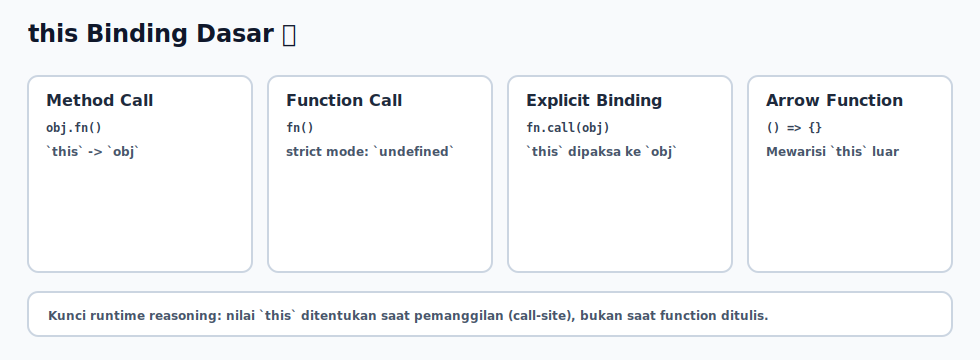

# this Binding Dasar

## Tujuan Pembelajaran

Setelah mempelajari topik ini, pembaca dapat:
- memahami bahwa nilai `this` ditentukan oleh call-site
- membedakan method call dan function call biasa
- menggunakan `call` atau `bind` untuk memperbaiki context yang hilang

## Konsep Utama

- `this`
- method call
- function call
- explicit binding (`call`, `apply`, `bind`)
- perilaku dasar arrow function terhadap `this`

## Penjelasan

`this` tidak ditentukan saat function ditulis, tetapi saat function dipanggil.

Aturan dasar:
- `obj.fn()` -> `this` mengarah ke `obj`
- `fn()` (strict mode) -> `this` adalah `undefined`
- `fn.call(obj)` -> `this` dipaksa ke `obj`
- arrow function tidak membuat `this` baru; ia mewarisi dari scope luar

Karena itu, context bug sering muncul saat method dilepas dari object lalu dipanggil sebagai fungsi biasa.

## Diagram Konsep (Opsional)



## Contoh Kode

### Contoh 1 - Method Call vs Function Call

```javascript
const user = {
  name: "Ari",
  showName() {
    console.log(this.name)
  }
}

user.showName() // Ari

const fn = user.showName
// fn() // TypeError di strict mode
```

### Contoh 2 - Explicit Binding dengan call

```javascript
function showRole(prefix) {
  console.log(prefix, this.role)
}

const admin = { role: "admin" }
const guest = { role: "guest" }

showRole.call(admin, "Role:") // Role: admin
showRole.call(guest, "Role:") // Role: guest
```

### Contoh 3 - Mini Kasus: Context Hilang di Callback

```javascript
const profile = {
  name: "Naya",
  print() {
    console.log("Nama:", this.name)
  }
}

setTimeout(profile.print.bind(profile), 0) // Nama: Naya
```

## Analogi Singkat (Opsional)

`this` seperti badge identitas saat function mulai bekerja. Function yang sama bisa memakai badge berbeda tergantung dipanggil dari ruangan mana.

## Eksperimen Kode

Uji tiga cara panggil function yang sama dan amati nilai `this`.

```javascript
const team = {
  name: "Frontend",
  show() {
    console.log(this.name)
  }
}

const detached = team.show
team.show()
// detached()
detached.call({ name: "Backend" })
```

Pertanyaan refleksi:
1. Kenapa context hilang saat method disimpan ke variabel biasa?
2. Kapan `bind` lebih tepat dibanding `call`?

## Common Misconception (Opsional)

- `this` bukan referensi permanen ke object tempat function ditulis.
- Arrow function bukan pengganti semua function method.

## Cakupan dan Batasan

- Dibahas di topik ini: rule dasar `this` binding pada skenario umum.
- Tidak dibahas di topik ini: pattern advanced binding yang kompleks.

## Latihan

1. Buat object `book` dengan method `printTitle()` yang memakai `this.title`.
2. Lepaskan method ke variabel lalu perbaiki dengan `bind`.
3. Uji method yang sama dengan `call` ke object lain.

## Ringkasan

- Nilai `this` ditentukan saat pemanggilan function.
- Method call dan function call bisa menghasilkan `this` yang berbeda.
- `call`/`bind` membantu mengontrol context secara eksplisit.

## Lanjut Setelah Ini

- [05-closure-patterns.md](./05-closure-patterns.md)
