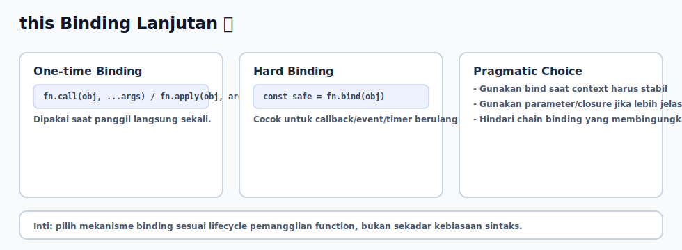

# this Binding Lanjutan

## Tujuan Pembelajaran

Setelah mempelajari topik ini, pembaca dapat:
- memilih teknik binding yang tepat (`call`, `apply`, `bind`) sesuai kasus
- memperbaiki callback context loss pada event/timer
- menentukan kapan lebih baik memakai closure daripada `this`

## Konsep Utama

- hard binding (`bind`)
- one-time binding (`call`/`apply`)
- callback context loss
- method borrowing
- tradeoff `this` vs closure

## Penjelasan

Pada skenario runtime nyata, bug `this` sering muncul saat method dipindah menjadi callback.

Perbedaan utama:
- `call(obj, ...args)`: panggil langsung sekali dengan `this = obj`
- `apply(obj, argsArray)`: sama seperti `call`, beda cara kirim argumen
- `bind(obj)`: menghasilkan function baru dengan `this` terkunci

Gunakan `bind` saat function akan dipanggil berkali-kali (event/timer/callback pipeline).

## Diagram Konsep (Opsional)



## Contoh Kode

### Contoh 1 - call, apply, bind

```javascript
function describe(level, team) {
  return `${this.name} - ${level} - ${team}`
}

const dev = { name: "Raka" }

console.log(describe.call(dev, "senior", "platform"))
console.log(describe.apply(dev, ["mid", "frontend"]))

const boundDescribe = describe.bind(dev)
console.log(boundDescribe("junior", "mobile"))
```

### Contoh 2 - Callback Context Loss

```javascript
const user = {
  name: "Alya",
  show() {
    console.log(this.name)
  }
}

const safeShow = user.show.bind(user)
setTimeout(safeShow, 0) // Alya
```

### Contoh 3 - Mini Kasus: Method Borrowing

```javascript
const cartA = {
  owner: "Ari",
  total: 100,
  print(prefix) {
    return `${prefix} ${this.owner}: ${this.total}`
  }
}

const cartB = { owner: "Bima", total: 250 }
console.log(cartA.print.call(cartB, "Cart")) // Cart Bima: 250
```

## Analogi Singkat (Opsional)

`bind` seperti menempelkan ID card permanen ke pekerja, sehingga saat dipindah ke ruangan mana pun, identitas kerjanya tetap sama.

## Eksperimen Kode

Coba panggil function yang sama dengan `call` dan `bind`, lalu bandingkan perilakunya.

```javascript
const obj1 = { label: "obj1" }
const obj2 = { label: "obj2" }

function showLabel() {
  console.log(this.label)
}

const bound = showLabel.bind(obj1)
bound()
showLabel.call(obj2)
```

Pertanyaan refleksi:
1. Kenapa `bind` menghasilkan function baru?
2. Kapan lebih baik menghindari `this` dan pakai parameter eksplisit saja?

## Common Misconception (Opsional)

- `bind` tidak mengeksekusi function saat dipanggil; ia hanya mengembalikan function baru.
- `call`/`apply` bukan pengganti permanen untuk callback jangka panjang.

## Cakupan dan Batasan

- Dibahas di topik ini: kontrol context di skenario callback dan utility runtime.
- Tidak dibahas di topik ini: decorator pattern atau abstraction framework-level.

## Latihan

1. Buat object dengan method `logName()` lalu jalankan lewat `setTimeout` tanpa dan dengan `bind`.
2. Buat satu function util lalu pakai `call` untuk dua object berbeda.
3. Bandingkan hasil pendekatan `this` dengan versi parameter eksplisit.

## Ringkasan

- `call`/`apply` cocok untuk binding sekali pakai.
- `bind` cocok untuk callback berulang dan context yang harus stabil.
- Untuk keterbacaan, kadang closure/parameter eksplisit lebih sederhana daripada chaining `this`.

## Lanjut Setelah Ini

- [07-execution-context-lifecycle.md](./07-execution-context-lifecycle.md)
