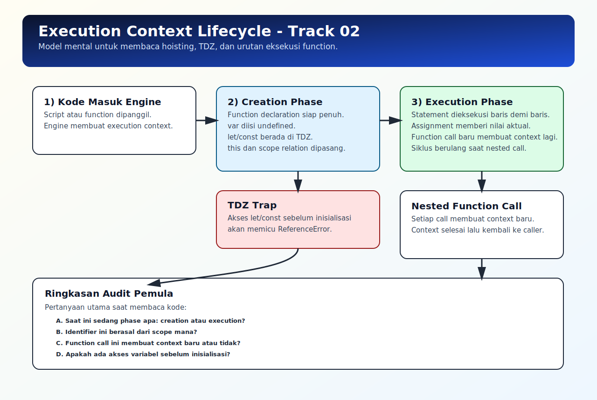

# Execution Context Lifecycle

## Tujuan Pembelajaran

Setelah mempelajari topik ini, pembaca dapat:
- menjelaskan dua fase utama execution context (creation dan execution)
- memprediksi efek hoisting berdasarkan lifecycle context
- menggunakan model context untuk debug bug runtime sinkron

## Konsep Utama

- execution context
- creation phase
- execution phase
- lexical environment
- hoisting

## Penjelasan

Setiap kali script atau function dijalankan, JavaScript membuat execution context.

Lifecycle sederhananya:
1. creation phase: engine menyiapkan binding variabel/function dan struktur scope
2. execution phase: statement dijalankan berurutan

Dampak runtime yang paling terasa:
- function declaration siap dipanggil saat execution dimulai
- `var` punya nilai awal `undefined`
- `let/const` belum bisa diakses sebelum deklarasi (TDZ)

## Diagram Konsep (Opsional)



## Contoh Kode

### Contoh 1 - Creation vs Execution pada `var`

```javascript
console.log(title) // undefined
var title = "JS Runtime"
console.log(title) // JS Runtime
```

### Contoh 2 - Function Context Baru per Pemanggilan

```javascript
function run(label) {
  console.log("run:", label)
}

run("A")
run("B")
```

### Contoh 3 - Mini Kasus: Shadowing dari Context Lokal

```javascript
var config = "global"

function start() {
  console.log(config) // undefined (var lokal di-hoist)
  var config = "local"
  console.log(config) // local
}

start()
console.log(config) // global
```

## Analogi Singkat (Opsional)

Execution context seperti briefing sebelum kerja dimulai. Semua peran dan alat disiapkan dulu (creation), baru pekerjaan benar-benar berjalan (execution).

## Eksperimen Kode

Coba aktifkan baris `let` berikut dan amati error TDZ.

```javascript
function test() {
  // console.log(count)
  let count = 1
  console.log(count)
}

test()
```

Pertanyaan refleksi:
1. Kenapa `var` bisa terbaca `undefined` di awal?
2. Kenapa `let` sebelum deklarasi menghasilkan `ReferenceError`?

## Common Misconception (Opsional)

- Hoisting bukan pemindahan fisik baris kode.
- `let/const` tetap di-hoist, tapi tidak usable sebelum inisialisasi.

## Cakupan dan Batasan

- Dibahas di topik ini: model lifecycle execution context pada kode sinkron.
- Tidak dibahas di topik ini: detail algoritma specification level.

## Latihan

1. Buat contoh `var` yang menunjukkan nilai awal `undefined`.
2. Buat contoh shadowing di dalam function.
3. Buat contoh TDZ dengan `let` lalu jelaskan urutan fasenya.

## Ringkasan

- Execution context punya fase persiapan dan fase eksekusi.
- Hoisting adalah efek dari fase persiapan context.
- Model context membantu menjelaskan banyak perilaku runtime secara konsisten.

## Lanjut Setelah Ini

- [08-call-stack-web-apis-queues.md](./08-call-stack-web-apis-queues.md)
