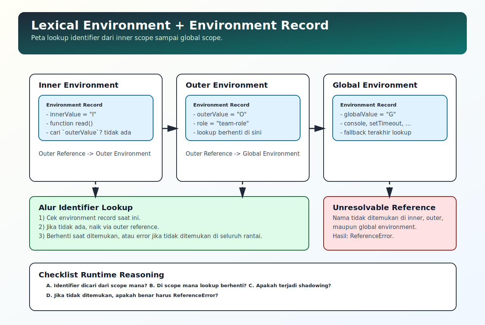

# Lexical Environment dan Environment Record

## Tujuan Pembelajaran

Setelah mempelajari topik ini, pembaca dapat:
- menjelaskan hubungan execution context dengan lexical environment
- memahami peran environment record dalam penyimpanan binding identifier
- memprediksi lookup identifier pada nested scope secara lebih presisi

## Konsep Utama

- lexical environment
- environment record
- outer reference
- identifier binding
- lexical scope

## Penjelasan

Setiap execution context memiliki lexical environment.

Secara konseptual, lexical environment terdiri dari:
- environment record: tempat binding nama variabel/fungsi disimpan
- outer reference: referensi ke environment luar

Saat identifier diakses, engine melihat environment record saat ini. Jika tidak ditemukan, engine mengikuti outer reference sampai global.

Konsep ini adalah dasar mekanis untuk memahami scope chain lookup dan closure.

## Diagram Konsep (Opsional)



## Contoh Kode

### Contoh 1 - Binding pada Scope Lokal

```javascript
const globalValue = "G"

function outer() {
  const outerValue = "O"

  function inner() {
    const innerValue = "I"
    console.log(globalValue, outerValue, innerValue)
  }

  inner()
}

outer() // G O I
```

### Contoh 2 - Lookup via Outer Reference

```javascript
const role = "global-role"

function team() {
  const role = "team-role"

  function member() {
    console.log(role)
  }

  member()
}

team() // team-role
```

### Contoh 3 - Mini Kasus: Closure Menyimpan Akses Environment

```javascript
function makeReader() {
  const config = "runtime-config"

  return function read() {
    return config
  }
}

const readConfig = makeReader()
console.log(readConfig()) // runtime-config
```

## Analogi Singkat (Opsional)

Lexical environment seperti folder kerja bertingkat. Tiap folder punya daftar nama sendiri, dan jika nama tidak ditemukan, pencarian naik ke folder induk.

## Eksperimen Kode

Ubah nama variabel lokal dan lihat perubahan sumber binding yang dipakai.

```javascript
const label = "global"

function one() {
  const label = "one"

  function two() {
    console.log(label)
  }

  two()
}

one()
```

Pertanyaan refleksi:
1. Kenapa `two()` tidak mengambil `label` global?
2. Apa hubungan outer reference dengan scope chain?

## Common Misconception (Opsional)

- Lexical environment bukan object biasa yang bisa diakses langsung dari kode aplikasi.
- Scope chain lookup tidak acak; ia mengikuti outer reference yang sudah ditentukan saat penulisan struktur kode.

## Cakupan dan Batasan

- Dibahas di topik ini: model konseptual lexical environment untuk reasoning runtime.
- Tidak dibahas di topik ini: formal algorithm spec-level mendalam.

## Latihan

1. Buat 3 level nested function dan tampilkan variabel dari level berbeda.
2. Buat satu contoh shadowing dan jelaskan binding mana yang dipakai.
3. Buat closure sederhana lalu jelaskan environment mana yang tetap diakses.

## Ringkasan

- Lexical environment adalah fondasi penyimpanan binding pada execution context.
- Environment record menyimpan nama identifier pada scope aktif.
- Outer reference menghubungkan satu scope ke scope luar untuk proses lookup.

## Lanjut Setelah Ini

- [11-memory-model-high-level.md](./11-memory-model-high-level.md)
- Pendalaman spec: [../../07-javascript-specification-companion/topics/03-environment-record-scope-dan-closure.md](../../07-javascript-specification-companion/topics/03-environment-record-scope-dan-closure.md)
