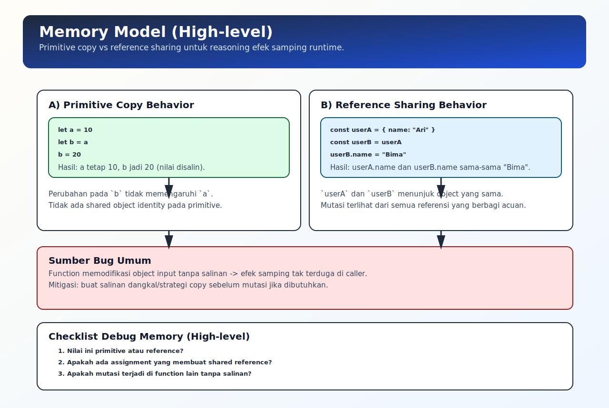

# Memory Model (High-level)

## Tujuan Pembelajaran

Setelah mempelajari topik ini, pembaca dapat:
- memahami perbedaan penyimpanan nilai primitive dan reference secara high-level
- menjelaskan kenapa mutasi object bisa terlihat di banyak tempat
- menghubungkan memory reasoning dengan debugging runtime dasar

## Konsep Utama

- memory model high-level
- primitive vs reference behavior
- object identity
- mutation sharing
- garbage collection (overview)

## Penjelasan

Pada level praktis, runtime JavaScript memperlakukan dua jenis nilai secara berbeda:
- primitive: dipindahkan/disalin sebagai nilai
- reference value (object/array/function): variabel menyimpan acuan ke data

Dampaknya:
- mengubah primitive pada variabel A tidak memengaruhi variabel B
- mengubah isi object yang direferensikan bersama bisa terlihat dari semua referensi

Garbage collection secara umum membersihkan data yang sudah tidak terjangkau lagi oleh referensi aktif.

## Diagram Konsep (Opsional)



## Contoh Kode

### Contoh 1 - Primitive Copy Behavior

```javascript
let a = 10
let b = a

b = 20

console.log(a) // 10
console.log(b) // 20
```

### Contoh 2 - Reference Sharing Behavior

```javascript
const userA = { name: "Ari" }
const userB = userA

userB.name = "Bima"

console.log(userA.name) // Bima
console.log(userB.name) // Bima
```

### Contoh 3 - Mini Kasus: Mutasi Tidak Sengaja

```javascript
function updatePrice(product) {
  product.price = product.price + 1000
}

const item = { name: "Book", price: 10000 }
updatePrice(item)

console.log(item.price) // 11000
```

## Analogi Singkat (Opsional)

Primitive seperti menyalin angka di kertas baru. Reference seperti menyalin alamat rumah; jika isi rumah diubah, semua yang punya alamat itu melihat perubahan yang sama.

## Eksperimen Kode

Bandingkan assignment langsung dengan salinan dangkal sederhana.

```javascript
const original = { score: 80 }
const shared = original
const copied = { ...original }

shared.score = 90
copied.score = 70

console.log(original.score) // 90
console.log(shared.score)   // 90
console.log(copied.score)   // 70
```

Pertanyaan refleksi:
1. Kenapa perubahan di `shared` ikut mengubah `original`?
2. Kapan perlu membuat salinan object sebelum modifikasi?

## Common Misconception (Opsional)

- "Object disimpan di stack" vs "heap" tidak perlu dibahas terlalu literal di tahap ini; fokus ke perilaku observable.
- Menyalin reference bukan berarti membuat object baru.

## Cakupan dan Batasan

- Dibahas di topik ini: memory behavior high-level untuk debugging runtime dasar.
- Tidak dibahas di topik ini: detail internal GC atau implementasi engine spesifik.

## Latihan

1. Buat contoh primitive copy dan reference sharing.
2. Tulis function yang memodifikasi object input, lalu jelaskan efek sampingnya.
3. Ubah contoh agar aman dengan membuat salinan sebelum modifikasi.

## Ringkasan

- Primitive dan reference punya perilaku copy yang berbeda.
- Shared reference adalah sumber bug mutasi paling umum.
- Memory reasoning high-level membantu memahami efek samping di runtime.

## Lanjut Setelah Ini

- Pendalaman memory detail: [../../05-javascript-memory-and-references/topics](../../05-javascript-memory-and-references/topics/)
