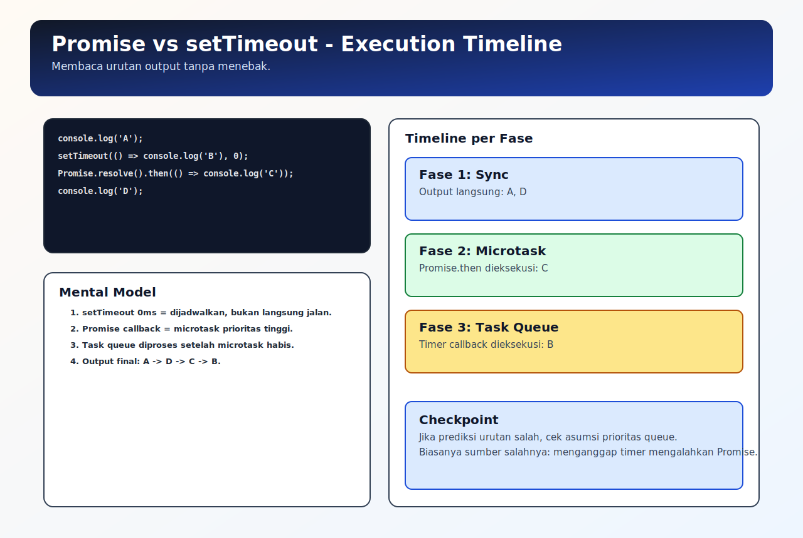

# Asynchronous JavaScript Dasar

## Tujuan Pembelajaran

Setelah mempelajari topik ini, pembaca dapat:
- memahami perbedaan alur synchronous dan asynchronous
- memprediksi urutan output dasar pada kombinasi sync, Promise, dan timer
- menjelaskan peran call stack, task queue, microtask queue, dan event loop

## Konsep Utama

- synchronous vs asynchronous execution
- call stack
- task queue (macrotask)
- microtask queue
- event loop

## Penjelasan

Kode synchronous dieksekusi langsung di call stack, satu per satu.

Pada kode asynchronous, sebagian pekerjaan dijadwalkan dulu, lalu dieksekusi ketika stack kosong. Urutan eksekusi ditentukan oleh event loop dengan aturan prioritas queue:
- microtask queue diproses lebih dulu
- task queue diproses setelah microtask habis

Itulah alasan `Promise.then(...)` sering tampil sebelum callback `setTimeout(..., 0)`.

## Diagram Konsep (Opsional)



## Contoh Kode

### Contoh 1 - Alur Sync Dasar

```javascript
console.log("A")
console.log("B")
console.log("C")
```

### Contoh 2 - Promise vs Timer

```javascript
console.log("1")

setTimeout(() => console.log("2 - timer"), 0)
Promise.resolve().then(() => console.log("3 - promise"))

console.log("4")
// urutan: 1, 4, 3 - promise, 2 - timer
```

### Contoh 3 - Mini Kasus: UI Loading Flow

```javascript
console.log("show loading")

Promise.resolve().then(() => {
  console.log("render data")
})

setTimeout(() => {
  console.log("hide loading fallback")
}, 0)
```

## Analogi Singkat (Opsional)

Bayangkan kasir dengan dua antrean: antrean prioritas (microtask) dan antrean reguler (task). Setiap kali kasir selesai kerja utama, antrean prioritas selalu didahulukan.

## Eksperimen Kode

Ubah urutan pendaftaran Promise dan timer, lalu prediksi output sebelum dijalankan.

```javascript
console.log("start")

Promise.resolve().then(() => console.log("microtask-1"))
setTimeout(() => console.log("task-1"), 0)
Promise.resolve().then(() => console.log("microtask-2"))

console.log("end")
```

Pertanyaan refleksi:
1. Kenapa microtask selalu tampil sebelum task pada contoh ini?
2. Apa dampaknya jika kita menaruh banyak microtask berantai?

## Common Misconception (Opsional)

- `setTimeout(..., 0)` bukan berarti callback langsung jalan.
- Asynchronous bukan “jalan paralel otomatis”; tetap ada aturan scheduling runtime.

## Cakupan dan Batasan

- Dibahas di topik ini: fondasi urutan eksekusi async di runtime JavaScript.
- Tidak dibahas di topik ini: starvation detail dan fairness lanjutan (dibahas di topik event loop detail).

## Latihan

1. Buat satu contoh urutan output sync + Promise + timer.
2. Tulis prediksi output sebelum run, lalu verifikasi.
3. Jelaskan kenapa output aktual sesuai/tidak sesuai prediksi awal.

## Ringkasan

- Asynchronous flow dikendalikan event loop, bukan sekadar urutan baris kode.
- Promise callback masuk microtask queue dan umumnya dieksekusi lebih cepat daripada timer task.
- Mental model queue sangat penting untuk debug bug urutan async.

## Lanjut Setelah Ini

- [02-promise-async-await.md](./02-promise-async-await.md)
