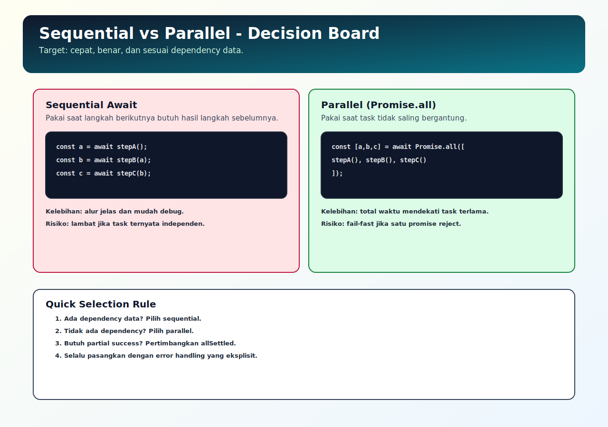

# Promise, Async, dan Await

## Tujuan Pembelajaran

Setelah mempelajari topik ini, pembaca dapat:
- menggunakan Promise chaining dan `async/await` dengan benar
- memilih sequential vs parallel execution untuk task async
- memahami perilaku fail-fast pada `Promise.all`

## Konsep Utama

- Promise lifecycle (resolve/reject)
- Promise chaining (`then/catch`)
- `async` / `await`
- sequential vs parallel await
- fail-fast behavior

## Penjelasan

Promise memberi kontrak hasil async: sukses (`resolve`) atau gagal (`reject`).

`async/await` membuat alur async lebih linear dan mudah dibaca. Namun performa bisa turun jika semua `await` ditulis berurutan padahal task independen.

Aturan praktis:
- pakai sequential jika ada dependency antar langkah
- pakai parallel (`Promise.all`) jika task saling independen

## Diagram Konsep (Opsional)



## Contoh Kode

### Contoh 1 - Promise Chaining

```javascript
function getValue() {
  return Promise.resolve(10)
}

getValue()
  .then((n) => n * 2)
  .then((n) => console.log(n)) // 20
  .catch((err) => console.error(err))
```

### Contoh 2 - Sequential vs Parallel

```javascript
function wait(ms, label) {
  return new Promise((resolve) => setTimeout(() => resolve(label), ms))
}

async function run() {
  const a = await wait(100, "A")
  const b = await wait(100, "B")
  console.log("sequential:", a, b)

  const [x, y] = await Promise.all([wait(100, "X"), wait(100, "Y")])
  console.log("parallel:", x, y)
}

run()
```

### Contoh 3 - Mini Kasus: Fail-fast Promise.all

```javascript
const p1 = Promise.resolve("ok-1")
const p2 = Promise.reject(new Error("fail-2"))
const p3 = Promise.resolve("ok-3")

Promise.all([p1, p2, p3])
  .then((values) => console.log(values))
  .catch((err) => console.log("caught:", err.message))
```

## Analogi Singkat (Opsional)

Jika kamu mengurus dokumen berantai, kamu harus tunggu dokumen sebelumnya selesai (sequential). Jika dokumen tidak saling bergantung, kirim sekaligus lebih efisien (parallel).

## Eksperimen Kode

Ubah `Promise.all` menjadi `Promise.allSettled` dan bandingkan hasilnya.

```javascript
const jobs = [
  Promise.resolve("A"),
  Promise.reject(new Error("B failed")),
  Promise.resolve("C")
]

Promise.allSettled(jobs).then((result) => console.log(result.map((x) => x.status)))
```

Pertanyaan refleksi:
1. Kapan `Promise.all` tepat dipakai?
2. Kapan `Promise.allSettled` lebih sesuai kebutuhan bisnis?

## Common Misconception (Opsional)

- `await` bukan “membuat async jadi sync”, tapi menunggu Promise dalam context async function.
- Menulis semua `await` berurutan bukan selalu benar dari sisi performa.

## Cakupan dan Batasan

- Dibahas di topik ini: orchestration async dasar berbasis Promise/await.
- Tidak dibahas di topik ini: cancellation/retry strategy (dibahas topik 06).

## Latihan

1. Tulis dua fungsi async independen lalu jalankan sequential dan parallel.
2. Catat perbedaan durasi total.
3. Tambahkan satu task reject dan observasi perilaku `Promise.all`.

## Ringkasan

- Promise dan `async/await` adalah fondasi utama flow async modern.
- Pilihan sequential vs parallel menentukan efisiensi alur.
- `Promise.all` fail-fast; pahami konsekuensinya sebelum dipakai.

## Lanjut Setelah Ini

- [03-event-loop-detail.md](./03-event-loop-detail.md)
