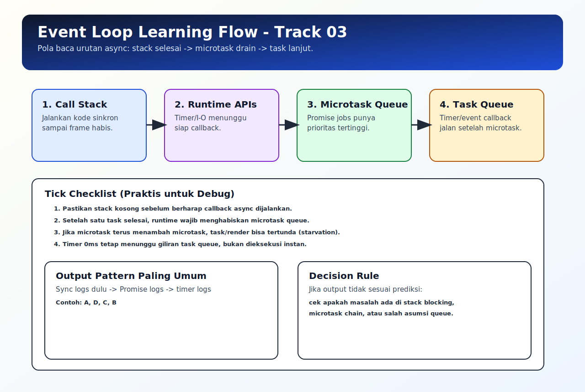

# Event Loop Detail

## Tujuan Pembelajaran

Setelah mempelajari topik ini, pembaca dapat:
- menjelaskan cara event loop memproses task dan microtask per tick
- mengidentifikasi gejala microtask starvation
- menganalisis delay callback berdasarkan prioritas queue

## Konsep Utama

- event loop tick
- task queue
- microtask queue
- microtask drain
- starvation

## Penjelasan

Setiap tick event loop secara umum berjalan seperti ini:
1. ambil task saat call stack kosong
2. jalankan task sampai selesai
3. habiskan microtask queue
4. lanjut ke tick berikutnya

Karena microtask selalu didahulukan setelah task selesai, rantai microtask panjang bisa menunda task lain (timer, UI task, dll).

## Diagram Konsep (Opsional)



## Contoh Kode

### Contoh 1 - Prioritas Microtask

```javascript
console.log("S")

setTimeout(() => console.log("T"), 0)

Promise.resolve()
  .then(() => console.log("P1"))
  .then(() => console.log("P2"))

console.log("E")
// urutan: S, E, P1, P2, T
```

### Contoh 2 - Microtask Tambah Microtask

```javascript
Promise.resolve().then(() => {
  console.log("A")
  Promise.resolve().then(() => console.log("B"))
})

setTimeout(() => console.log("C"), 0)
// urutan: A, B, C
```

### Contoh 3 - Mini Kasus: Delay karena Kerja Sinkron

```javascript
function heavy(ms) {
  const end = Date.now() + ms
  while (Date.now() < end) {}
}

setTimeout(() => console.log("timer done"), 0)
heavy(80)
console.log("main done")
```

## Analogi Singkat (Opsional)

Event loop seperti loket yang wajib menyelesaikan antrean prioritas (microtask) sebelum kembali melayani antrean reguler (task).

## Eksperimen Kode

Tambahkan `.then(...)` berantai lebih panjang dan amati kapan timer dieksekusi.

```javascript
setTimeout(() => console.log("task"), 0)

Promise.resolve()
  .then(() => console.log("m1"))
  .then(() => console.log("m2"))
  .then(() => console.log("m3"))
```

Pertanyaan refleksi:
1. Kenapa timer tertunda sampai semua microtask selesai?
2. Apa dampaknya jika microtask chain terlalu panjang di UI app?

## Common Misconception (Opsional)

- `setTimeout(0)` bukan prioritas tertinggi.
- Event loop bukan hanya soal timer; Promise jobs sangat memengaruhi urutan.

## Cakupan dan Batasan

- Dibahas di topik ini: prioritas queue dan timing dasar event loop.
- Tidak dibahas di topik ini: perbedaan implementasi event loop per runtime secara mendalam.

## Latihan

1. Buat contoh yang menghasilkan urutan `sync -> microtask -> task`.
2. Buat chain microtask 4 langkah dan prediksi output.
3. Tambahkan loop sinkron berat dan jelaskan efek ke timer.

## Ringkasan

- Event loop memproses task dan microtask dengan aturan prioritas tertentu.
- Microtask drain bisa menunda task jika chain terlalu panjang.
- Memahami detail event loop mempercepat debug masalah urutan async.

## Lanjut Setelah Ini

- [04-error-handling-async.md](./04-error-handling-async.md)
