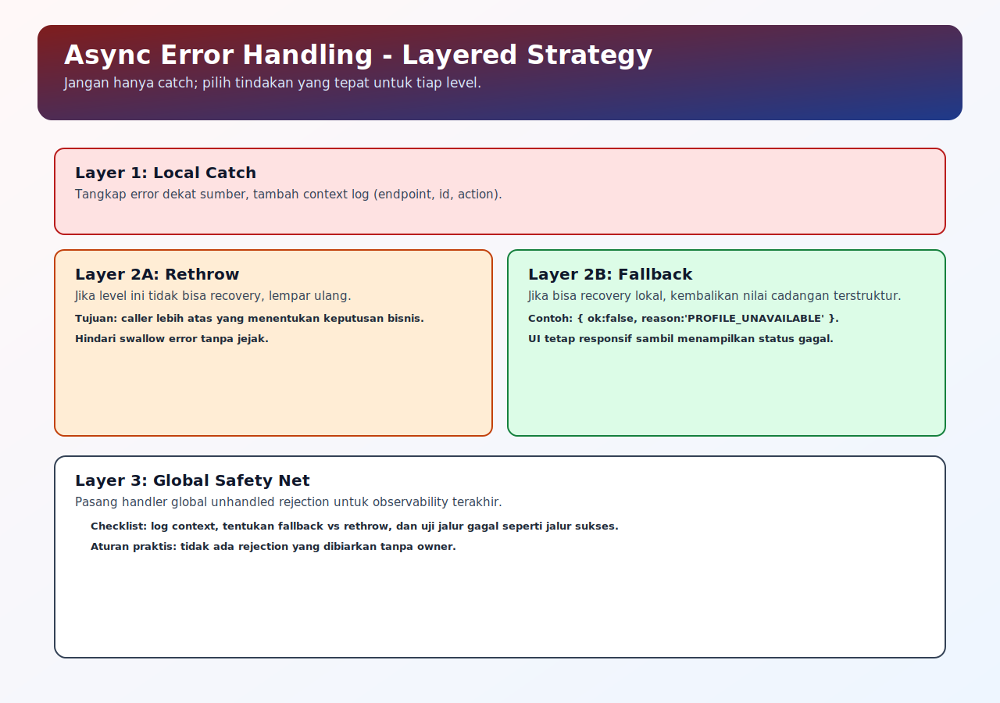

# Error Handling Async

## Tujuan Pembelajaran

Setelah mempelajari topik ini, pembaca dapat:
- menangani rejection dengan `try/catch` dan `.catch()` secara konsisten
- membedakan jalur fallback vs jalur rethrow
- mencegah unhandled rejection pada flow async

## Konsep Utama

- Promise rejection
- error propagation
- `try/catch` pada `async/await`
- `.catch()` pada promise chain
- fallback strategy

## Penjelasan

Error async muncul sebagai rejection, bukan selalu exception sinkron biasa.

Prinsip praktis:
- pakai `try/catch` jika memakai `await`
- pakai `.catch()` jika memakai chaining
- jika tidak bisa recovery di level ini, rethrow ke caller
- jangan swallow error tanpa logging/context

Dengan pola ini, alur gagal tetap terkontrol dan UI tidak menggantung.

## Diagram Konsep (Opsional)



## Contoh Kode

### Contoh 1 - `try/catch` dengan `await`

```javascript
async function loadUser(id) {
  try {
    const user = await fetchUser(id)
    return { ok: true, data: user }
  } catch (err) {
    return { ok: false, reason: err.message }
  }
}
```

### Contoh 2 - Promise Chain dengan `.catch()`

```javascript
fetchData()
  .then((data) => transform(data))
  .then((result) => console.log(result))
  .catch((err) => {
    console.error("flow failed:", err.message)
  })
```

### Contoh 3 - Mini Kasus: Fallback + Rethrow

```javascript
async function getDashboard() {
  try {
    return await fetchDashboard()
  } catch (err) {
    console.warn("primary failed, fallback to cache")

    const cached = await readDashboardCache()
    if (cached) return cached

    throw err
  }
}
```

## Analogi Singkat (Opsional)

Error handling seperti prosedur eskalasi layanan: masalah kecil diselesaikan di frontdesk, masalah besar diteruskan ke level lebih tinggi.

## Eksperimen Kode

Ubah salah satu promise menjadi reject dan amati jalur penanganannya.

```javascript
async function run() {
  try {
    await Promise.resolve("ok")
    await Promise.reject(new Error("boom"))
    console.log("after")
  } catch (err) {
    console.log("caught:", err.message)
  }
}

run()
```

Pertanyaan refleksi:
1. Kapan sebaiknya fallback dipakai?
2. Kapan error harus di-rethrow ke caller?

## Common Misconception (Opsional)

- Menggunakan `try/catch` luar tidak otomatis menangkap promise yang tidak di-`await`.
- Menangkap error tanpa logging bukan penanganan yang aman.

## Cakupan dan Batasan

- Dibahas di topik ini: strategi penanganan error async untuk aplikasi umum.
- Tidak dibahas di topik ini: observability stack trace lintas service terdistribusi.

## Latihan

1. Buat fungsi async yang kadang reject.
2. Tangani reject dengan fallback value.
3. Tambahkan satu versi yang rethrow agar caller menangani error.

## Ringkasan

- Error async harus ditangani eksplisit lewat `catch`/`try-catch`.
- Pilih fallback atau rethrow berdasarkan tanggung jawab layer.
- Tujuan utama: mencegah unhandled rejection dan state aplikasi yang tidak jelas.

## Lanjut Setelah Ini

- [05-concurrency-patterns.md](./05-concurrency-patterns.md)
