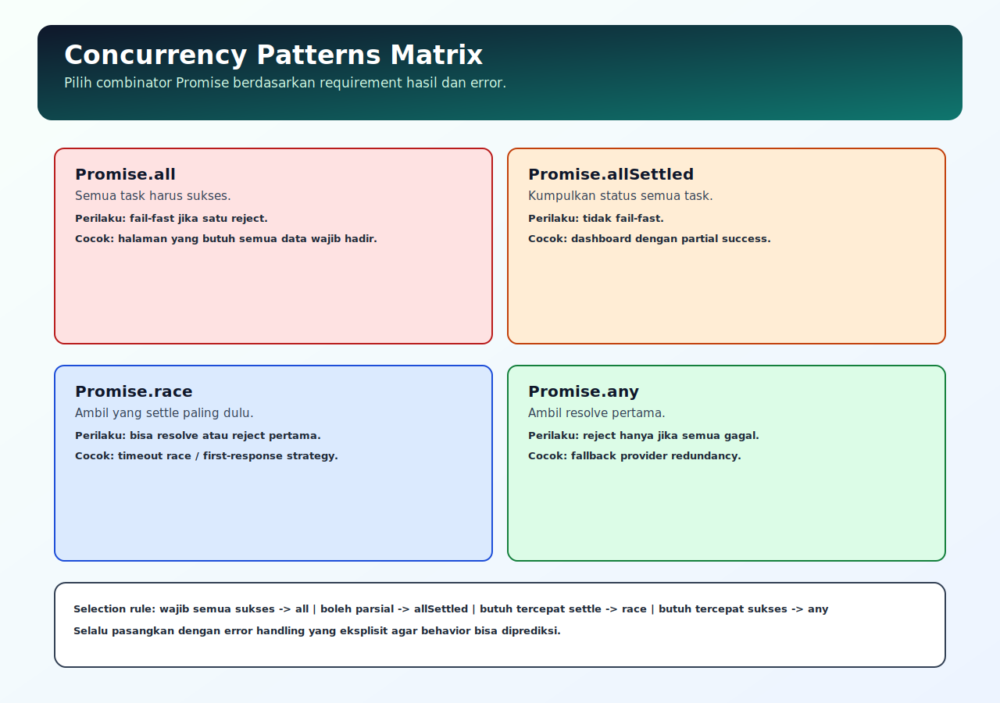

# Concurrency Patterns

## Tujuan Pembelajaran

Setelah mempelajari topik ini, pembaca dapat:
- memilih combinator Promise yang tepat sesuai requirement
- membedakan fail-fast, partial success, dan first winner
- merancang orchestration async yang efisien dan terkontrol

## Konsep Utama

- `Promise.all`
- `Promise.allSettled`
- `Promise.race`
- `Promise.any`
- sequential vs parallel orchestration

## Penjelasan

Concurrency bukan sekadar membuat semua request paralel. Kuncinya memilih perilaku hasil yang benar:
- `all`: semua harus sukses
- `allSettled`: kumpulkan semua hasil termasuk gagal
- `race`: ambil yang settle pertama (resolve/reject)
- `any`: ambil resolve pertama, gagal jika semua reject

Pemilihan combinator harus mengikuti kebutuhan bisnis, bukan preferensi gaya kode.

## Diagram Konsep (Opsional)



## Contoh Kode

### Contoh 1 - `Promise.all` (Fail-fast)

```javascript
const p1 = Promise.resolve("A")
const p2 = Promise.reject(new Error("B failed"))

Promise.all([p1, p2])
  .then((result) => console.log(result))
  .catch((err) => console.log("catch:", err.message))
```

### Contoh 2 - `Promise.allSettled` (Partial Success)

```javascript
Promise.allSettled([
  Promise.resolve("ok"),
  Promise.reject(new Error("fail"))
]).then((result) => {
  console.log(result.map((x) => x.status))
})
```

### Contoh 3 - Mini Kasus: Fallback Provider dengan `Promise.any`

```javascript
const primary = Promise.reject(new Error("provider-1 down"))
const secondary = Promise.resolve("provider-2 result")

Promise.any([primary, secondary])
  .then((value) => console.log("winner:", value))
  .catch(() => console.log("all providers failed"))
```

## Analogi Singkat (Opsional)

Memesan dari beberapa vendor: kadang semua vendor wajib berhasil, kadang cukup satu yang berhasil paling cepat.

## Eksperimen Kode

Ubah kombinasi resolve/reject di tiap promise dan cek perbedaan hasil antar combinator.

```javascript
const jobs = [
  Promise.resolve("X"),
  Promise.reject(new Error("Y")),
  Promise.resolve("Z")
]

Promise.race(jobs)
  .then((v) => console.log("race:", v))
  .catch((e) => console.log("race err:", e.message))
```

Pertanyaan refleksi:
1. Kapan `allSettled` lebih tepat daripada `all`?
2. Apa risiko memakai `race` tanpa guard?

## Common Misconception (Opsional)

- `Promise.race` tidak selalu sukses duluan; bisa juga reject duluan.
- `Promise.any` tidak sama dengan `race`.

## Cakupan dan Batasan

- Dibahas di topik ini: combinator Promise untuk orkestrasi umum.
- Tidak dibahas di topik ini: bounded concurrency implementation detail lanjutan.

## Latihan

1. Buat contoh `all`, `allSettled`, `race`, `any` dengan input campuran.
2. Tulis prediksi output masing-masing.
3. Tentukan combinator paling tepat untuk skenario dashboard multi-widget.

## Ringkasan

- Pilihan combinator menentukan perilaku sukses/gagal flow async.
- `all` fail-fast, `allSettled` cocok untuk partial success.
- Gunakan combinator sesuai kebutuhan bisnis dan toleransi error.

## Lanjut Setelah Ini

- [06-cancellation-timeout-dan-retry-strategy.md](./06-cancellation-timeout-dan-retry-strategy.md)
