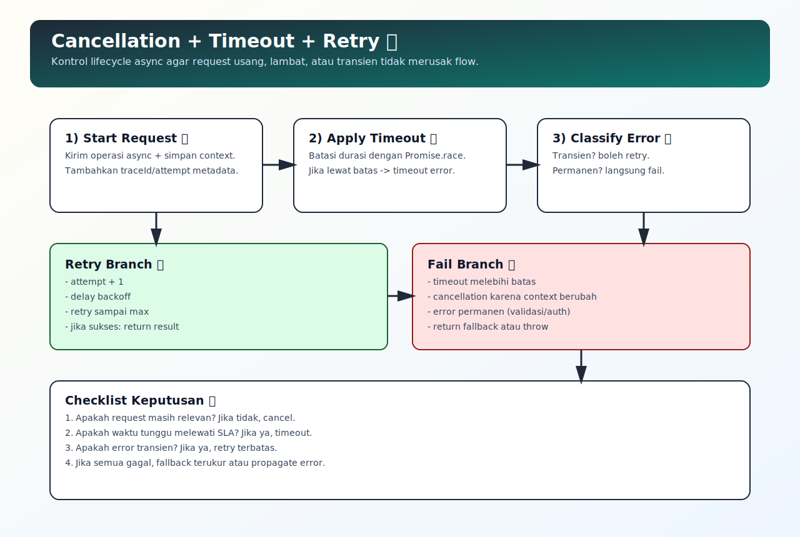

# Cancellation, Timeout, dan Retry Strategy

## Tujuan Pembelajaran

Setelah mempelajari topik ini, pembaca dapat:
- menerapkan timeout untuk membatasi durasi operasi async
- menerapkan retry terkontrol untuk error transien
- menerapkan cancellation agar request usang tidak mengganggu state terbaru

## Konsep Utama

- cancellation
- timeout
- retry
- exponential backoff
- error classification (transien vs permanen)

## Penjelasan

Flow async di production butuh kontrol lifecycle:
- timeout: mencegah request menggantung terlalu lama
- retry: mencoba ulang untuk kegagalan sementara
- cancellation: membatalkan request yang tidak relevan lagi

Gunakan retry dengan klasifikasi error. Jangan retry error validasi atau input yang memang salah.

## Diagram Konsep (Opsional)



## Contoh Kode

### Contoh 1 - Timeout dengan `Promise.race`

```javascript
function withTimeout(promise, ms) {
  return Promise.race([
    promise,
    new Promise((_, reject) => {
      setTimeout(() => reject(new Error("timeout")), ms)
    })
  ])
}
```

### Contoh 2 - Retry Sederhana

```javascript
async function retry(fn, maxRetry = 3) {
  let attempt = 0

  while (attempt < maxRetry) {
    try {
      return await fn()
    } catch (err) {
      attempt += 1
      if (attempt >= maxRetry) throw err
    }
  }
}
```

### Contoh 3 - Mini Kasus: Search Request Cancellation (Conceptual)

```javascript
let lastToken = 0

async function search(query) {
  const token = ++lastToken
  const result = await fetchSearch(query)

  if (token !== lastToken) {
    return null // hasil usang, abaikan
  }

  return result
}
```

## Analogi Singkat (Opsional)

Timeout adalah batas tunggu, retry adalah mencoba ulang jalur yang sempat macet, cancellation adalah membatalkan kendaraan lama saat rute sudah berubah.

## Eksperimen Kode

Uji fungsi retry dengan fungsi yang gagal dua kali lalu berhasil.

```javascript
let n = 0

async function unstable() {
  n += 1
  if (n < 3) throw new Error("temporary")
  return "ok"
}

retry(unstable, 3)
  .then((v) => console.log(v))
  .catch((e) => console.log(e.message))
```

Pertanyaan refleksi:
1. Kapan retry justru berbahaya untuk sistem?
2. Bagaimana menentukan batas timeout yang masuk akal?

## Common Misconception (Opsional)

- Retry bukan solusi universal semua error.
- Timeout tanpa cleanup bisa menyisakan side effect di layer lain.

## Cakupan dan Batasan

- Dibahas di topik ini: strategi kontrol async dasar untuk reliability.
- Tidak dibahas di topik ini: circuit breaker dan distributed resilience pattern penuh.

## Latihan

1. Tambahkan delay backoff sederhana di fungsi retry.
2. Simulasikan timeout pada request lambat.
3. Buat aturan kapan hasil request harus diabaikan karena usang.

## Ringkasan

- Timeout, retry, dan cancellation saling melengkapi.
- Retry harus selektif berdasarkan jenis error.
- Cancellation penting untuk mencegah race update pada UI/state.

## Lanjut Setelah Ini

- [07-async-iteration-dan-for-await-of.md](./07-async-iteration-dan-for-await-of.md)

