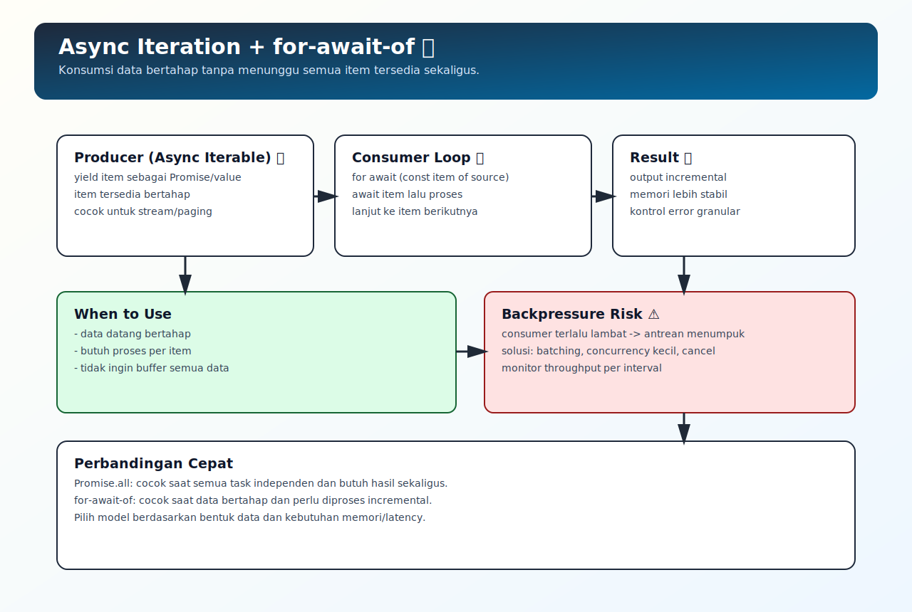

# Async Iteration dan for-await-of

## Tujuan Pembelajaran

Setelah mempelajari topik ini, pembaca dapat:
- memahami kapan memakai async iterable dibanding list Promise biasa
- menggunakan `for await...of` untuk konsumsi data bertahap
- mengenali risiko backpressure pada consumer loop

## Konsep Utama

- iterator vs async iterator
- async iterable
- `for await...of`
- stream-like consumption
- backpressure

## Penjelasan

Tidak semua data async datang sekaligus. Untuk alur data bertahap (stream/paging/queue), async iteration lebih natural.

`for await...of` mengonsumsi item satu per satu, menunggu tiap item resolve sebelum lanjut. Ini membuat kontrol alur lebih stabil dibanding memaksa semua data tersedia sejak awal.

## Diagram Konsep (Opsional)



## Contoh Kode

### Contoh 1 - Async Generator Dasar

```javascript
async function* source() {
  yield Promise.resolve(1)
  yield Promise.resolve(2)
  yield Promise.resolve(3)
}
```

### Contoh 2 - Konsumsi dengan `for await...of`

```javascript
async function run() {
  for await (const n of source()) {
    console.log(n)
  }
}

run()
```

### Contoh 3 - Mini Kasus: Sum Bertahap

```javascript
async function* scores() {
  yield 10
  yield 20
  yield 30
}

async function sumScores() {
  let total = 0

  for await (const s of scores()) {
    total += s
  }

  return total
}

sumScores().then((total) => console.log(total)) // 60
```

## Analogi Singkat (Opsional)

Async iteration seperti menerima paket satu per satu dari kurir, bukan menunggu seluruh paket dunia tiba dulu baru diproses.

## Eksperimen Kode

Tambahkan delay di tiap `yield` untuk melihat alur konsumsi bertahap.

```javascript
async function* delayedSource() {
  for (const n of [1, 2, 3]) {
    await new Promise((r) => setTimeout(r, 50))
    yield n
  }
}

;(async () => {
  for await (const n of delayedSource()) {
    console.log("item:", n)
  }
})()
```

Pertanyaan refleksi:
1. Kapan `Promise.all` lebih tepat daripada async iteration?
2. Bagaimana mencegah consumer loop jadi bottleneck?

## Common Misconception (Opsional)

- `for...of` biasa tidak cukup untuk async iterator.
- Async iteration bukan selalu lebih cepat; ia dipilih untuk flow bertahap dan kontrol memori.

## Cakupan dan Batasan

- Dibahas di topik ini: pola konsumsi async iterable dasar.
- Tidak dibahas di topik ini: stream API detail per platform.

## Latihan

1. Buat async generator yang mengeluarkan 5 angka.
2. Konsumsi dengan `for await...of` dan filter angka genap.
3. Tambahkan delay agar terlihat efek proses bertahap.

## Ringkasan

- Async iteration cocok untuk data yang datang bertahap.
- `for await...of` memberi flow yang jelas dan mudah dipelihara.
- Tetap perhatikan backpressure dan throughput consumer.

## Lanjut Setelah Ini

- [08-async-architecture-dan-anti-patterns.md](./08-async-architecture-dan-anti-patterns.md)

