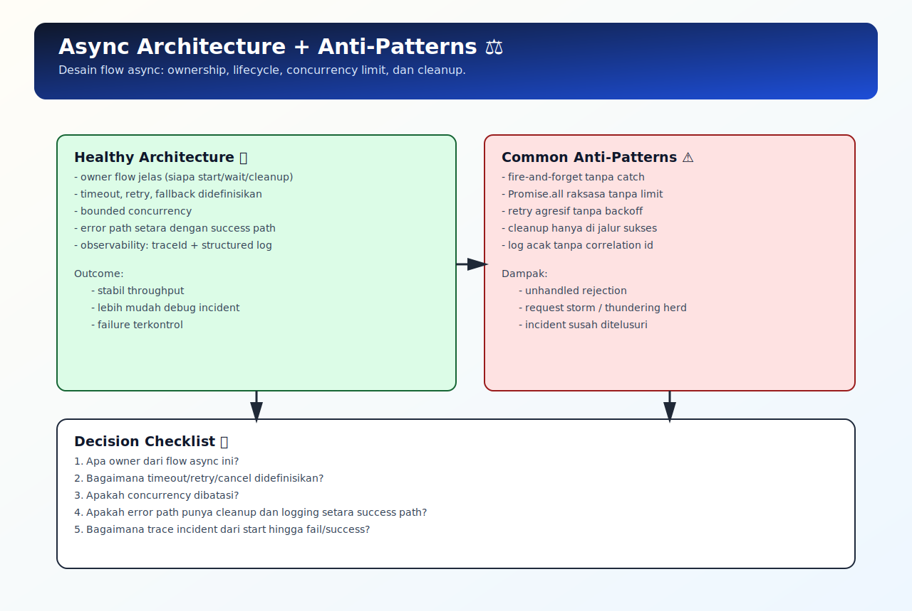

# Async Architecture dan Anti-Patterns

## Tujuan Pembelajaran

Setelah mempelajari topik ini, pembaca dapat:
- merancang async flow dengan ownership dan lifecycle yang jelas
- mengenali anti-pattern async yang sering menyebabkan insiden produksi
- menentukan strategi concurrency yang terkontrol untuk reliability

## Konsep Utama

- async boundary
- orchestration layer
- bounded concurrency
- fire-and-forget risk
- unhandled rejection risk

## Penjelasan

Di production, masalah async sering muncul dari desain alur, bukan syntax.

Prinsip arsitektur async sehat:
- tetapkan owner flow async (siapa menunggu, siapa cleanup)
- hindari fire-and-forget tanpa handler
- batasi concurrency untuk resource mahal
- definisikan timeout/retry/fallback dari awal

## Diagram Konsep (Opsional)



## Contoh Kode

### Contoh 1 - Bounded Batch Orchestration

```javascript
async function runTasks(tasks, limit = 2) {
  const result = []

  for (let i = 0; i < tasks.length; i += limit) {
    const chunk = tasks.slice(i, i + limit).map((fn) => fn())
    result.push(...(await Promise.all(chunk)))
  }

  return result
}
```

### Contoh 2 - Fire-and-forget yang Aman (minimal)

```javascript
function fireAndForgetSafe(task) {
  task().catch((err) => {
    console.error("background task failed:", err.message)
  })
}
```

### Contoh 3 - Mini Kasus: Orchestrator dengan Fallback

```javascript
async function loadDashboard() {
  try {
    const [profile, stats] = await Promise.all([fetchProfile(), fetchStats()])
    return { profile, stats }
  } catch (err) {
    const cached = await readDashboardCache()
    if (cached) return cached
    throw err
  }
}
```

## Analogi Singkat (Opsional)

Arsitektur async seperti dapur restoran: perlu kepala dapur, batas kapasitas kompor, jalur darurat, dan prosedur cleanup.

## Eksperimen Kode

Simulasikan 6 task dengan limit berbeda lalu bandingkan throughput.

```javascript
function makeTask(id) {
  return async () => {
    await new Promise((r) => setTimeout(r, 50))
    return `task-${id}`
  }
}

const tasks = [1, 2, 3, 4, 5, 6].map(makeTask)
runTasks(tasks, 3).then((r) => console.log(r))
```

Pertanyaan refleksi:
1. Apa risiko jika semua task dijalankan sekaligus tanpa limit?
2. Kapan fire-and-forget benar-benar boleh dipakai?

## Common Misconception (Opsional)

- “Semakin paralel selalu semakin bagus” tidak selalu benar.
- Unhandled rejection kecil bisa menjadi insiden besar jika terjadi berulang.

## Cakupan dan Batasan

- Dibahas di topik ini: prinsip arsitektur async praktis untuk aplikasi umum.
- Tidak dibahas di topik ini: distributed async architecture lintas banyak service.

## Latihan

1. Ubah orchestrator agar memakai `allSettled` untuk partial success.
2. Tambahkan timeout di tiap task chunk.
3. Tambahkan logging standar untuk jalur sukses/gagal.

## Ringkasan

- Arsitektur async yang baik menekankan kontrol lifecycle dan error path.
- Bounded concurrency membantu menjaga stabilitas sistem.
- Anti-pattern utama: fire-and-forget liar, unhandled rejection, dan retry agresif tanpa batas.

## Lanjut Setelah Ini

- [09-bounded-concurrency-dan-pool-pattern.md](./09-bounded-concurrency-dan-pool-pattern.md)

