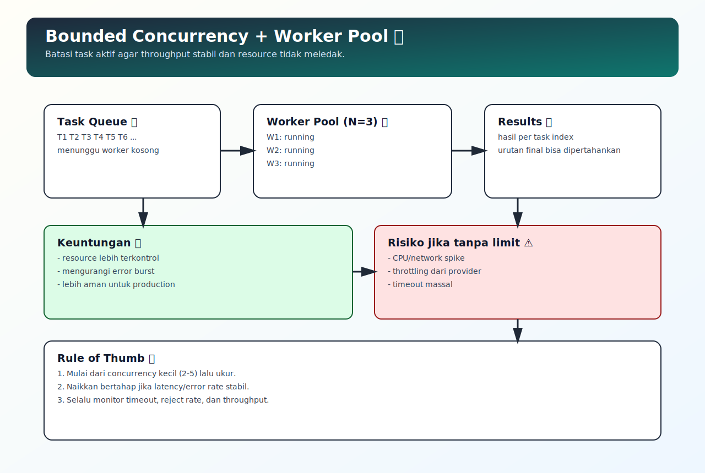

# Bounded Concurrency dan Pool Pattern

## Tujuan Pembelajaran

Setelah mempelajari topik ini, pembaca dapat:
- memahami risiko menjalankan terlalu banyak task async sekaligus
- menerapkan bounded concurrency sederhana dengan worker pool
- memilih ukuran concurrency yang masuk akal sesuai beban sistem

## Konsep Utama

- bounded concurrency
- worker pool
- throughput vs stability
- queue of tasks
- backpressure awareness

## Penjelasan

`Promise.all` untuk ratusan task sekaligus bisa membebani CPU, network, atau service eksternal.

Bounded concurrency membatasi jumlah task aktif pada saat yang sama. Task lain menunggu giliran di antrean.

Keuntungan:
- throughput stabil
- error burst berkurang
- resource lebih terkontrol

Tradeoff:
- total durasi bisa lebih lama dibanding full parallel, tapi lebih aman untuk production.

## Diagram Konsep (Opsional)



## Contoh Kode

### Contoh 1 - Full Parallel (Risiko Beban Tinggi)

```javascript
await Promise.all(tasks.map((task) => task()))
```

### Contoh 2 - Worker Pool Sederhana

```javascript
async function runWithPool(tasks, concurrency = 3) {
  let index = 0
  const results = new Array(tasks.length)

  async function worker() {
    while (index < tasks.length) {
      const current = index++
      results[current] = await tasks[current]()
    }
  }

  const workers = Array.from({ length: concurrency }, () => worker())
  await Promise.all(workers)
  return results
}
```

### Contoh 3 - Mini Kasus: Batched API Calls

```javascript
function makeTask(id) {
  return async () => {
    await new Promise((r) => setTimeout(r, 40))
    return `done-${id}`
  }
}

const tasks = Array.from({ length: 10 }, (_, i) => makeTask(i + 1))
runWithPool(tasks, 3).then((r) => console.log(r.length))
```

## Analogi Singkat (Opsional)

Pool pattern seperti membatasi jumlah kasir yang aktif. Pelanggan tetap dilayani semua, tapi antrean dikelola supaya operasional tidak kolaps.

## Eksperimen Kode

Ubah nilai `concurrency` (1, 2, 5, 10) lalu bandingkan waktu total dan stabilitas error.

```javascript
const start = Date.now()
runWithPool(tasks, 2).then(() => {
  console.log("elapsed:", Date.now() - start)
})
```

Pertanyaan refleksi:
1. Kapan full parallel masih aman dipakai?
2. Apa indikator bahwa concurrency harus diturunkan?

## Common Misconception (Opsional)

- Concurrency lebih tinggi tidak selalu lebih cepat secara end-to-end.
- Worker pool bukan hanya soal performa, tapi juga reliabilitas.

## Cakupan dan Batasan

- Dibahas di topik ini: bounded concurrency dasar untuk aplikasi async umum.
- Tidak dibahas di topik ini: adaptive concurrency algoritmik lanjutan.

## Latihan

1. Implementasikan `runWithPool` sendiri tanpa melihat contoh.
2. Tambahkan error handling per task agar satu task gagal tidak menghentikan semua worker.
3. Bandingkan hasil `Promise.all` vs `runWithPool` untuk 50 task mock.

## Ringkasan

- Bounded concurrency menjaga keseimbangan antara performa dan stabilitas.
- Worker pool adalah pola praktis untuk membatasi task aktif.
- Pola ini penting untuk beban produksi yang tidak kecil.

## Lanjut Setelah Ini

- [10-async-observability-dan-debugging-strategy.md](./10-async-observability-dan-debugging-strategy.md)

