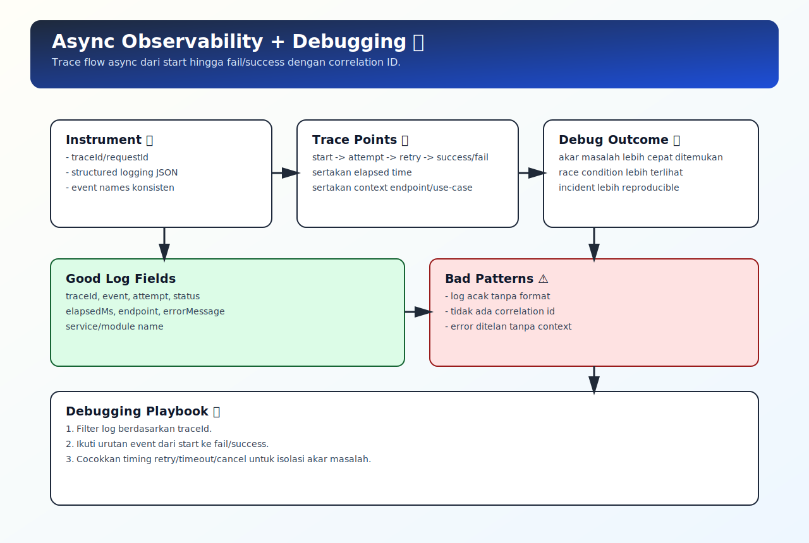

# Async Observability dan Debugging Strategy

## Tujuan Pembelajaran

Setelah mempelajari topik ini, pembaca dapat:
- membangun logging async yang bisa ditelusuri lintas langkah
- mengidentifikasi sumber race condition dan unhandled rejection
- menyusun strategi debugging async yang repeatable

## Konsep Utama

- structured logging
- correlation/request id
- async trace points
- error context propagation
- debugging playbook

## Penjelasan

Bug async sering sulit direproduksi jika log tidak konsisten.

Prinsip observability dasar:
- beri `requestId`/`traceId` untuk tiap flow
- log tahap penting: start, success, fail, retry, timeout, cancel
- sertakan context minimal: endpoint, attempt, elapsed time

Strategi ini mempercepat diagnosis saat insiden terjadi.

## Diagram Konsep (Opsional)



## Contoh Kode

### Contoh 1 - Structured Log Helper

```javascript
function logEvent(event, context = {}) {
  console.log(JSON.stringify({
    ts: Date.now(),
    event,
    ...context
  }))
}
```

### Contoh 2 - Request Flow dengan Correlation ID

```javascript
async function fetchProfileWithTrace(userId, traceId) {
  logEvent("profile.start", { traceId, userId })

  try {
    const data = await fetchProfile(userId)
    logEvent("profile.success", { traceId })
    return data
  } catch (err) {
    logEvent("profile.fail", { traceId, message: err.message })
    throw err
  }
}
```

### Contoh 3 - Mini Kasus: Retry Trace

```javascript
async function retryWithTrace(task, traceId, maxRetry = 3) {
  for (let attempt = 1; attempt <= maxRetry; attempt++) {
    try {
      logEvent("retry.attempt", { traceId, attempt })
      return await task()
    } catch (err) {
      logEvent("retry.error", { traceId, attempt, message: err.message })
      if (attempt === maxRetry) throw err
    }
  }
}
```

## Analogi Singkat (Opsional)

Observability async seperti CCTV + log buku kejadian. Tanpa jejak waktu dan identitas kasus, susah menentukan siapa melakukan apa dan kapan.

## Eksperimen Kode

Tambahkan `traceId` ke beberapa fungsi async berantai lalu cek apakah log masih bisa diikuti ujung ke ujung.

```javascript
const traceId = "req-1001"
logEvent("flow.start", { traceId })

Promise.resolve()
  .then(() => logEvent("flow.step1", { traceId }))
  .then(() => logEvent("flow.step2", { traceId }))
```

Pertanyaan refleksi:
1. Informasi minimal apa yang harus ada di log async?
2. Kapan log terlalu banyak justru merusak observability?

## Common Misconception (Opsional)

- `console.log` acak tanpa format bukan observability strategy.
- Stack trace saja sering tidak cukup untuk menjelaskan race condition async.

## Cakupan dan Batasan

- Dibahas di topik ini: observability dan debugging async pada level aplikasi.
- Tidak dibahas di topik ini: distributed tracing full-stack lintas banyak service.

## Latihan

1. Tambahkan helper log terstruktur pada flow async kamu.
2. Tambahkan `traceId` pada minimal 3 function async berantai.
3. Simulasikan error dan cek apakah log cukup untuk menemukan akar masalah.

## Ringkasan

- Observability adalah fondasi debugging async yang efektif.
- Correlation ID memudahkan menelusuri satu flow dari awal sampai akhir.
- Debugging async yang baik butuh event log yang konsisten, bukan sekadar log acak.

## Lanjut Setelah Ini

- Drill async order: [../../06-javascript-runtime-exercises/exercises/03-async-order-drills.md](../../06-javascript-runtime-exercises/exercises/03-async-order-drills.md)

