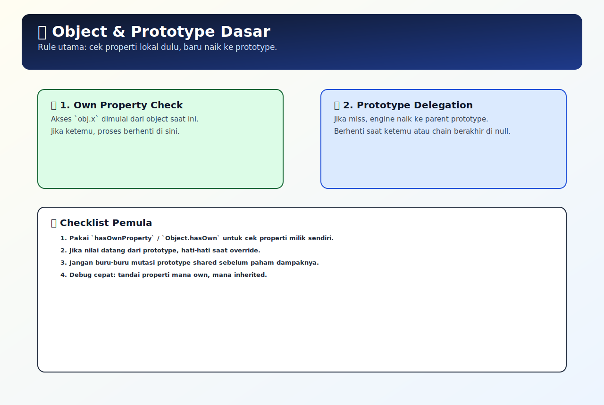

# Object dan Prototype Dasar

## Tujuan Pembelajaran

- Bisa jelaskan urutan pencarian property pada prototype chain.
- Bisa membedakan own property vs inherited property.
- Bisa membaca kode `Object.create(...)` dan memprediksi output akses property.

## Konsep Utama

- Object: kumpulan pasangan `key: value`.
- Property: data yang disimpan dalam object.
- Method: function yang menjadi property object.
- Prototype: object acuan yang dipakai saat property tidak ditemukan di object saat ini.
- Prototype chain: rantai pencarian property dari object ke prototype-nya, lalu ke atas lagi.
- Reference: nilai yang menyimpan acuan/alamat ke data.

### Prasyarat dan Kamus Mini

Rujukan cepat:
- Dasar umum: [`../PRASYARAT-DAN-KAMUS-MINI.md`](../PRASYARAT-DAN-KAMUS-MINI.md)
- Alur topik: [`../docs/learning-path.md`](../docs/learning-path.md)
- Visual map: [`../assets/object-prototype-basics-map.svg`](../assets/object-prototype-basics-map.svg)

Alur topik:
- Topik ini ada di urutan ke-`1` pada Buku 04.
- Prasyarat langsung: `../../02-javascript-runtime-first-principles/topics/03-function-closure-dasar.md`.
- Lanjut setelah ini: `02-prototype-chain-lanjutan.md`.

Prasyarat topik:
- Sudah paham function dasar.
- Sudah paham tipe data primitive vs reference.

Referensi remedial:
- [`../../02-javascript-runtime-first-principles/docs/prasyarat/function-dasar.md`](../../02-javascript-runtime-first-principles/docs/prasyarat/function-dasar.md)
- [`../../02-javascript-runtime-first-principles/docs/prasyarat/object-dasar.md`](../../02-javascript-runtime-first-principles/docs/prasyarat/object-dasar.md)
- [`../../02-javascript-runtime-first-principles/docs/prasyarat/variabel-dasar.md`](../../02-javascript-runtime-first-principles/docs/prasyarat/variabel-dasar.md)

Kamus mini topik:
- `[baru]` Object: kumpulan pasangan `key: value`.
- `[baru]` Property: data yang disimpan dalam object.
- `[baru]` Method: function yang menjadi property object.
- `[baru]` Prototype: object acuan yang dipakai saat property tidak ditemukan di object saat ini.
- `[baru]` Prototype chain: rantai pencarian property dari object ke prototype-nya, lalu ke atas lagi.
- `[ulang]` Reference: nilai yang menyimpan acuan/alamat ke data.

## Penjelasan

### Pengantar Singkat Topik

Object menyimpan data/perilaku dalam bentuk property dan method, sedangkan prototype menjadi jalur berbagi perilaku antar object. Dengan memahami keduanya, kamu bisa membaca proses lookup property tanpa menebak-nebak.

### Big Picture

Pada object JavaScript, kesalahan desain sering terjadi karena lookup property dan pewarisan perilaku dianggap seperti copy data biasa. Topik ini menjelaskan cara object menyimpan own property dan bagaimana prototype chain dipakai untuk delegasi saat property tidak ditemukan. Setelah paham, kamu bisa memutuskan kapan menaruh data di instance, kapan berbagi method lewat prototype, dan bagaimana menghindari override yang tidak sengaja.

### Small Picture

1. Saat akses `obj.x`, engine cek dulu apakah `x` ada di `obj`.
2. Jika tidak ada, engine cek `obj` punya prototype apa.
3. Pencarian lanjut ke prototype tersebut.
4. Jika masih tidak ada, lanjut ke prototype berikutnya sampai `null`.
5. Jika tetap tidak ditemukan, hasilnya `undefined`.

## Diagram Konsep (Opsional)



### Wireframe

```text
Alur utama:
[Akses obj.prop] -> [cek own property] -> [jika tidak ada, naik prototype]

Alur jalan:
[prop ada di prototype] -> [lookup berhenti di level itu] -> [nilai dikembalikan]

Alur error:
[asumsi prop milik object sendiri] -> [ubah data di tempat salah] -> [bug pewarisan/override]
```

## Contoh Kode

```js
const animal = {
  eat() {
    return 'makan';
  },
};

const cat = Object.create(animal);
cat.name = 'Milo';

console.log(cat.name);     // Milo
console.log(cat.eat());    // makan
console.log(cat.hasOwnProperty('eat')); // false
```

### Bedah Output (Langkah Demi Langkah)
1. `cat` dibuat dengan prototype `animal`.
2. `cat.name` adalah property milik langsung `cat`.
3. Saat `cat.eat()` dipanggil, `eat` tidak ada di `cat`, jadi pencarian naik ke `animal`.
4. Method `eat` ditemukan di prototype, lalu dijalankan.
5. `hasOwnProperty('eat')` bernilai `false` karena `eat` bukan milik langsung `cat`.

## Analogi Singkat (Opsional)

Bayangkan kamu cari dokumen:
- Meja kamu = object saat ini.
- Lemari tim = prototype pertama.
- Arsip kantor = prototype di level atas.
Kalau dokumen tidak ada di meja, kamu cari ke lemari tim, lalu ke arsip.

## Eksperimen Kode

```js
const base = { a: 1 };
const child = Object.create(base);
child.b = 2;

console.log(child.a);
console.log(child.b);
console.log(child.hasOwnProperty('a'));
console.log(child.hasOwnProperty('b'));
```

### Kunci Jawaban Drill
- `child.a` -> `1` (didapat dari prototype `base`)
- `child.b` -> `2` (property langsung di `child`)
- `child.hasOwnProperty('a')` -> `false`
- `child.hasOwnProperty('b')` -> `true`

## Common Misconception (Opsional)

- Mengira property dari prototype adalah property milik object langsung.
- Mengubah prototype global/utama tanpa alasan kuat.
- Bingung kenapa `for...in` bisa membaca property dari prototype juga.

## Cakupan dan Batasan

- Dipakai untuk: berbagi method antar banyak object tanpa duplikasi.
- Alasan pakai: lebih hemat memori dan struktur kode lebih terorganisir.
- Kapan tidak dipakai: hindari manipulasi prototype sembarangan jika membuat perilaku object sulit diprediksi.

## Latihan

1. Buat object `animal` sebagai prototype dan `cat` sebagai turunan via `Object.create`, lalu buktikan perbedaan own property vs inherited property.
2. Tambahkan property dengan nama yang sama di turunan, lalu jelaskan efek shadowing pada hasil akses obj.prop.
3. Gunakan `hasOwnProperty` pada minimal 4 properti berbeda dan tulis alasan kenapa hasilnya `true` atau `false`.

### Debug Story

Kasus: object user tiba-tiba punya method tambahan yang tidak dideklarasikan di file itu.
Langkah debug:
1. Cek apakah method tersebut berasal dari prototype (pakai `hasOwnProperty`).
2. Telusuri apakah ada kode yang memodifikasi prototype bersama.
3. Jika ya, pindahkan method ke tempat yang lebih eksplisit agar dampaknya terkontrol.

### Checkpoint

- [ ] Bisa jelaskan urutan pencarian property pada prototype chain.
- [ ] Bisa membedakan own property vs inherited property.
- [ ] Bisa membaca kode `Object.create(...)` dan memprediksi output akses property.

### Bacaan Remedial

1. Ulangi contoh `animal` dan `cat` sambil cek `hasOwnProperty`.
2. Coba tambah property dengan nama sama di `cat` lalu lihat efek override.
3. Fokus ke pertanyaan: "property ini milik object langsung atau dari prototype?"

## Ringkasan

- Object menyimpan own property, sementara prototype dipakai sebagai jalur delegasi saat property tidak ditemukan.
- Lookup property berjalan bertahap dari object saat ini ke prototype hingga terminal `null`.
- Pemisahan own vs inherited property adalah fondasi untuk membaca perilaku object secara akurat.

## Lanjut Setelah Ini

- [02-prototype-chain-lanjutan.md](./02-prototype-chain-lanjutan.md)


