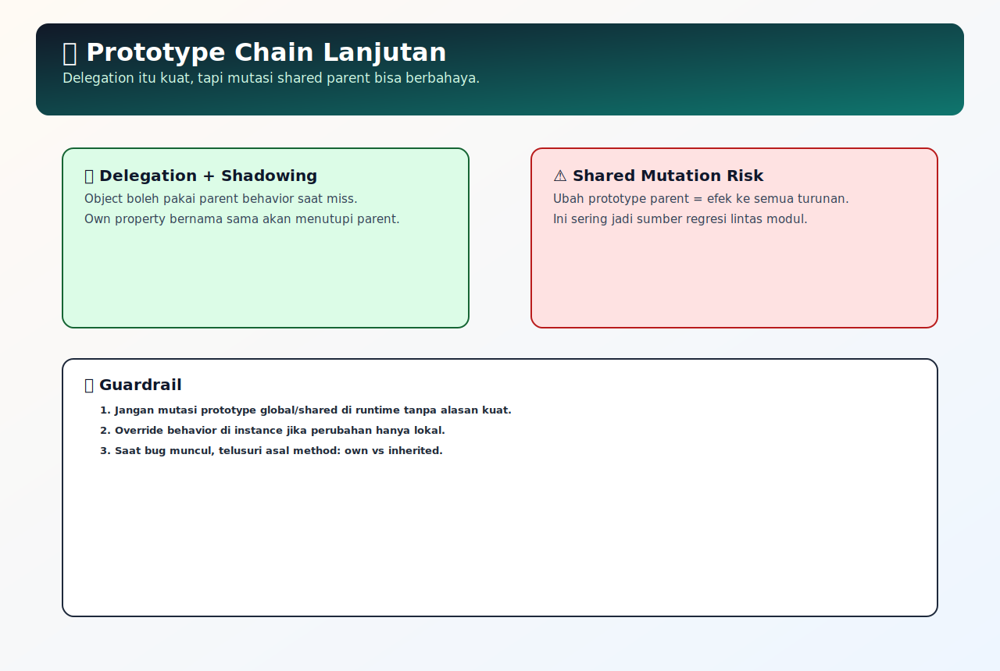

# Prototype Chain Lanjutan

## Tujuan Pembelajaran

- Bisa menjelaskan shadowing dan delegation dengan contoh.
- Bisa mengidentifikasi dampak mutasi prototype shared.
- Bisa membaca alur lookup 3 level prototype tanpa menjalankan kode.

## Konsep Utama

- Shadowing: property lokal menimpa property bernama sama dari prototype.
- Delegation: object mendelegasikan lookup ke prototype.
- Mutation risk: perubahan prototype berdampak ke banyak object turunan.
- Prototype pollution: injeksi property berbahaya ke prototype bersama.
- Prototype chain: rantai pencarian property dari object ke atas.

### Prasyarat dan Kamus Mini

Rujukan cepat:
- Dasar umum: [`../PRASYARAT-DAN-KAMUS-MINI.md`](../PRASYARAT-DAN-KAMUS-MINI.md)
- Alur topik: [`../docs/learning-path.md`](../docs/learning-path.md)
- Visual map: [`../assets/prototype-chain-advanced-map.svg`](../assets/prototype-chain-advanced-map.svg)

Alur topik:
- Topik ini ada di urutan ke-`2` pada Buku 04.
- Prasyarat langsung: `01-object-prototype-dasar.md`.
- Lanjut setelah ini: `03-prototype-chain-lookup.md`.

Prasyarat topik:
- Sudah paham lookup property dasar pada prototype chain.
- Sudah paham perbedaan own property dan inherited property.

Referensi remedial:
- [`01-object-prototype-dasar.md`](./01-object-prototype-dasar.md)
- [`../../02-javascript-runtime-first-principles/docs/prasyarat/object-dasar.md`](../../02-javascript-runtime-first-principles/docs/prasyarat/object-dasar.md)

Kamus mini topik:
- `[baru]` Shadowing: property lokal menimpa property bernama sama dari prototype.
- `[baru]` Delegation: object mendelegasikan lookup ke prototype.
- `[baru]` Mutation risk: perubahan prototype berdampak ke banyak object turunan.
- `[baru]` Prototype pollution: injeksi property berbahaya ke prototype bersama.
- `[ulang]` Prototype chain: rantai pencarian property dari object ke atas.

## Penjelasan

### Pengantar Singkat Topik

Prototype chain lanjutan membahas delegasi perilaku antar object sekaligus risikonya saat prototype diubah. Ini penting untuk menjaga desain inheritance tetap aman di codebase yang berkembang.

### Big Picture

Bug lintas modul sering muncul ketika perubahan pada prototype shared tidak dipahami dampaknya ke semua turunan. Topik ini menjelaskan prototype chain sebagai mekanisme delegasi sekaligus titik risiko seperti shadowing, mutasi shared parent, dan prototype pollution. Setelah paham, kamu bisa mengambil keputusan desain inheritance yang lebih aman dan menempatkan override di level yang tepat.

### Small Picture

1. Saat property diakses, engine cari di own property terlebih dahulu.
2. Jika tidak ada, engine naik ke prototype secara berantai.
3. Jika own property dibuat dengan nama yang sama, property prototype jadi tertutup (shadowing).
4. Jika prototype bersama dimodifikasi, seluruh object turunan bisa ikut berubah.
5. Karena itu, perubahan prototype harus eksplisit dan terkendali.

## Diagram Konsep (Opsional)



### Wireframe

```text
Alur utama:
[obj.prop diakses] -> [cek own property] -> [delegasi ke prototype chain]

Alur jalan:
[prop tidak ada di obj] -> [ditemukan di parent prototype] -> [nilai dikembalikan]

Alur error:
[prototype shared dimutasi sembarang] -> [semua turunan ikut terpengaruh] -> [bug lintas modul]
```

## Contoh Kode

```js
const baseUser = {
  role: 'user',
  canEdit() {
    return false;
  },
};

const admin = Object.create(baseUser);
admin.role = 'admin'; // shadowing
admin.canEdit = function () {
  return true;
};

const guest = Object.create(baseUser);

console.log(admin.role);        // admin
console.log(guest.role);        // user
console.log(admin.canEdit());   // true
console.log(guest.canEdit());   // false
```

### Bedah Output (Langkah Demi Langkah)
1. `admin` dan `guest` sama-sama mewarisi `baseUser`.
2. `admin.role = 'admin'` membuat own property baru, menimpa (`shadow`) `role` dari prototype.
3. `guest.role` tidak punya own property `role`, jadi lookup naik ke `baseUser.role`.
4. `admin.canEdit` di-override lokal, jadi hasil `true`.
5. `guest.canEdit` tetap menggunakan method dari prototype `baseUser`, hasil `false`.

## Analogi Singkat (Opsional)

Bayangkan SOP perusahaan:
- Aturan tim lokal = own property.
- Aturan pusat perusahaan = prototype.
Jika tim lokal tidak punya aturan, mereka mengikuti aturan pusat (delegation).
Jika aturan pusat diubah sembarangan, semua tim ikut terdampak.

## Eksperimen Kode

```js
const root = { status: 'active' };
const child = Object.create(root);
const grandChild = Object.create(child);

grandChild.status = 'paused';

console.log(root.status);
console.log(child.status);
console.log(grandChild.status);
console.log(grandChild.hasOwnProperty('status'));
```

### Kunci Jawaban Drill
- `root.status` -> `active`
- `child.status` -> `active` (delegasi ke `root`)
- `grandChild.status` -> `paused` (shadowing di own property)
- `grandChild.hasOwnProperty('status')` -> `true`

## Common Misconception (Opsional)

- Mengira perubahan object turunan otomatis mengubah prototype parent.
- Lupa efek global saat memodifikasi prototype shared.
- Tidak membedakan property hasil shadowing vs property dari prototype.
- Mengabaikan risiko prototype pollution dari input tak tervalidasi.

## Cakupan dan Batasan

- Dipakai untuk: berbagi method lintas banyak object, model inheritance berbasis delegasi.
- Alasan pakai: hemat memori dan menjaga perilaku umum di satu tempat.
- Kapan tidak dipakai: hindari mutasi prototype global/shared jika tim butuh perilaku yang stabil.

## Latihan

1. Bangun rantai 
oot -> child -> grandChild, lalu uji kapan nilai didapat dari delegation dan kapan tertutup karena shadowing.
2. Simulasikan mutasi pada prototype shared dan catat object turunan mana saja yang ikut berubah.
3. Buat checklist debugging untuk kasus bug lintas modul yang dipicu perubahan prototype bersama.

### Debug Story

Kasus: method helper berubah perilaku di banyak modul sekaligus setelah satu refactor.
Langkah debug:
1. Cek apakah method tersebut didefinisikan di prototype shared.
2. Telusuri commit yang memodifikasi prototype object dasar.
3. Batasi efek dengan memindahkan override ke object spesifik jika perubahan tidak global.

### Checkpoint

- [ ] Bisa menjelaskan shadowing dan delegation dengan contoh.
- [ ] Bisa mengidentifikasi dampak mutasi prototype shared.
- [ ] Bisa membaca alur lookup 3 level prototype tanpa menjalankan kode.

### Bacaan Remedial

1. Ulangi topik dasar: `01-object-prototype-dasar.md`.
2. Buat 3 level object (`root -> child -> grandChild`) lalu latih shadowing.
3. Gunakan `hasOwnProperty` untuk memisahkan own vs inherited property.

## Ringkasan

- Prototype chain lanjutan menekankan delegation, shadowing, dan dampak perubahan pada prototype shared.
- Mutasi parent prototype bisa memicu efek global pada seluruh turunan jika tidak dikontrol.
- Model inheritance aman membutuhkan batas jelas antara behavior bersama dan override lokal.

## Lanjut Setelah Ini

- [03-prototype-chain-lookup.md](./03-prototype-chain-lookup.md)


