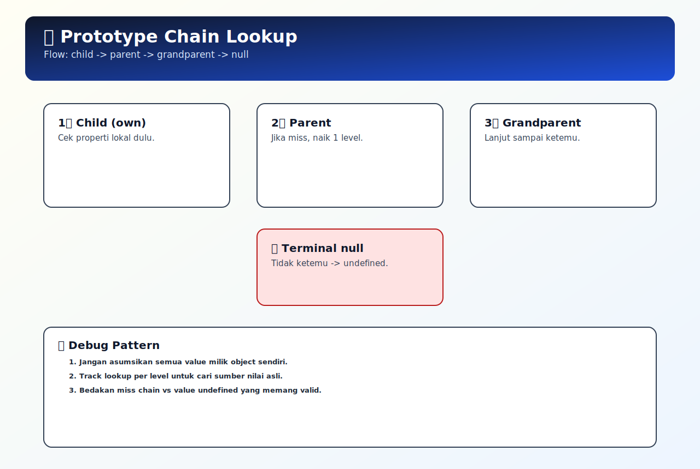

# Prototype Chain Lookup

## Tujuan Pembelajaran

- Bisa melacak asal property: own atau inherited.
- Bisa menjelaskan kapan lookup berhenti dan kapan lanjut ke parent.
- Bisa menghindari bug akibat mutasi prototype shared.

## Konsep Utama

- `[[Prototype]]` slot: referensi internal object ke prototype-nya.
- Own property check: pemeriksaan property langsung milik object saat ini.
- Lookup miss: kondisi property tidak ditemukan di satu level prototype.
- Terminal null: akhir prototype chain ketika parent bernilai `null`.
- Shadowing: property lokal menutupi property bernama sama di prototype.

### Prasyarat dan Kamus Mini

Rujukan cepat:
- Dasar umum: [`../PRASYARAT-DAN-KAMUS-MINI.md`](../PRASYARAT-DAN-KAMUS-MINI.md)
- Alur topik: [`../docs/learning-path.md`](../docs/learning-path.md)
- Visual map: [`../assets/prototype-chain-lookup-map.svg`](../assets/prototype-chain-lookup-map.svg)

Alur topik:
- Topik ini ada di urutan ke-`3` pada Buku 04.
- Prasyarat langsung: `02-prototype-chain-lanjutan.md`.
- Lanjut setelah ini: `04-property-descriptors-dasar.md`.

Prasyarat topik:
- Sudah paham object/prototype dasar dan prototype chain lanjutan.
- Sudah paham perbedaan lookup identifier vs lookup property.

Referensi remedial:
- [`01-object-prototype-dasar.md`](./01-object-prototype-dasar.md)
- [`02-prototype-chain-lanjutan.md`](./02-prototype-chain-lanjutan.md)
- [`../../02-javascript-runtime-first-principles/topics/09-scope-chain-lookup.md`](../../02-javascript-runtime-first-principles/topics/09-scope-chain-lookup.md)

Kamus mini topik:
- `[baru]` `[[Prototype]]` slot: referensi internal object ke prototype-nya.
- `[baru]` Own property check: pemeriksaan property langsung milik object saat ini.
- `[baru]` Lookup miss: kondisi property tidak ditemukan di satu level prototype.
- `[baru]` Terminal null: akhir prototype chain ketika parent bernilai `null`.
- `[ulang]` Shadowing: property lokal menutupi property bernama sama di prototype.

## Penjelasan

### Pengantar Singkat Topik

Prototype chain lookup membahas langkah mesin saat mencari property pada object beserta jalur naik ke parent prototype. Topik ini membantu membedakan masalah data tidak ada, tertutup shadowing, atau memang berhenti di `null`.

### Big Picture

Masalah pada kode berbasis object sering muncul ketika kita salah menebak dari level mana property diambil. Topik ini menjelaskan urutan lookup property: cek own property, naik ke `[[Prototype]]`, dan berhenti saat ketemu atau mencapai terminal `null`. Setelah paham, kamu bisa mengambil keputusan desain object yang lebih aman, menghindari mutasi tak sengaja di level prototype, dan debug lookup miss dengan cepat.

### Small Picture

1. Saat `obj.prop` diakses, engine cek dulu own property di `obj`.
2. Jika miss, engine baca `[[Prototype]]` internal dari `obj`.
3. Di parent prototype, engine ulangi proses cek property.
4. Jika ketemu di salah satu level, nilai langsung dikembalikan.
5. Jika terus miss sampai prototype `null`, hasil akhir `undefined`.

## Diagram Konsep (Opsional)



### Wireframe

```text
Alur utama:
[akses obj.prop] -> [cek own property] -> [naik `[[Prototype]]` berantai] -> [nilai ditemukan]

Alur jalan:
[prop ada di parent prototype] -> [lookup berhenti di level parent] -> [nilai dipakai]

Alur error:
[asumsi prop milik own object] -> [ternyata dari prototype shared] -> [mutasi/override salah target]
```

## Contoh Kode

```js
const base = { role: 'user', canEdit: false };
const manager = Object.create(base);
manager.team = 'A';

console.log(manager.team);    // A (own)
console.log(manager.role);    // user (prototype)
console.log(manager.canEdit); // false (prototype)
console.log(manager.level);   // undefined (lookup miss sampai null)
```

### Bedah Output (Langkah Demi Langkah)
1. `manager.team` ditemukan langsung sebagai own property.
2. `manager.role` tidak ada di own, lookup naik ke `base` dan menemukan `role`.
3. `manager.canEdit` juga ditemukan di `base`.
4. `manager.level` miss di `manager`, miss di `base`, lalu chain berakhir di `null`.
5. Karena terminal `null`, hasil akhir `undefined`.

## Analogi Singkat (Opsional)

Bayangkan mencari alat kerja:
- Laci pribadi = own property.
- Lemari tim = parent prototype.
- Gudang kantor = prototype level atas.
Kamu cek dari yang paling dekat dulu; kalau ketemu, berhenti, tidak lanjut ke gudang lain.

## Eksperimen Kode

```js
const grand = { a: 1 };
const parent = Object.create(grand);
parent.b = 2;
const child = Object.create(parent);
child.a = 9;

console.log(child.a);
console.log(child.b);
console.log(child.c);
```

### Kunci Jawaban Drill
- `child.a` -> `9` (own property shadowing)
- `child.b` -> `2` (ditemukan di parent)
- `child.c` -> `undefined` (miss sampai `null`)
- Alasan: lookup selalu dari level child ke atas hingga ketemu atau chain habis.

## Common Misconception (Opsional)

- Mengira `obj.prop` selalu membaca data milik object sendiri.
- Mengubah prototype shared tanpa sadar efeknya ke banyak turunan.
- Salah memakai `in` saat sebenarnya butuh cek own property (`hasOwnProperty`/`Object.hasOwn`).

## Cakupan dan Batasan

- Dipakai untuk: debugging inheritance object, audit shadowing, dan validasi sumber property.
- Alasan pakai: memperjelas asal nilai property sehingga perubahan behavior lebih terkontrol.
- Kapan tidak dipakai: tidak perlu mendalam untuk object flat tanpa pewarisan.

## Latihan

1. Buat tiga skenario lookup: property ditemukan di own object, di parent prototype, dan tidak ditemukan sama sekali.
2. Prediksi hasil akses property tanpa menjalankan kode, lalu verifikasi dengan output aktual.
3. Gunakan `Object.getPrototypeOf` berulang untuk memetakan jalur lookup sampai `null`.

### Debug Story

Kasus: flag permission tiba-tiba berubah di banyak object turunan.
Langkah debug:
1. Cek apakah property tersebut sebenarnya berasal dari prototype shared.
2. Audit perubahan terbaru apakah ada mutasi langsung ke prototype parent.
3. Pindahkan property yang harus unik ke own property masing-masing object.
4. Tambahkan test untuk membedakan behavior own vs inherited.

### Checkpoint

- [ ] Bisa melacak asal property: own atau inherited.
- [ ] Bisa menjelaskan kapan lookup berhenti dan kapan lanjut ke parent.
- [ ] Bisa menghindari bug akibat mutasi prototype shared.

### Bacaan Remedial

1. Ulangi `01-object-prototype-dasar.md`.
2. Ulangi `02-prototype-chain-lanjutan.md`.
3. Latih tiga skenario: own hit, inherited hit, dan lookup miss.

## Ringkasan

- Lookup property tidak melakukan copy data, tetapi menelusuri rantai prototype secara bertahap.
- Urutan prioritas selalu own property terlebih dahulu sebelum naik ke parent prototype.
- Memahami titik berhenti lookup mempermudah diagnosis nilai undefined yang membingungkan.

## Lanjut Setelah Ini

- [04-property-descriptors-dasar.md](./04-property-descriptors-dasar.md)


