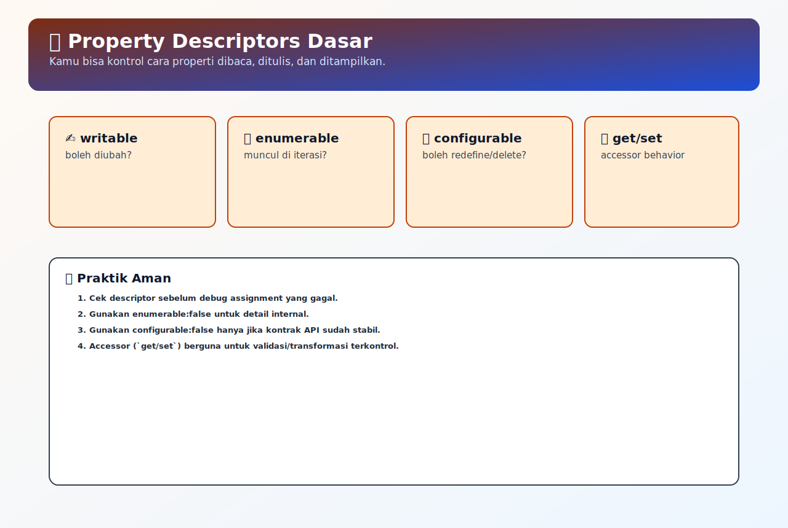

# Property Descriptors Dasar

## Tujuan Pembelajaran

- Bisa menjelaskan arti `writable`, `enumerable`, `configurable`.
- Bisa membuat property read-only dengan `defineProperty`.
- Bisa membedakan data property dan accessor property secara praktis.

## Konsep Utama

- Descriptor: metadata property (`value`, `writable`, `enumerable`, `configurable`).
- Accessor property: property berbasis `get/set`.
- Data property: property dengan nilai langsung (`value`).
- Own property: property langsung milik object.

### Prasyarat dan Kamus Mini

Rujukan cepat:
- Dasar umum: [`../PRASYARAT-DAN-KAMUS-MINI.md`](../PRASYARAT-DAN-KAMUS-MINI.md)
- Alur topik: [`../docs/learning-path.md`](../docs/learning-path.md)
- Visual map: [`../assets/property-descriptor-map.svg`](../assets/property-descriptor-map.svg)

Alur topik:
- Topik ini ada di urutan ke-`4` pada Buku 04.
- Prasyarat langsung: `03-prototype-chain-lookup.md`.
- Lanjut setelah ini: `05-class-constructor-dan-new.md`.

Prasyarat topik:
- Sudah paham own vs inherited property.
- Sudah paham lookup property dasar.

Referensi remedial:
- [`01-object-prototype-dasar.md`](./01-object-prototype-dasar.md)
- [`03-prototype-chain-lookup.md`](./03-prototype-chain-lookup.md)

Kamus mini topik:
- `[baru]` Descriptor: metadata property (`value`, `writable`, `enumerable`, `configurable`).
- `[baru]` Accessor property: property berbasis `get/set`.
- `[baru]` Data property: property dengan nilai langsung (`value`).
- `[ulang]` Own property: property langsung milik object.

## Penjelasan

### Pengantar Singkat Topik

Property descriptor menentukan bagaimana sebuah property bisa dibaca, ditulis, ditampilkan, atau dihapus. Memahami descriptor penting untuk membuat API object yang lebih aman dan eksplisit.

### Big Picture

Bug object sering terjadi bukan karena property tidak ada, tetapi karena aturan property tidak dipahami (`writable`, `configurable`, dan `enumerable`). Topik ini menjelaskan descriptor sebagai kontrak perilaku property agar perubahan object bisa dikontrol dengan sadar.

### Small Picture

1. `Object.getOwnPropertyDescriptor` dipakai untuk melihat metadata property.
2. `Object.defineProperty` dipakai untuk mengatur descriptor secara eksplisit.
3. `writable: false` mencegah perubahan nilai.
4. `enumerable: false` menyembunyikan property dari iterasi umum.
5. `configurable: false` mencegah re-define/hapus property.

## Diagram Konsep (Opsional)



### Wireframe

```text
Alur utama:
[define property] -> [set descriptor] -> [perilaku property terkontrol]

Alur jalan:
[writable false] -> [assignment diabaikan / error strict mode] -> [nilai tetap]

Alur error:
[anggap semua property writable] -> [update gagal diam-diam] -> [state membingungkan]
```

## Contoh Kode

```js
const user = {};

Object.defineProperty(user, 'id', {
  value: 101,
  writable: false,
  enumerable: true,
  configurable: false,
});

user.id = 202; // gagal ubah
console.log(user.id); // 101
```

### Bedah Output (Langkah Demi Langkah)
1. Property `id` dibuat sebagai data property.
2. Karena `writable: false`, assignment baru tidak mengubah nilai.
3. `console.log` tetap menampilkan `101`.

## Analogi Singkat (Opsional)

Bayangkan lemari arsip:
- `writable` = boleh isi ulang dokumen atau tidak.
- `enumerable` = dokumen muncul di daftar umum atau tidak.
- `configurable` = label dokumen bisa diganti/dihapus atau tidak.

## Eksperimen Kode

```js
const obj = {};
Object.defineProperty(obj, 'x', {
  value: 10,
  writable: false,
  enumerable: false,
});

obj.x = 99;
console.log(obj.x);
console.log(Object.keys(obj));
```

### Kunci Jawaban Drill
- `obj.x` -> `10`
- `Object.keys(obj)` -> `[]`
- Alasan: `x` read-only dan non-enumerable.

## Common Misconception (Opsional)

- Lupa default descriptor `defineProperty` cenderung restrictive jika tidak diset.
- Mengira `configurable: false` masih bisa redefine bebas.
- Salah pakai getter/setter sehingga side effect sulit dilacak.

## Cakupan dan Batasan

- Dipakai untuk: membuat property read-only, hidden internals, controlled APIs.
- Alasan pakai: mencegah mutasi tidak sengaja dan memperjelas kontrak object.
- Kapan tidak dipakai: hindari over-engineering jika object sederhana dan tidak dibagikan lintas modul.

## Latihan

1. Definisikan properti dengan kombinasi writable, enumerable, dan configurable berbeda, lalu uji perilakunya.
2. Bandingkan hasil `for...in`, `Object.keys`, dan assignment pada properti enumerable vs non-enumerable.
3. Buat contoh gagal ubah properti non-writable, lalu jelaskan kenapa runtime menolak perubahan.

### Debug Story

Kasus: nilai config tidak pernah berubah meskipun assignment sudah dijalankan.
Langkah debug:
1. Cek descriptor pakai `Object.getOwnPropertyDescriptor`.
2. Pastikan `writable/configurable` sesuai kebutuhan.
3. Jika read-only memang sengaja, ubah alur update ke object baru (immutable style).

### Checkpoint

- [ ] Bisa menjelaskan arti `writable`, `enumerable`, `configurable`.
- [ ] Bisa membuat property read-only dengan `defineProperty`.
- [ ] Bisa membedakan data property dan accessor property secara praktis.

### Bacaan Remedial

1. Ulangi `01-object-prototype-dasar.md`.
2. Coba eksperimen descriptor satu per satu.
3. Gunakan `getOwnPropertyDescriptor` setiap selesai eksperimen.

## Ringkasan

- Descriptor menentukan aturan baca/tulis/iterasi/konfigurasi sebuah properti.
- Perilaku object sering terlihat aneh jika flag descriptor tidak diperiksa.
- Pemeriksaan descriptor membuat proses debugging mutasi properti jauh lebih presisi.

## Lanjut Setelah Ini

- [05-class-constructor-dan-new.md](./05-class-constructor-dan-new.md)


