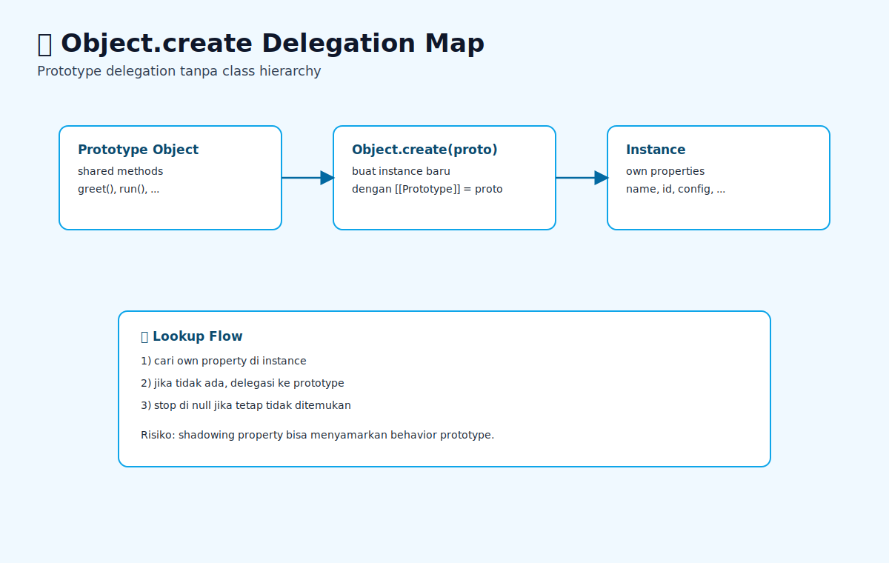

# Object.create dan Delegation Patterns

## Tujuan Pembelajaran

- Bisa menjelaskan delegation berbasis prototype tanpa class.
- Bisa memakai `Object.create` untuk factory sederhana.
- Bisa mendeteksi bug shadowing pada own property.

## Konsep Utama

- Delegation: object meneruskan lookup behavior ke prototype.
- Factory delegation: pembuatan object tanpa class, berbasis prototype delegation.
- `Object.create`: membuat object dengan prototype eksplisit.

### Prasyarat dan Kamus Mini

Rujukan cepat:
- Dasar umum: [`../PRASYARAT-DAN-KAMUS-MINI.md`](../PRASYARAT-DAN-KAMUS-MINI.md)
- Alur topik: [`../docs/learning-path.md`](../docs/learning-path.md)
- Visual map: [`../assets/object-create-delegation-patterns-map.svg`](../assets/object-create-delegation-patterns-map.svg)\n- Remedial prototype: [`02-prototype-chain-lanjutan.md`](./02-prototype-chain-lanjutan.md)

Alur topik:
- Topik ini ada di urutan ke-`7` pada Buku 04.
- Prasyarat langsung: `06-composition-vs-inheritance.md`.
- Lanjut setelah ini: `08-property-descriptors-lanjutan-dan-defineproperty.md`.

Prasyarat topik:
- Sudah paham prototype chain dasar.
- Sudah paham perbedaan own property vs inherited property.

Referensi remedial:
- [`01-object-prototype-dasar.md`](./01-object-prototype-dasar.md)
- [`03-prototype-chain-lookup.md`](./03-prototype-chain-lookup.md)

Kamus mini topik:
- `[baru]` Delegation: object meneruskan lookup behavior ke prototype.
- `[baru]` Factory delegation: pembuatan object tanpa class, berbasis prototype delegation.
- `[ulang]` `Object.create`: membuat object dengan prototype eksplisit.

## Penjelasan

### Pengantar Singkat Topik

`Object.create` memberi kontrol langsung terhadap prototype object. Topik ini membahas pola delegation tanpa class ketika kamu butuh object yang ringan dan eksplisit.

### Big Picture

Banyak codebase terlalu cepat lompat ke class. Padahal untuk beberapa kasus, delegation lewat `Object.create` lebih sederhana, fleksibel, dan minim boilerplate. Topik ini membantu kamu memilih model object berbasis prototype secara sadar.

### Small Picture

1. Tentukan object prototype berisi behavior umum.
2. Buat instance dengan `Object.create(proto)`.
3. Tambahkan own property spesifik pada instance.
4. Akses method lewat delegation ke prototype.
5. Gunakan ini saat tidak butuh hierarchy class kompleks.

## Diagram Konsep (Opsional)



### Wireframe

```text
Alur utama:
[define prototype behavior] -> [Object.create] -> [instance pakai delegation]

Alur jalan:
[shared method di prototype] -> [hemat duplikasi method]

Alur error:
[salah set prototype] -> [lookup tidak sesuai] -> [method undefined]
```

## Contoh Kode

```js
const userProto = {
  greet() {
    return `Halo ${this.name}`;
  },
};

const u1 = Object.create(userProto);
u1.name = 'Nina';

console.log(u1.greet());
```

### Bedah Output (Langkah Demi Langkah)
1. `u1` tidak punya own method `greet`.
2. Saat `u1.greet()` dipanggil, engine lookup ke prototype (`userProto`).
3. Method dieksekusi dengan `this = u1`.
4. Output: `Halo Nina`.

## Analogi Singkat (Opsional)

Seperti punya template SOP tim. Member tim baru mengacu SOP pusat, tapi tetap punya catatan personal masing-masing.

## Eksperimen Kode

```js
const base = { x: 1 };
const obj = Object.create(base);
obj.x = 2;
console.log(obj.x, base.x);
```

### Kunci Jawaban Drill
- Output: `2 1`
- Alasan: `obj.x` menjadi own property yang men-shadow `base.x`.

## Common Misconception (Opsional)

- Menaruh state mutable shared di prototype.
- Lupa set own property yang dibutuhkan method.
- Mengira `Object.create(null)` punya method bawaan object.

## Cakupan dan Batasan

- Dipakai untuk: object factory ringan, plugin behavior, mock object sederhana.
- Alasan pakai: kontrol prototype eksplisit, tanpa overhead class inheritance.
- Kapan tidak dipakai: jika tim kamu sudah sangat bergantung pada idiom class untuk konsistensi.

## Latihan

1. Buat factory berbasis Object.create untuk menghasilkan beberapa object dengan behavior shared.
2. Tambahkan override method pada salah satu turunan dan buktikan object lain tidak terdampak.
3. Bandingkan readability dan footprint kode antara pola delegation ini dengan class sederhana.

### Debug Story

Kasus: method object tiba-tiba `undefined` setelah refactor factory.
Langkah debug:
1. Cek hasil `Object.getPrototypeOf(instance)`.
2. Pastikan prototype mengarah ke object behavior yang benar.
3. Pastikan method tidak tertimpa own property non-function.

### Checkpoint

- [ ] Bisa menjelaskan delegation berbasis prototype tanpa class.
- [ ] Bisa memakai `Object.create` untuk factory sederhana.
- [ ] Bisa mendeteksi bug shadowing pada own property.

### Bacaan Remedial

1. Ulangi `02-prototype-chain-lanjutan.md`.
2. Uji `Object.getPrototypeOf` di beberapa object.
3. Bandingkan factory class vs factory `Object.create`.

## Ringkasan

- Object.create memberi kontrol eksplisit terhadap hubungan prototype antar object.
- Delegation pattern efektif untuk berbagi behavior tanpa boilerplate class yang berlebihan.
- Override lokal tetap perlu disiplin agar alur lookup tidak menjadi implicit dan sulit dibaca.

## Lanjut Setelah Ini

- [08-property-descriptors-lanjutan-dan-defineproperty.md](./08-property-descriptors-lanjutan-dan-defineproperty.md)


