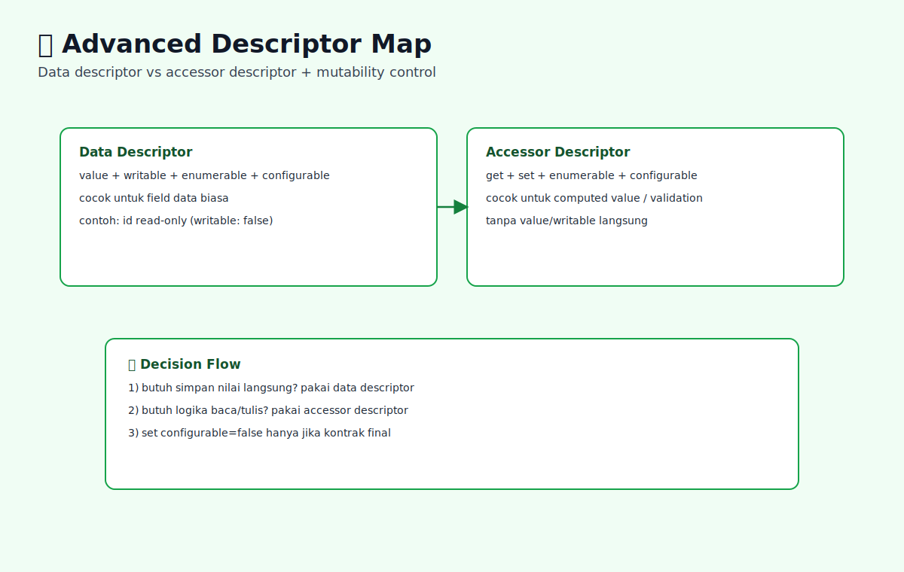

# Property Descriptors Lanjutan dan Object.defineProperty

## Tujuan Pembelajaran

- Bisa membedakan data descriptor vs accessor descriptor.
- Bisa mendesain properti read-only secara sadar.
- Bisa debug isu mutasi berdasarkan descriptor aktual.

## Konsep Utama

- Data descriptor: descriptor dengan `value`/`writable`.
- Accessor descriptor: descriptor dengan `get`/`set`.
- Non-configurable: properti yang tidak bisa dihapus/diubah descriptor intinya.

### Prasyarat dan Kamus Mini

Rujukan cepat:
- Dasar umum: [`../PRASYARAT-DAN-KAMUS-MINI.md`](../PRASYARAT-DAN-KAMUS-MINI.md)
- Alur topik: [`../docs/learning-path.md`](../docs/learning-path.md)
- Visual map: [`../assets/property-descriptors-advanced-defineproperty-map.svg`](../assets/property-descriptors-advanced-defineproperty-map.svg)

Alur topik:
- Topik ini ada di urutan ke-`8` pada Buku 04.
- Prasyarat langsung: `07-object-create-dan-delegation-patterns.md`.
- Lanjut setelah ini: `09-internal-methods-get-set-dan-defineownproperty.md`.

Prasyarat topik:
- Sudah paham descriptor dasar (`writable`, `enumerable`, `configurable`).
- Sudah paham `Object.defineProperty` level dasar.

Referensi remedial:
- [`04-property-descriptors-dasar.md`](./04-property-descriptors-dasar.md)

Kamus mini topik:
- `[baru]` Data descriptor: descriptor dengan `value`/`writable`.
- `[baru]` Accessor descriptor: descriptor dengan `get`/`set`.
- `[baru]` Non-configurable: properti yang tidak bisa dihapus/diubah descriptor intinya.

## Penjelasan

### Pengantar Singkat Topik

Topik ini memperdalam descriptor untuk desain API object yang lebih ketat, aman, dan jelas batas mutasinya.

### Big Picture

Descriptor lanjutan penting saat kamu butuh object dengan kontrak ketat. Tanpa pemahaman ini, property bisa berubah tak terkontrol dan menimbulkan bug halus di runtime.

### Small Picture

1. Tentukan apakah properti bersifat data atau accessor.
2. Pilih attribute descriptor sesuai kontrak API.
3. Gunakan non-configurable hanya jika benar-benar final.
4. Kombinasikan dengan `Object.freeze/seal` bila perlu.
5. Pastikan perilaku descriptor terdokumentasi di tim.

## Diagram Konsep (Opsional)



### Wireframe

```text
Alur utama:
[butuh kontrol property] -> [pilih descriptor type] -> [defineProperty]

Alur jalan:
[descriptor tepat] -> [mutasi terkontrol] -> [bug berkurang]

Alur error:
[salah descriptor] -> [property sulit diubah/didebug] -> [regresi]
```

## Contoh Kode

```js
const user = {};
Object.defineProperty(user, 'id', {
  value: 123,
  writable: false,
  enumerable: true,
  configurable: false,
});

user.id = 999;
console.log(user.id);
```

### Bedah Output (Langkah Demi Langkah)
1. `id` didefinisikan read-only.
2. Assignment `user.id = 999` gagal mengubah nilai.
3. Nilai tetap `123`.
4. Perilaku ini melindungi identity field dari mutasi tak sengaja.

## Analogi Singkat (Opsional)

Seperti membuat pintu dengan akses card tertentu: ada pintu read-only, ada pintu khusus admin, ada yang permanen terkunci.

## Eksperimen Kode

```js
const obj = {};
Object.defineProperty(obj, 'x', { value: 1, writable: false });
obj.x = 2;
console.log(obj.x);
```

### Kunci Jawaban Drill
- Output: `1`
- Alasan: `x` non-writable sehingga assignment tidak mengubah nilai.

## Common Misconception (Opsional)

- Mencampur data descriptor dan accessor descriptor sekaligus.
- Menetapkan `configurable: false` terlalu dini.
- Mengira assignment gagal selalu melempar error (tergantung strict mode).

## Cakupan dan Batasan

- Dipakai untuk: config object, domain model, API internal library.
- Alasan pakai: menjaga invariants object dan mencegah mutasi liar.
- Kapan tidak dipakai: untuk object sementara/POJO sederhana yang tidak butuh kontrak ketat.

## Latihan

1. Gunakan Object.defineProperty untuk membuat properti read-only dan uji respons saat diubah.
2. Buat accessor get/set yang memvalidasi input, lalu catat dampaknya pada state object.
3. Rancang skenario transisi descriptor (`configurable` ke `false`) dan jelaskan batas perubahan setelahnya.

### Debug Story

Kasus: properti config tidak bisa diupdate setelah deploy.
Langkah debug:
1. Cek descriptor via `Object.getOwnPropertyDescriptor`.
2. Pastikan `writable/configurable` sesuai kebutuhan evolusi.
3. Jika terlalu ketat, revisi desain descriptor di tempat definisi awal.

### Checkpoint

- [ ] Bisa membedakan data descriptor vs accessor descriptor.
- [ ] Bisa mendesain properti read-only secara sadar.
- [ ] Bisa debug isu mutasi berdasarkan descriptor aktual.

### Bacaan Remedial

1. Ulangi `04-property-descriptors-dasar.md`.
2. Coba `Object.getOwnPropertyDescriptor` di beberapa object nyata.
3. Uji perilaku descriptor di strict dan non-strict mode.

## Ringkasan

- Descriptor lanjutan memungkinkan kontrol ketat terhadap mutasi dan visibilitas properti.
- Object.defineProperty relevan saat aturan data harus diproteksi di level object model.
- Tanpa pemahaman descriptor, perilaku update properti mudah disalahartikan sebagai bug acak.

## Lanjut Setelah Ini

- [09-internal-methods-get-set-dan-defineownproperty.md](./09-internal-methods-get-set-dan-defineownproperty.md)


