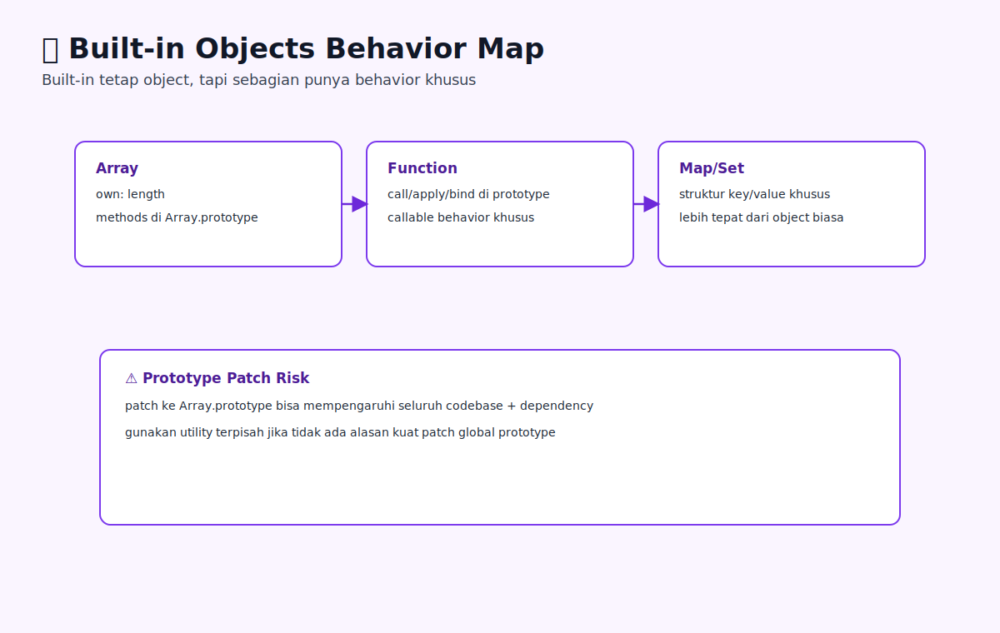

# Built-in Objects dan Behavior Khusus

## Tujuan Pembelajaran

- Bisa menjelaskan peran prototype pada built-in object.
- Bisa memilih built-in structure sesuai use case.
- Bisa mengidentifikasi risiko patch prototype global.

## Konsep Utama

- Built-in object: object bawaan JS seperti `Array`, `Function`, `Date`, `Map`.
- Exotic behavior: perilaku khusus yang tidak identik dengan object biasa.
- Prototype method sharing: method dibagi lewat prototype built-in.

### Prasyarat dan Kamus Mini

Rujukan cepat:
- Dasar umum: [`../PRASYARAT-DAN-KAMUS-MINI.md`](../PRASYARAT-DAN-KAMUS-MINI.md)
- Alur topik: [`../docs/learning-path.md`](../docs/learning-path.md)\n- Visual map: [`../assets/built-in-objects-behavior-khusus-map.svg`](../assets/built-in-objects-behavior-khusus-map.svg)

Alur topik:
- Topik ini ada di urutan ke-`11` pada Buku 04.
- Prasyarat langsung: `10-this-method-dispatch-dan-object-context.md`.
- Lanjut setelah ini: `12-proxy-reflect-dasar-dan-metaprogramming.md`.

Prasyarat topik:
- Sudah paham prototype chain dasar.
- Sudah paham descriptor dan method dispatch.

Referensi remedial:
- [`01-object-prototype-dasar.md`](./01-object-prototype-dasar.md)
- [`04-property-descriptors-dasar.md`](./04-property-descriptors-dasar.md)

Kamus mini topik:
- `[baru]` Built-in object: object bawaan JS seperti `Array`, `Function`, `Date`, `Map`.
- `[baru]` Exotic behavior: perilaku khusus yang tidak identik dengan object biasa.
- `[ulang]` Prototype method sharing: method dibagi lewat prototype built-in.

## Penjelasan

### Pengantar Singkat Topik

Topik ini membahas kenapa built-in objects punya perilaku yang kadang terasa "spesial", serta dampaknya saat desain API object sendiri.

### Big Picture

Memahami built-in object membuat kamu lebih hati-hati saat extending prototype global dan lebih tepat saat memilih struktur data (`Array` vs `Map`, dsb). Ini penting agar object model codebase tetap stabil.

### Small Picture

1. Built-in tetap object, tapi beberapa punya behavior khusus.
2. Method built-in umumnya tinggal di prototype masing-masing.
3. Extending prototype global berisiko memengaruhi code lintas modul.
4. Pilih built-in sesuai karakter data dan operasi dominan.
5. Hindari asumsi semua built-in punya semantics object biasa.

## Diagram Konsep (Opsional)



### Wireframe

```text
Alur utama:
[pilih built-in object] -> [gunakan method prototype relevan] -> [perilaku sesuai desain]

Alur jalan:
[pemilihan struktur data tepat] -> [kode lebih jelas dan efisien]

Alur error:
[patch prototype global sembarangan] -> [efek samping luas] -> [bug sulit dilacak]
```

## Contoh Kode

```js
const arr = [1, 2, 3];
console.log(arr.hasOwnProperty('length'));
console.log(typeof arr.map);
```

### Bedah Output (Langkah Demi Langkah)
1. `arr` punya own property khusus `length`.
2. `map` bukan own property, datang dari `Array.prototype`.
3. Ini menunjukkan kombinasi own property + delegated method.

## Analogi Singkat (Opsional)

Seperti memilih alat: obeng, palu, dan tang sama-sama alat, tapi tiap alat punya perilaku terbaik untuk kasus tertentu.

## Eksperimen Kode

```js
const arr = [1, 2];
console.log(arr.__proto__ === Array.prototype);
```

### Kunci Jawaban Drill
- Output: `true`
- Alasan: array instance berdelegasi ke `Array.prototype`.

## Common Misconception (Opsional)

- Menambah method ke `Array.prototype` di aplikasi besar tanpa kontrol.
- Memakai object biasa untuk key kompleks padahal `Map` lebih tepat.
- Mengira semua built-in bisa diperlakukan identik.

## Cakupan dan Batasan

- Dipakai untuk: pemilihan struktur data dan pemakaian method built-in yang tepat.
- Alasan pakai: menghindari misuse object generic untuk semua masalah.
- Kapan tidak dipakai: jangan over-abstract jika built-in langsung sudah cukup.

## Latihan

1. Identifikasi minimal tiga built-in object yang punya perilaku khusus, lalu dokumentasikan edge case pentingnya.
2. Buat eksperimen kecil tentang risiko patching prototype global dan observasi efek sampingnya.
3. Tulis guideline tim kapan patch prototype boleh dipertimbangkan dan kapan harus dilarang.

### Debug Story

Kasus: loop `for...in` menampilkan key tak terduga setelah integrasi library lama.
Langkah debug:
1. Cek apakah ada patch prototype global dari dependency.
2. Identifikasi property enumerable tambahan di prototype.
3. Ganti iterasi sensitif dengan `Object.keys`/`for...of` sesuai kebutuhan.

### Checkpoint

- [ ] Bisa menjelaskan peran prototype pada built-in object.
- [ ] Bisa memilih built-in structure sesuai use case.
- [ ] Bisa mengidentifikasi risiko patch prototype global.

### Bacaan Remedial

1. Ulangi `03-prototype-chain-lookup.md`.
2. Cek prototype berbagai built-in via console.
3. Bandingkan object biasa vs `Map` untuk key non-string.

## Ringkasan

- Built-in objects memiliki kontrak perilaku khusus yang harus dipahami sebelum dipakai intensif.
- Patching prototype global bisa menimbulkan dampak sistemik pada modul yang tidak terkait.
- Strategi aman adalah meminimalkan modifikasi global dan menjaga kompatibilitas perilaku default.

## Lanjut Setelah Ini

- [12-proxy-reflect-dasar-dan-metaprogramming.md](./12-proxy-reflect-dasar-dan-metaprogramming.md)


