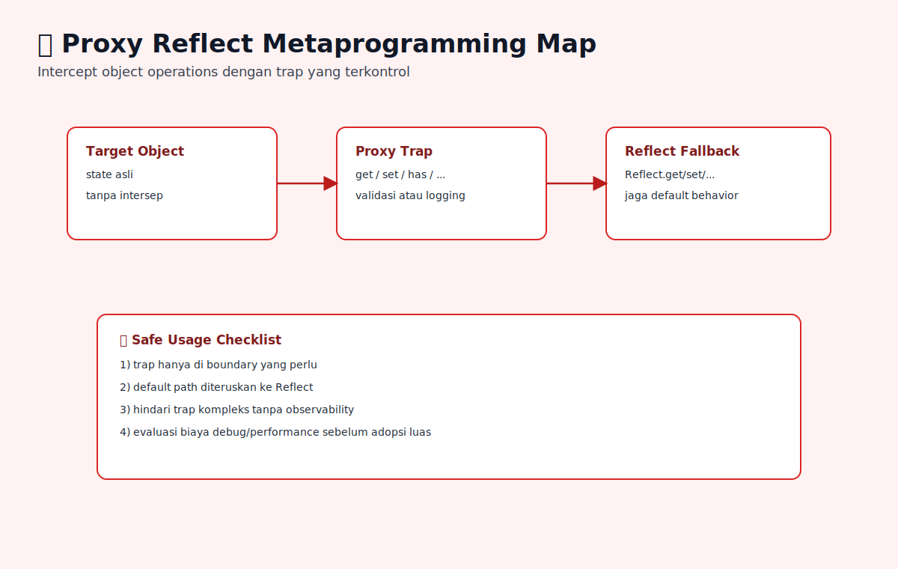

# Proxy, Reflect Dasar, dan Metaprogramming

## Tujuan Pembelajaran

- Bisa menjelaskan peran Proxy dan Reflect.
- Bisa membuat trap sederhana tanpa merusak behavior default.
- Bisa menentukan kapan Proxy layak dipakai dan kapan tidak.

## Konsep Utama

- Proxy: object pembungkus untuk intercept operasi object.
- Trap: handler untuk operasi tertentu (`get`, `set`, dll).
- Reflect: API standar untuk operasi object low-level.
- Metaprogramming: kode yang memodifikasi perilaku kode lain.

### Prasyarat dan Kamus Mini

Rujukan cepat:
- Dasar umum: [`../PRASYARAT-DAN-KAMUS-MINI.md`](../PRASYARAT-DAN-KAMUS-MINI.md)
- Alur topik: [`../docs/learning-path.md`](../docs/learning-path.md)\n- Visual map: [`../assets/proxy-reflect-metaprogramming-map.svg`](../assets/proxy-reflect-metaprogramming-map.svg)

Alur topik:
- Topik ini ada di urutan ke-`12` pada Buku 04.
- Prasyarat langsung: `11-built-in-objects-dan-behavior-khusus.md`.
- Lanjut setelah ini: `../../05-javascript-memory-and-references/topics/01-memory-lifecycle-garbage-collection.md`.

Prasyarat topik:
- Sudah paham descriptor, prototype, dan internal methods secara konsep.
- Sudah paham use case object model level menengah.

Referensi remedial:
- [`08-property-descriptors-lanjutan-dan-defineproperty.md`](./08-property-descriptors-lanjutan-dan-defineproperty.md)
- [`09-internal-methods-get-set-dan-defineownproperty.md`](./09-internal-methods-get-set-dan-defineownproperty.md)

Kamus mini topik:
- `[baru]` Proxy: object pembungkus untuk intercept operasi object.
- `[baru]` Trap: handler untuk operasi tertentu (`get`, `set`, dll).
- `[baru]` Reflect: API standar untuk operasi object low-level.
- `[ulang]` Metaprogramming: kode yang memodifikasi perilaku kode lain.

## Penjelasan

### Pengantar Singkat Topik

Topik ini menutup buku 04 dengan pengantar metaprogramming dasar menggunakan `Proxy` dan `Reflect` secara aman dan terukur.

### Big Picture

`Proxy` sangat kuat, tapi mudah disalahgunakan. Pahami kapan cocok dipakai (validation, logging, access control) dan kapan harus dihindari agar performa/debuggability tetap sehat.

### Small Picture

1. Bungkus target object dengan `new Proxy(target, handler)`.
2. Trap `get/set` bisa intercept read/write.
3. Gunakan `Reflect` untuk meneruskan behavior default.
4. Hindari trap berlebihan tanpa kebutuhan jelas.
5. Dokumentasikan kontrak Proxy karena behavior jadi implicit.

## Diagram Konsep (Opsional)



### Wireframe

```text
Alur utama:
[target object] -> [proxy trap] -> [custom behavior + Reflect fallback]

Alur jalan:
[validasi akses/mutasi] -> [error lebih awal] -> [state lebih aman]

Alur error:
[trap terlalu kompleks] -> [sulit debug/perf turun] -> [maintainability buruk]
```

## Contoh Kode

```js
const user = { name: 'Nina' };

const proxied = new Proxy(user, {
  get(target, prop, receiver) {
    console.log('read:', String(prop));
    return Reflect.get(target, prop, receiver);
  },
});

console.log(proxied.name);
```

### Bedah Output (Langkah Demi Langkah)
1. Akses `proxied.name` masuk trap `get`.
2. Trap mencatat log akses property.
3. `Reflect.get` meneruskan behavior default object.
4. Hasil tetap nilai asli `name`.

## Analogi Singkat (Opsional)

Seperti satpam di lobi gedung: semua request masuk bisa dicek dulu, lalu diteruskan ke ruangan asli jika valid.

## Eksperimen Kode

```js
const target = { n: 1 };
const p = new Proxy(target, {
  set(obj, key, value) {
    if (key === 'n' && value < 0) return false;
    return Reflect.set(obj, key, value);
  },
});

p.n = 2;
console.log(target.n);
```

### Kunci Jawaban Drill
- Output: `2`
- Alasan: assignment valid, trap meneruskan ke `Reflect.set`.

## Common Misconception (Opsional)

- Trap tidak meneruskan ke `Reflect` sehingga behavior default rusak.
- Memakai Proxy untuk semua object tanpa alasan jelas.
- Mengabaikan biaya debug/performance dari interception berlapis.

## Cakupan dan Batasan

- Dipakai untuk: validation layer, debug instrumentation, access control sederhana.
- Alasan pakai: intersep operasi object tanpa ubah call-site pemakai.
- Kapan tidak dipakai: untuk data model sederhana yang cukup dengan function biasa.

## Latihan

1. Buat Proxy dengan trap get dan set sederhana yang selalu fallback ke Reflect untuk behavior default.
2. Tambahkan validasi pada trap set, lalu ukur apakah aturan baru memudahkan atau mempersulit debugging.
3. Evaluasi satu kasus nyata di codebase: apakah butuh Proxy atau lebih baik function biasa.

### Debug Story

Kasus: state object berubah tak terduga setelah menambah Proxy logging.
Langkah debug:
1. Audit trap mana yang mengubah return semantics default.
2. Pastikan trap non-intervensi memakai `Reflect`.
3. Batasi penggunaan Proxy hanya di boundary yang benar-benar perlu.

### Checkpoint

- [ ] Bisa menjelaskan peran Proxy dan Reflect.
- [ ] Bisa membuat trap sederhana tanpa merusak behavior default.
- [ ] Bisa menentukan kapan Proxy layak dipakai dan kapan tidak.

### Bacaan Remedial

1. Ulangi `09-internal-methods-get-set-dan-defineownproperty.md`.
2. Uji trap `get` dan `set` di object kecil.
3. Bandingkan versi kode dengan/ tanpa Proxy dari sisi kompleksitas.

## Ringkasan

- Proxy memungkinkan interception operasi object, sedangkan Reflect menjaga fallback ke semantik default.
- Metaprogramming efektif hanya jika trap tetap sederhana dan kontraknya terdokumentasi.
- Penggunaan Proxy harus selektif agar biaya kompleksitas tidak melebihi manfaatnya.

## Lanjut Setelah Ini

- [../../05-javascript-memory-and-references/topics/01-memory-lifecycle-garbage-collection.md](./../../05-javascript-memory-and-references/topics/01-memory-lifecycle-garbage-collection.md)


