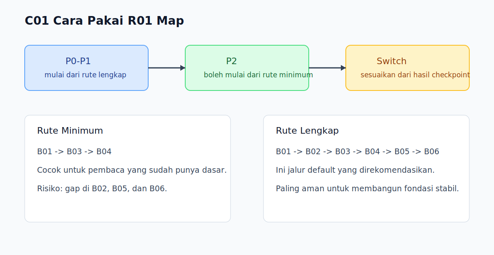

# C01 - Cara Pakai R01

## Tujuan

Bab ini membantu pembaca memilih rute belajar R01 yang sesuai dengan kondisi awalnya.

## Profil Masuk Pembaca

Sebelum memilih rute, tentukan profil awal:

- `P0`: belum pernah menulis JavaScript.
- `P1`: sudah pernah coba JavaScript, tapi belum stabil.
- `P2`: sudah bisa dasar, ingin merapikan fondasi.

## Rute Belajar

### Rute Minimum

- Selesaikan `B01` -> `B03` -> `B04`.
- Cocok untuk pembaca yang butuh cepat menulis program dasar.
- Profil yang cocok: `P2`.
- Risiko: gap pada types/coercion (`B02`) dan error/modules (`B06`).

### Rute Lengkap

- Selesaikan `B01` -> `B02` -> `B03` -> `B04` -> `B05` -> `B06`.
- Cocok untuk pembaca yang ingin fondasi stabil sebelum masuk runtime dan async.
- Profil yang cocok: `P0` dan `P1`.
- Rute ini direkomendasikan sebagai jalur default R01.

## Aturan Switching Rute

- Mulai dari rute lengkap.
- Jika 3 checkpoint awal selalu stabil, pembaca boleh percepat ritme.
- Jika 2 bab berturut-turut gagal checkpoint, kembali ke ritme rute lengkap.

## Aturan Umum

- Jangan loncat buku jika belum paham output buku sebelumnya.
- Gunakan latihan singkat tiap bab sebagai checkpoint.
- Catat bagian yang belum paham untuk diulang di akhir buku.

## Checklist Eksekusi Mingguan

- [ ] Menetapkan rute (`minimum` atau `lengkap`) di awal minggu.
- [ ] Menyelesaikan target buku sesuai rute.
- [ ] Menutup minggu dengan review singkat miskonsepsi.
- [ ] Menyesuaikan rute minggu berikutnya berdasarkan hasil checkpoint.

## Visual Map

