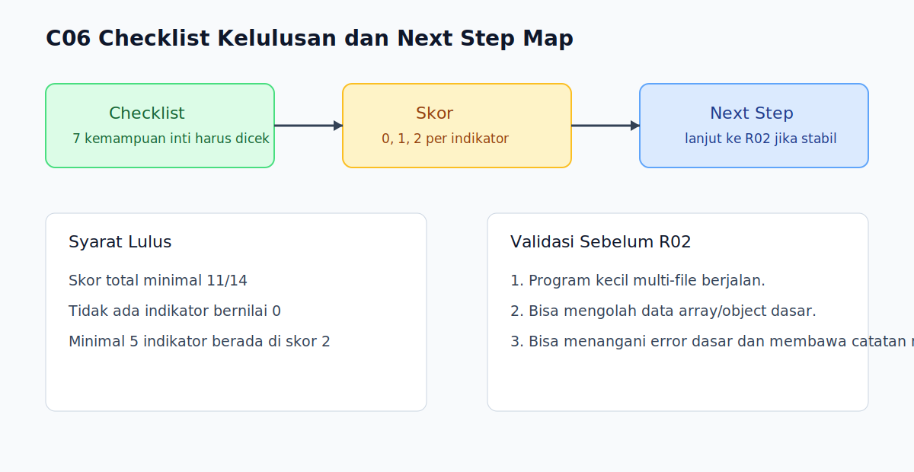

# C06 - Checklist Kelulusan dan Next Step

## Tujuan

Bab ini menutup R01 dengan evaluasi sederhana dan arah lanjut belajar.

## Checklist Kelulusan R01 (Wajib)

- [ ] Bisa menulis program dasar multi-file.
- [ ] Bisa menjelaskan perbedaan `==` dan `===` pada kasus umum.
- [ ] Bisa menggunakan `if`, `switch`, dan loop sesuai kebutuhan.
- [ ] Bisa menulis fungsi sederhana dengan parameter/return jelas.
- [ ] Bisa memakai object/array methods dasar secara tepat.
- [ ] Bisa menerapkan `try...catch` pada kasus validasi sederhana.
- [ ] Bisa memakai `import`/`export` dasar.

## Rubrik Skor Kelulusan

Gunakan skala berikut untuk tiap poin checklist:

- `0` = belum paham
- `1` = paham konsep, belum stabil praktik
- `2` = paham dan bisa praktik mandiri

### Cara Hitung

- Jumlah item: 7
- Skor maksimum: 14
- Batas kelulusan minimum: 11

### Syarat Lulus R01

- Skor total minimal `11/14`
- Tidak ada poin dengan skor `0`
- Minimal 5 poin berada di skor `2`

## Validasi Praktis Sebelum Lanjut

Sebelum masuk `R02`, pembaca sebaiknya menyelesaikan mini tugas berikut:

1. Membuat program kecil multi-file dengan `import/export`.
2. Memproses data array sederhana memakai method dasar.
3. Menangani minimal 1 kasus error menggunakan `try...catch`.
4. Menulis 3 catatan miskonsepsi yang ditemukan selama R01.

Jika mini tugas belum stabil, ulang buku yang paling terkait dulu (`B03-B06`).

## Next Step

- Lanjut ke `R02-runtime-dasar` untuk memahami runtime internals.
- Bawa catatan miskonsepsi dari R01 sebagai referensi saat masuk R02.

## Catatan Transisi

- `R01` memastikan pembaca bisa memakai JavaScript dengan benar.
- `R02` membantu pembaca memahami mengapa perilaku JavaScript terjadi.

## Visual Map

