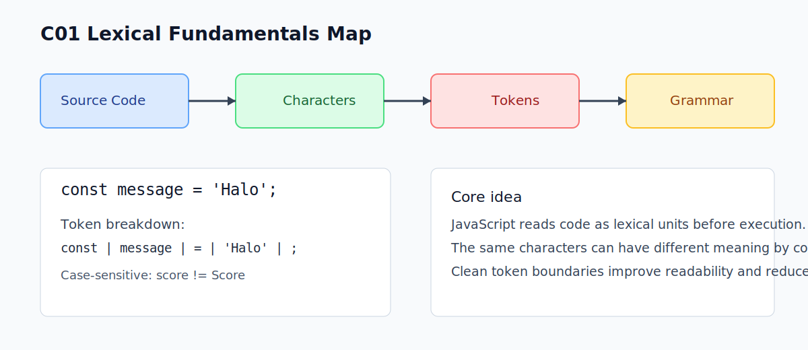

# C01 - Lexical Fundamentals

## Tujuan

Bab ini mengenalkan fondasi lexical JavaScript: bagaimana source code dibaca sebagai unit kecil sebelum dieksekusi.

## Kenapa Bab Ini Penting

Sebelum bicara types, functions, atau async, pembaca perlu paham bahwa JavaScript membaca kode berdasarkan aturan lexical.

Jika fondasi ini tidak jelas, error sintaks sederhana akan sering muncul dan sulit didiagnosis.

## Gambaran Mental Model

Saat engine membaca file JavaScript:

1. source code dibaca sebagai karakter
2. karakter dipetakan menjadi token lexical
3. token disusun mengikuti grammar
4. hasilnya baru bisa diproses sebagai program

Bab ini fokus pada langkah 1 dan 2 secara praktis.

## Konsep Inti

### 1. JavaScript Bersifat Case-Sensitive

Nama identifier membedakan huruf besar-kecil.

```js
const score = 10;
const Score = 20;

console.log(score); // 10
console.log(Score); // 20
```

`score` dan `Score` adalah identifier berbeda.

### 2. Source Code Dibaca Berurutan

JavaScript membaca file dari atas ke bawah.

Urutan penulisan berpengaruh terhadap keterbacaan dan validitas sintaks.

### 3. Token Adalah Unit Dasar Lexical

Contoh token sederhana:

- keyword: `const`
- identifier: `message`
- punctuator: `=` `;`
- literal: `'Halo'`

```js
const message = 'Halo';
```

Baris di atas terlihat sederhana, tetapi secara lexical terdiri dari beberapa token.

## Kesalahan Umum

- Mengira `Data` dan `data` adalah variabel yang sama.
- Menulis kode dengan penamaan campur-campur sehingga sulit dibaca.
- Mengabaikan error sintaks kecil karena belum paham konsep token.

## Checkpoint Cepat

Jawab tanpa menjalankan kode:

1. Apakah `Total` dan `total` sama?
2. Pada `let age = 18;`, mana keyword, identifier, dan literal?
3. Kenapa urutan kode memengaruhi hasil parsing?

## Ringkasan

- JavaScript membaca source code berdasarkan aturan lexical.
- Bahasa ini case-sensitive.
- Program dibangun dari token, bukan langsung dari "kalimat" bebas.
- Fondasi lexical membantu mencegah error sintaks dasar di bab berikutnya.

## Visual Map



## Contoh Runnable

- Lihat contoh: `../examples/C01-lexical-fundamentals/example.js`
- Panduan: `../examples/C01-lexical-fundamentals/README.md`
