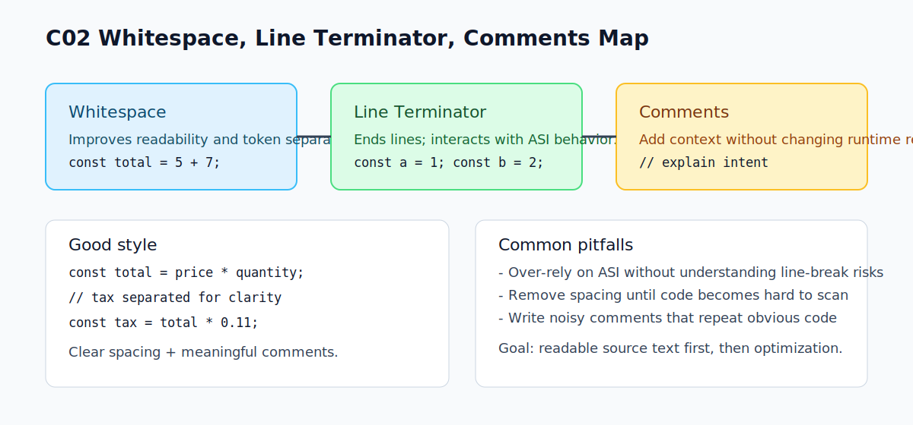

# C02 - Whitespace, Line Terminator, dan Comments

## Tujuan

Bab ini menjelaskan elemen non-eksekusi yang tetap penting dalam pembacaan source code JavaScript.

## Kenapa Bab Ini Penting

`whitespace` dan `line terminator` sering terlihat sepele, padahal bisa memengaruhi keterbacaan kode dan pada kasus tertentu memengaruhi hasil parsing.

Komentar juga penting untuk dokumentasi, tetapi jika berlebihan bisa membuat kode sulit dipindai.

## Konsep Inti

### 1. Whitespace

Whitespace adalah spasi, tab, dan karakter pemisah yang membantu memisahkan token agar mudah dibaca.

Contoh dua format berikut secara umum setara hasilnya:

```js
const total = 5 + 7;
```

```js
const total=5+7;
```

Keduanya valid, tetapi format pertama jauh lebih mudah dibaca.

### 2. Line Terminator

Line terminator menandai akhir baris. JavaScript memiliki mekanisme *Automatic Semicolon Insertion* (ASI), tetapi jangan mengandalkannya sembarangan.

Contoh aman:

```js
const a = 1;
const b = 2;
```

Gunakan semicolon eksplisit agar konsisten dan mengurangi ambiguitas.

### 3. Comments

JavaScript punya dua bentuk komentar:

- single-line: `// komentar`
- multi-line: `/* komentar */`

Contoh:

```js
// Hitung total harga
const total = price * quantity;

/*
  Pajak dihitung terpisah
  agar rumus utama tetap singkat
*/
const tax = total * 0.11;
```

## Praktik yang Direkomendasikan

- Gunakan indentasi konsisten.
- Tambahkan spasi di sekitar operator.
- Simpan komentar untuk konteks penting, bukan menjelaskan baris yang sudah jelas.
- Pilih satu gaya semicolon (`selalu pakai`) dan konsisten.

## Kesalahan Umum

- Menghapus whitespace sampai kode sulit dibaca.
- Mengandalkan ASI tanpa memahami risikonya.
- Menulis komentar terlalu banyak sampai menutupi logika inti.

## Checkpoint Cepat

1. Apa perbedaan fungsi whitespace dan comment?
2. Kenapa semicolon eksplisit lebih aman untuk pemula?
3. Kapan komentar diperlukan, dan kapan sebaiknya dihindari?

## Analogi

- Intuisi Singkat: Whitespace, line terminator, dan komentar memengaruhi cara kode dipisah/dibaca.
- Analogi: Seperti tanda jeda, paragraf, dan catatan pinggir di naskah editor.
- Batas Analogi: Sebagian tampak “kosong”, tapi efeknya ke parsing bisa nyata pada konteks tertentu.

## Ringkasan

- Whitespace membantu keterbacaan dan pemisahan visual token.
- Line terminator penting dalam struktur baris dan berhubungan dengan ASI.
- Comment harus dipakai seperlunya untuk konteks, bukan untuk mengulang isi kode.

## Visual Map



## Contoh Runnable

- Lihat contoh: `../examples/C02-whitespace-line-terminator-comments/example.js`
- Panduan: `../examples/C02-whitespace-line-terminator-comments/README.md`
