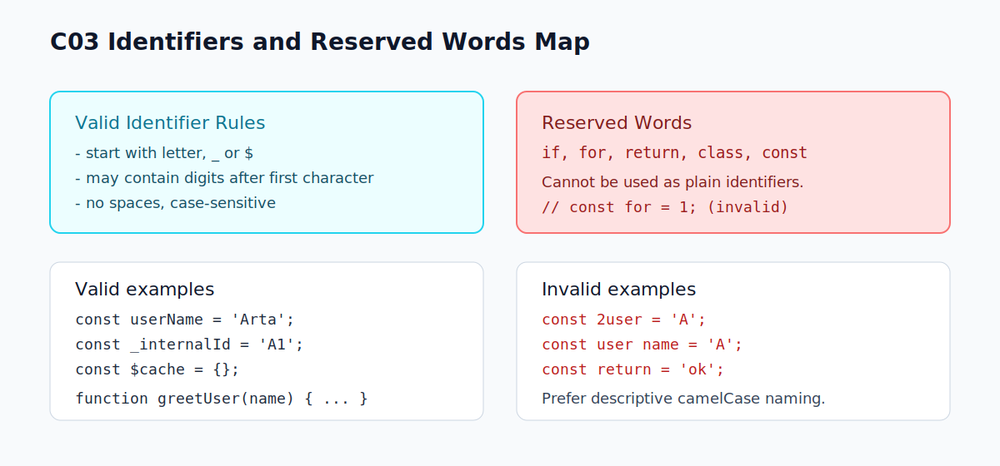

# C03 - Identifiers dan Reserved Words

## Tujuan

Bab ini membantu pembaca menulis nama variabel/fungsi yang valid serta menghindari kata yang tidak boleh dipakai sebagai identifier.

## Kenapa Bab Ini Penting

Banyak error sintaks pemula berasal dari penamaan yang tidak valid atau penggunaan keyword sebagai nama variabel.

Dengan aturan identifier yang benar, kode jadi lebih aman dan mudah dipahami.

## Konsep Inti

### 1. Apa Itu Identifier

Identifier adalah nama untuk entitas dalam kode, misalnya:

- variabel
- fungsi
- parameter
- properti tertentu

Contoh:

```js
const userName = 'Arta';
function greetUser(name) {
  return `Hello, ${name}`;
}
```

`userName`, `greetUser`, dan `name` adalah identifier.

### 2. Aturan Dasar Identifier

Secara umum:

- boleh memakai huruf, angka, `_`, dan `$`
- tidak boleh diawali angka
- tidak boleh mengandung spasi
- case-sensitive (`total` beda dengan `Total`)

Contoh valid:

```js
const totalPrice = 100;
const _internalId = 'A1';
const $cache = {};
```

Contoh tidak valid:

```js
// const 2ndUser = 'Budi'; // diawali angka
// const user name = 'Budi'; // mengandung spasi
```

### 3. Reserved Words

Reserved words adalah kata yang sudah dipakai oleh bahasa JavaScript dan tidak boleh dipakai sebagai identifier biasa.

Contoh umum:

- `if`
- `for`
- `const`
- `class`
- `return`

Contoh salah:

```js
// const for = 10;
// let return = 'ok';
```

Gunakan nama alternatif yang tetap deskriptif:

```js
const totalForWeek = 10;
const returnMessage = 'ok';
```

## Praktik Naming yang Direkomendasikan

- gunakan `camelCase` untuk variabel dan fungsi
- pilih nama deskriptif, hindari nama terlalu pendek seperti `x`, `y` untuk konteks umum
- konsisten satu gaya penamaan di seluruh file

## Kesalahan Umum

- memakai keyword sebagai nama variabel
- penamaan campur format (`user_name`, `UserName`, `userName`) tanpa aturan
- nama terlalu umum sehingga maksud variabel tidak jelas

## Checkpoint Cepat

Tentukan valid atau tidak:

1. `const user2 = 'A';`
2. `const 2user = 'A';`
3. `const return = 'ok';`
4. `const _userName = 'A';`
5. `const user name = 'A';`

## Ringkasan

- Identifier adalah nama entitas dalam program JavaScript.
- Nama identifier harus mengikuti aturan lexical dasar.
- Reserved words tidak boleh dipakai sebagai identifier biasa.
- Naming yang konsisten membantu kode tetap mudah dibaca dan dipelihara.

## Visual Map



## Contoh Runnable

- Lihat contoh: `../examples/C03-identifiers-reserved-words/example.js`
- Panduan: `../examples/C03-identifiers-reserved-words/README.md`
