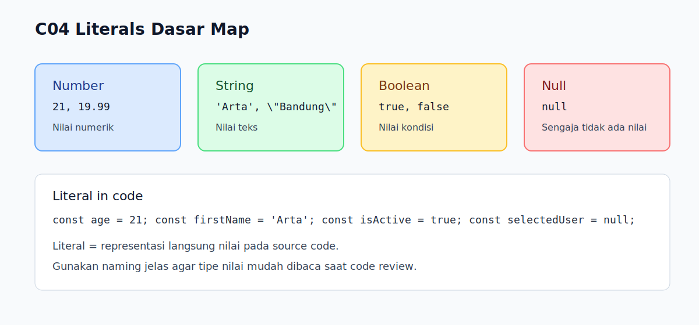

# C04 - Literals Dasar

## Tujuan

Bab ini mengenalkan literal dasar JavaScript: `number`, `string`, `boolean`, dan `null`.

## Kenapa Bab Ini Penting

Literal adalah cara paling langsung untuk menuliskan nilai di dalam kode.

Jika pemahaman literal belum stabil, pembaca akan mudah salah saat masuk ke topik values/types di `B02`.

## Konsep Inti

### 1. Number Literal

Number literal digunakan untuk nilai numerik.

```js
const age = 21;
const price = 19.99;
```

JavaScript tidak membedakan tipe integer vs float pada level dasar penggunaan.

### 2. String Literal

String literal dipakai untuk teks.

Bisa menggunakan:

- single quote: `'...'`
- double quote: `"..."`
- backtick: `` `...` ``

```js
const firstName = 'Arta';
const city = "Bandung";
const message = `Hello, ${firstName}`;
```

Gunakan gaya yang konsisten dalam satu file.

### 3. Boolean Literal

Boolean hanya punya dua nilai:

- `true`
- `false`

```js
const isActive = true;
const hasPaid = false;
```

Boolean umum dipakai untuk kondisi dan status.

### 4. Null Literal

`null` merepresentasikan "tidak ada nilai" yang sengaja ditetapkan.

```js
const selectedUser = null;
```

Untuk level fondasi, cukup pahami bahwa `null` sering dipakai sebagai nilai awal sebelum data tersedia.

## Praktik yang Direkomendasikan

- pakai nama variabel yang menjelaskan jenis nilainya
- gunakan template literal (backtick) saat perlu interpolasi
- hindari mencampur gaya quote tanpa alasan

## Kesalahan Umum

- mengira `null` sama dengan string `'null'`
- menulis angka di dalam string padahal ingin nilai numerik
- mencampur quote acak sehingga kode sulit dibaca konsisten

## Checkpoint Cepat

1. Apa beda `null` dan `'null'`?
2. Kapan sebaiknya memakai backtick?
3. Manakah boolean literal yang valid selain `true`/`false`?

## Analogi Singkat

Literal itu seperti menulis isi jawaban langsung di formulir tanpa perlu menghitung atau mengambil dari tempat lain. Di JavaScript, kita menaruh nilainya langsung di source code dengan bentuk penulisan yang sudah ditentukan.

## Ringkasan

- Literal adalah representasi langsung nilai di source code.
- Empat literal dasar pada bab ini: number, string, boolean, dan null.
- Konsistensi penulisan literal membantu kode lebih jelas dan siap untuk bahasan values/types lanjutan.

## Visual Map



## Contoh Runnable

- Lihat contoh: `../examples/C04-literals-dasar/example.js`
- Panduan: `../examples/C04-literals-dasar/README.md`
