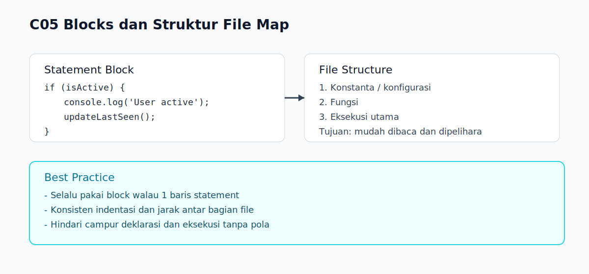

# C05 - Blocks dan Struktur File

## Tujuan

Bab ini mengenalkan fungsi statement block (`{}`) dan cara menyusun struktur file JavaScript dasar agar rapi dan mudah dibaca.

## Kenapa Bab Ini Penting

Tanpa pemahaman block, kode kontrol alur dan fungsi akan cepat berantakan.

Tanpa struktur file yang jelas, pembaca akan sulit menambah fitur dan menjaga konsistensi saat kode mulai bertambah.

## Konsep Inti

### 1. Apa Itu Block

Block adalah kumpulan statement yang dibungkus kurung kurawal `{}`.

Block sering dipakai pada:

- `if` / `else`
- loop (`for`, `while`)
- function body

Contoh:

```js
if (isActive) {
  console.log('User active');
  updateLastSeen();
}
```

Semua statement di dalam `{}` dianggap satu kelompok logika.

### 2. Kenapa Block Penting

Block membantu:

- membatasi area kode
- menjaga alur logika tetap jelas
- memudahkan pembacaan struktur program

Pada bab lanjut, block juga berhubungan dengan scope, tetapi di bab ini fokusnya pada keterbacaan struktur.

### 3. Struktur File Dasar

Untuk program sederhana, gunakan urutan konsisten:

1. deklarasi konstanta/konfigurasi
2. deklarasi fungsi
3. bagian eksekusi utama

Contoh:

```js
const APP_NAME = 'Task App';

function printTitle() {
  console.log(APP_NAME);
}

printTitle();
```

Struktur ini membuat pembaca cepat menangkap bagian "setup", "logic", dan "run".

## Praktik yang Direkomendasikan

- selalu pakai block untuk kontrol alur, walaupun statement hanya satu baris
- gunakan indentasi konsisten (misalnya 2 spasi)
- beri jarak antar-bagian file agar pemindaian visual lebih mudah
- hindari mencampur deklarasi dan eksekusi secara acak

## Kesalahan Umum

- menulis `if` tanpa block lalu menambah baris baru yang ternyata tidak termasuk kondisi
- struktur file campur aduk antara deklarasi fungsi dan eksekusi
- block terlalu panjang tanpa pemisahan logika

## Checkpoint Cepat

1. Kenapa menulis block tetap disarankan walau statement satu baris?
2. Pada file sederhana, bagian apa yang idealnya ditaruh paling atas?
3. Apa risiko jika deklarasi dan eksekusi dicampur tanpa pola?

## Analogi Singkat

Block dan struktur file itu seperti membagi dokumen besar menjadi bab, subbab, dan bagian-bagian yang mudah diikuti. Susunan yang rapi membantu pembaca melihat batas tiap bagian kode dengan lebih cepat.

## Ringkasan

- Block (`{}`) adalah kelompok statement yang membentuk unit logika.
- Block membantu keterbacaan dan konsistensi struktur kode.
- Struktur file sederhana yang konsisten mempermudah pemeliharaan dan pengembangan.

## Visual Map



## Contoh Runnable

- Lihat contoh: `../examples/C05-blocks-dan-struktur-file/example.js`
- Panduan: `../examples/C05-blocks-dan-struktur-file/README.md`
