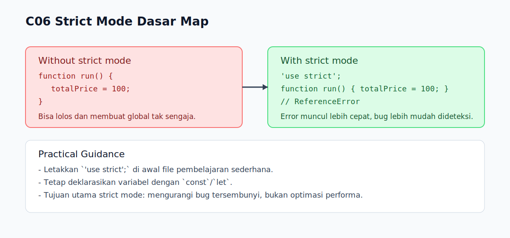

# C06 - Strict Mode Dasar

## Tujuan

Bab ini mengenalkan strict mode (`"use strict"`) dan dampak praktisnya pada penulisan kode JavaScript dasar.

## Kenapa Bab Ini Penting

Strict mode membuat JavaScript lebih ketat terhadap pola kode yang berisiko menimbulkan bug.

Untuk pemula, strict mode membantu mendeteksi kesalahan lebih awal.

## Konsep Inti

### 1. Apa Itu Strict Mode

Strict mode diaktifkan dengan string literal:

```js
'use strict';
```

Jika diletakkan di awal file atau awal function, aturan parsing dan eksekusi jadi lebih ketat.

### 2. Contoh Dampak Umum

Tanpa strict mode, typo pada assignment bisa membuat variabel global tak sengaja.

Dengan strict mode, kasus seperti ini akan melempar error.

```js
'use strict';

function run() {
  totalPrice = 100; // ReferenceError (karena tidak dideklarasikan)
}

run();
```

### 3. Kapan Dipakai

Untuk konteks belajar di `R01`, gunakan strict mode agar:

- kesalahan dasar lebih cepat terlihat
- kebiasaan penulisan kode lebih disiplin
- transisi ke topik lanjutan lebih aman

## Praktik yang Direkomendasikan

- letakkan `'use strict';` di awal file pembelajaran sederhana
- tetap deklarasikan variabel dengan `const` atau `let`
- jangan gunakan strict mode setengah-setengah dalam contoh dasar

## Kesalahan Umum

- menulis `'use strict'` tidak di posisi awal
- menganggap strict mode mempercepat performa (fokus utamanya bukan itu)
- tetap menulis pola lama yang bergantung pada perilaku longgar JavaScript

## Checkpoint Cepat

1. Apa fungsi utama strict mode untuk pemula?
2. Kenapa assignment ke variabel yang belum dideklarasikan jadi error di strict mode?
3. Di mana posisi paling aman menaruh `'use strict';` pada file sederhana?

## Analogi

- Intuisi Singkat: Strict mode menyalakan aturan yang lebih tegas untuk mencegah pola berisiko.
- Analogi: Seperti mengaktifkan mode audit ketat dalam sistem operasi kerja.
- Batas Analogi: Kode lama yang “jalan” di sloppy mode bisa gagal di strict mode.

## Ringkasan

- Strict mode membuat aturan JavaScript lebih ketat.
- Tujuan utamanya di level dasar adalah pencegahan bug lebih awal.
- Gunakan strict mode secara konsisten di contoh pembelajaran agar kebiasaan coding lebih bersih.

## Visual Map



## Contoh Runnable

- Lihat contoh: `../examples/C06-strict-mode-dasar/example.js`
- Panduan: `../examples/C06-strict-mode-dasar/README.md`
