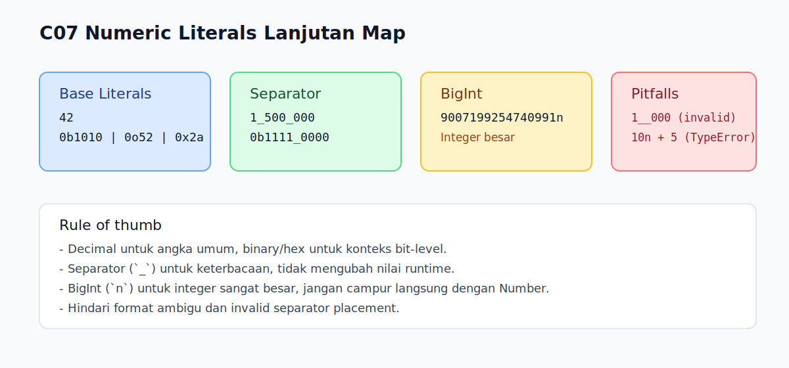

# C07 - Numeric Literals Lanjutan

## Tujuan

Bab ini bertujuan memahami variasi numeric literal termasuk binary, octal, hexadecimal, numeric separator, dan bigint literal.

## Kenapa Bab Ini Penting

Pada proyek nyata, angka tidak selalu ditulis dalam decimal biasa.

Kamu akan sering menemukan:

- nilai bitmask dalam hexadecimal
- flag biner dalam binary literal
- nilai besar yang lebih aman dibaca dengan separator
- integer besar menggunakan BigInt

Jika format literal ini tidak dipahami, kode mudah salah baca atau salah konversi.

## Konsep Inti

### 1. Decimal, Binary, Octal, Hexadecimal

JavaScript mendukung beberapa bentuk numeric literal:

```js
const dec = 42;      // decimal
const bin = 0b1010;  // binary (10)
const oct = 0o52;    // octal (42)
const hex = 0x2a;    // hexadecimal (42)
```

Semua contoh di atas valid dan menghasilkan nilai number.

### 2. Numeric Separator (`_`)

Numeric separator dipakai untuk meningkatkan keterbacaan angka besar.

```js
const budget = 1_500_000;
const mask = 0b1111_0000;
const color = 0xff_aa_00;
```

Nilai runtime tetap sama seperti tanpa `_`. Separator hanya untuk keterbacaan source code.

### 3. BigInt Literal (`n`)

BigInt dipakai untuk integer sangat besar yang melebihi batas aman `Number`.

```js
const safe = 9_007_199_254_740_991;    // Number.MAX_SAFE_INTEGER
const huge = 9_007_199_254_740_991n;   // BigInt
```

BigInt literal harus berupa integer dan diakhiri `n`.

## Edge Cases Penting

### 1. Separator Tidak Bisa Sembarangan

Contoh tidak valid:

```js
// const a = _1000;
// const b = 1000_;
// const c = 1__000;
// const d = 1._5;
```

### 2. BigInt Tidak Boleh Decimal

Contoh tidak valid:

```js
// const bad = 10.5n;
```

### 3. Jangan Campur Number dan BigInt Langsung

Operasi campuran akan error:

```js
// const sum = 10n + 5; // TypeError
```

Jika perlu, konversi dulu secara eksplisit.

## Praktik yang Direkomendasikan

- gunakan decimal untuk angka umum
- gunakan binary/hex hanya saat konteksnya memang bit-level atau low-level
- gunakan separator untuk angka panjang agar mudah dibaca
- gunakan BigInt hanya saat kebutuhan integer besar benar-benar ada

## Kesalahan Umum

- mengira `0o` sama dengan angka decimal biasa
- menempatkan `_` di posisi yang tidak valid
- menganggap BigInt bisa diperlakukan sama persis dengan Number

## Checkpoint Cepat

1. Nilai berapa dari `0b1011` dalam decimal?
2. Mana yang valid: `1_000`, `1__000`, `1000_`?
3. Kenapa `10n + 5` error?
4. Kapan lebih tepat memakai BigInt dibanding Number?

## Analogi Singkat

Numeric literal itu seperti menulis angka dengan gaya yang berbeda sesuai kebutuhan, misalnya angka biasa untuk manusia dan notasi khusus untuk konteks teknis. Bentuk tulisannya bisa berubah, tetapi nilainya tetap dibaca sebagai angka oleh JavaScript.

## Ringkasan

- Numeric literal JavaScript tidak hanya decimal; ada binary, octal, dan hexadecimal.
- Numeric separator (`_`) membantu keterbacaan, bukan mengubah nilai.
- BigInt literal memakai suffix `n` untuk integer besar.
- Pahami edge case agar tidak terkena error sintaks dan type mismatch.

## Visual Map



## Contoh Runnable

- Lihat contoh: `../examples/C07-numeric-literals-lanjutan/example.js`
- Panduan: `../examples/C07-numeric-literals-lanjutan/README.md`
