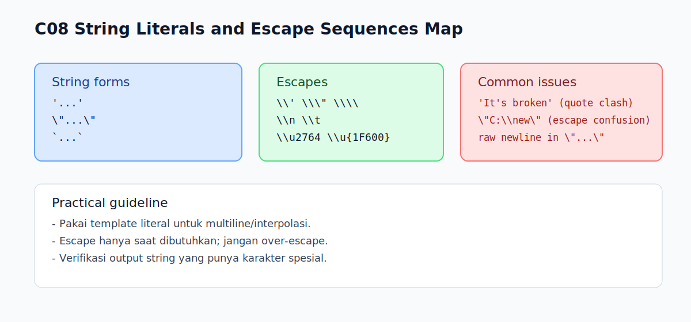

# C08 - String Literals dan Escape Sequences

## Tujuan

Bab ini bertujuan memahami escape sequence pada string dan jebakan karakter khusus.

## Kenapa Bab Ini Penting

String sering dipakai di hampir semua program JavaScript.

Tanpa memahami escape sequence, pembaca akan mudah mengalami:

- error sintaks karena quote bentrok
- output teks tidak sesuai harapan
- kebingungan saat menangani karakter spesial seperti newline atau tab

## Konsep Inti

### 1. Bentuk String Literal

String literal bisa ditulis dengan:

- single quote: `'...'`
- double quote: `"..."`
- backtick: `` `...` ``

```js
const a = 'Halo';
const b = "Dunia";
const c = `Halo Dunia`;
```

Pilih satu gaya konsisten di satu file.

### 2. Escape Sequence Dasar

Escape sequence dipakai untuk karakter khusus di dalam string.

Contoh umum:

- `\'` untuk single quote dalam single-quoted string
- `\"` untuk double quote dalam double-quoted string
- `\\` untuk backslash
- `\n` untuk newline
- `\t` untuk tab

```js
const quote1 = 'It\\'s fine';
const quote2 = "He said: \"Hi\"";
const path = "C:\\\\Users\\\\Arta";
const lines = "Baris 1\\nBaris 2";
const tabbed = "Nama:\\tArta";
```

### 3. Unicode Escape Dasar

Kamu bisa menulis karakter menggunakan escape Unicode.

```js
const heart = '\u2764';     // ❤
const smile = '\u{1F600}';  // 😀
```

Gunakan ini jika karakter sulit diketik langsung atau untuk menjaga konsistensi source text.

## Edge Cases Penting

### 1. Quote Bentrok

Contoh salah:

```js
// const bad = 'It's broken';
```

Solusi: escape quote atau ganti jenis quote pembungkus.

### 2. Backslash Ganda pada Path

Contoh:

```js
const windowsPath = "C:\\Program Files\\Node";
```

Jika hanya satu backslash ditulis, hasil string bisa rusak karena dibaca sebagai escape awal.

### 3. Newline Langsung pada Single/Double Quote

Contoh salah:

```js
// const bad = "Baris 1
// Baris 2";
```

Gunakan `\n` atau template literal.

## Praktik yang Direkomendasikan

- gunakan template literal untuk string multi-baris atau interpolasi
- gunakan escape hanya saat benar-benar perlu
- hindari kombinasi quote campur aduk tanpa aturan
- cek kembali output string yang berisi karakter khusus

## Kesalahan Umum

- lupa escape quote yang sama dengan pembungkus string
- mengira `\n` ditampilkan sebagai dua karakter literal (`\` dan `n`)
- memakai backslash tunggal pada path Windows

## Checkpoint Cepat

1. Kapan `\n` dipakai?
2. Kenapa `"C:\new"` bisa bermasalah?
3. Bagaimana menulis string `It's OK` dengan single quote pembungkus?
4. Kapan lebih tepat pakai template literal dibanding single/double quote?

## Ringkasan

- Escape sequence membantu menulis karakter khusus dalam string.
- Karakter penting yang sering dipakai: quote escape, backslash, newline, tab.
- Unicode escape berguna untuk karakter non-ASCII tertentu.
- Penggunaan string literal yang konsisten mengurangi bug sintaks dan bug output.

## Visual Map



## Contoh Runnable

- Lihat contoh: `../examples/C08-string-literals-escape-sequences/example.js`
- Panduan: `../examples/C08-string-literals-escape-sequences/README.md`
