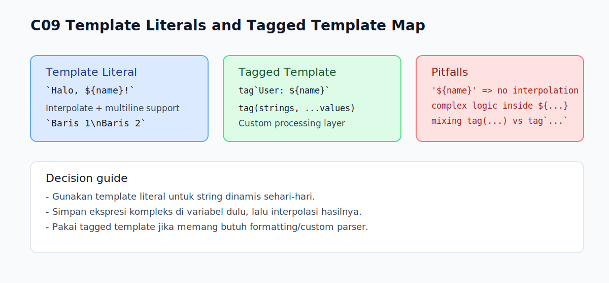

# C09 - Template Literals dan Tagged Template Dasar

## Tujuan

Bab ini bertujuan memahami template literals lebih dalam termasuk pengantar tagged templates.

## Kenapa Bab Ini Penting

String dinamis adalah kasus umum dalam JavaScript.

Tanpa template literals, kode sering menjadi:

- sulit dibaca karena banyak operator `+`
- rawan salah format saat ada banyak variabel
- rumit saat membuat string multi-baris

Tagged template juga penting sebagai dasar memahami bagaimana template dapat diproses custom.

## Konsep Inti

### 1. Template Literal Dasar

Template literal memakai backtick:

```js
const name = 'Arta';
const message = `Halo, ${name}!`;
```

` ${...} ` disebut interpolasi expression.

### 2. Multi-line String

Template literal mendukung multi-line secara natural:

```js
const text = `Baris 1
Baris 2
Baris 3`;
```

Ini biasanya lebih bersih daripada kombinasi `\n` berulang.

### 3. Expression di Dalam Interpolasi

Interpolasi tidak hanya variabel, tapi expression:

```js
const a = 5;
const b = 7;
const result = `Jumlah: ${a + b}`;
```

### 4. Pengantar Tagged Template

Tagged template berarti template literal diproses fungsi khusus.

```js
function tag(strings, value) {
  return `${strings[0]}[${value}]`;
}

const name = 'Arta';
const out = tag`User: ${name}`;
// out => "User: [Arta]"
```

Pada contoh di atas:

- `strings` berisi potongan string statis
- expression dikirim sebagai argumen berikutnya

## Edge Cases Penting

### 1. Salah Pakai Quote

Interpolasi hanya jalan pada backtick, bukan single/double quote.

```js
const name = 'Arta';
const bad = 'Halo, ${name}'; // tidak di-interpolasi
const good = `Halo, ${name}`; // di-interpolasi
```

### 2. Backtick di Dalam String

Jika perlu menulis karakter backtick, escape dengan `\``.

### 3. Tagged Template Bukan Function Call Biasa

Sintaks `tag\`...\`` berbeda dari `tag(...)`, jadi jangan mencampur keduanya.

## Praktik yang Direkomendasikan

- gunakan template literal untuk string dinamis
- gunakan interpolasi secukupnya, hindari expression terlalu kompleks di dalam `${...}`
- untuk logika kompleks, hitung dulu di variabel terpisah lalu interpolasi hasilnya
- pakai tagged template hanya saat ada kebutuhan format/custom processing yang jelas

## Kesalahan Umum

- memakai `'${value}'` lalu berharap interpolasi terjadi
- menaruh logika panjang di dalam `${...}` hingga sulit dibaca
- mengira tagged template wajib dipakai untuk semua template literal

## Checkpoint Cepat

1. Apa kelebihan template literal dibanding concatenation dengan `+`?
2. Kenapa `'Hello ${name}'` tidak berubah?
3. Apa parameter pertama yang diterima fungsi tag?
4. Kapan tagged template sebaiknya dipakai?

## Analogi Singkat

Template literal mirip format pesan yang punya tempat kosong untuk diisi nilai saat dibutuhkan. Bentuk ini terasa alami untuk teks yang berubah-ubah atau punya beberapa baris.

## Analogi

- Intuisi Singkat: Template literal memudahkan multi-line string dan interpolasi nilai.
- Analogi: Seperti template surat yang punya slot variabel untuk diisi otomatis.
- Batas Analogi: Kemudahan ini tetap perlu disiplin agar ekspresi di dalam template tidak berlebihan.

## Ringkasan

- Template literal memudahkan interpolasi dan multi-line string.
- Interpolasi hanya aktif jika memakai backtick.
- Tagged template memberi cara untuk memproses template literal dengan fungsi custom.
- Gunakan fitur ini untuk meningkatkan keterbacaan, bukan menambah kompleksitas.

## Visual Map



## Contoh Runnable

- Lihat contoh: `../examples/C09-template-literals-tagged-template/example.js`
- Panduan: `../examples/C09-template-literals-tagged-template/README.md`
