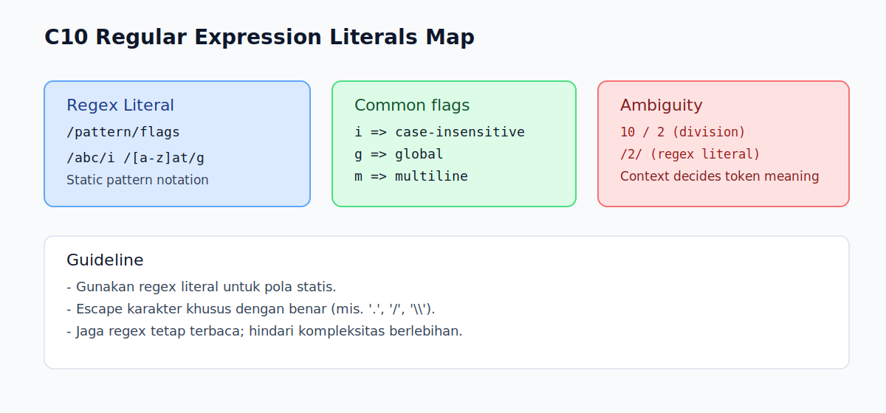

# C10 - Regular Expression Literals Dasar

## Tujuan

Bab ini bertujuan memahami regex literal sebagai bagian dari lexical grammar.

## Kenapa Bab Ini Penting

Regex literal sering dipakai untuk validasi, pencarian pola, dan ekstraksi teks.

Di level lexical, penting paham bahwa `/.../` bisa berarti:

- regular expression literal
- atau operator division, tergantung konteks parsing

## Konsep Inti

### 1. Bentuk Regex Literal

Regex literal ditulis dengan slash:

```js
const re = /abc/;
```

Bagian setelah slash terakhir bisa berisi flags, misalnya:

```js
const reInsensitive = /abc/i;
const reGlobal = /abc/g;
```

### 2. Penggunaan Dasar

Contoh pakai `test()`:

```js
const re = /js/i;
console.log(re.test('JavaScript')); // true
console.log(re.test('Python'));     // false
```

Contoh pakai `match()`:

```js
const text = 'cat bat rat';
const out = text.match(/[a-z]at/g);
// ['cat', 'bat', 'rat']
```

### 3. Flags Dasar yang Umum

- `i`: case-insensitive
- `g`: global match
- `m`: multiline

```js
const re = /^ab/m;
```

## Edge Cases Penting

### 1. Escape Slash di Dalam Regex

Jika pola butuh slash `/`, escape dengan `\/`.

```js
const re = /https?:\/\/example\.com/;
```

### 2. Regex Literal vs Division

Contoh berikut adalah division:

```js
const result = 10 / 2;
```

Sementara ini regex:

```js
const re = /2/;
```

Konteks sintaks menentukan maknanya.

### 3. Global Flag Mengubah Perilaku `match`

Dengan `g`, hasil `match()` adalah array semua kecocokan sederhana.
Tanpa `g`, hasil berisi info match pertama dan metadata.

## Praktik yang Direkomendasikan

- gunakan regex literal untuk pola statis
- gunakan constructor `new RegExp(...)` hanya saat pola dinamis
- mulai dari pola sederhana, lalu tambah kompleksitas bertahap
- tulis komentar singkat jika regex cukup kompleks

## Kesalahan Umum

- lupa escape karakter khusus regex (mis. `.` atau `/`)
- mencampur regex literal dan string biasa tanpa sadar
- membuat regex terlalu kompleks untuk kasus sederhana

## Checkpoint Cepat

1. Apa bedanya `/abc/i` dan `/abc/g`?
2. Kenapa `.` perlu di-escape jika ingin titik literal?
3. Kapan lebih tepat pakai regex literal dibanding `new RegExp()`?
4. Apa risiko regex yang terlalu rumit di level pemula?

## Ringkasan

- Regex literal ditulis dengan bentuk `/pattern/flags`.
- Dalam lexical grammar, slash dapat ambigu dengan division dan diselesaikan oleh konteks parsing.
- Pahami flags dasar dan escaping agar pola bekerja sesuai harapan.
- Gunakan regex secukupnya, utamakan keterbacaan.

## Visual Map



## Contoh Runnable

- Lihat contoh: `../examples/C10-regex-literals-dasar/example.js`
- Panduan: `../examples/C10-regex-literals-dasar/README.md`
