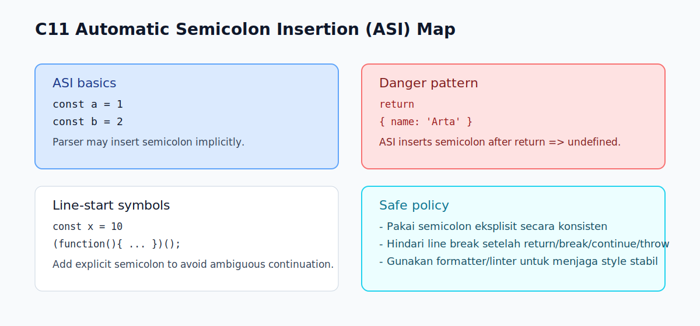

# C11 - Automatic Semicolon Insertion (ASI)

## Tujuan

Bab ini bertujuan memahami aturan ASI dan edge case yang sering menimbulkan bug.

## Kenapa Bab Ini Penting

JavaScript dapat menyisipkan semicolon otomatis pada kondisi tertentu.

Fitur ini terlihat membantu, tetapi jika tidak dipahami bisa menghasilkan perilaku yang tidak terduga.

## Konsep Inti

### 1. Apa Itu ASI

ASI adalah mekanisme parser JavaScript untuk menambahkan semicolon secara implisit pada situasi tertentu.

Contoh umum yang tetap aman:

```js
const a = 1
const b = 2
```

Kode di atas biasanya tetap berjalan karena parser menyisipkan semicolon.

### 2. ASI Bukan "Selalu Aman"

Tidak semua line break bisa diselamatkan oleh ASI.

Ada pola yang justru berubah makna jika semicolon tidak ditulis eksplisit.

## Edge Cases Penting

### 1. `return` di Baris Baru

```js
function getUser() {
  return
  {
    name: 'Arta'
  }
}
```

Pada kasus ini, ASI menambahkan semicolon setelah `return`, sehingga fungsi mengembalikan `undefined`.

Versi aman:

```js
function getUser() {
  return {
    name: 'Arta'
  };
}
```

### 2. Baris Baru Dimulai Dengan `(` atau `[`

```js
const x = 10
(function () {
  console.log('IIFE');
})();
```

Tanpa semicolon setelah `10`, baris berikut dapat diparse sebagai kelanjutan expression sebelumnya.

Versi aman:

```js
const x = 10;
(function () {
  console.log('IIFE');
})();
```

Kasus mirip juga bisa terjadi saat baris berikut diawali `[` atau template tag tertentu.

### 3. Postfix `++` dan `--`

Line break dapat mengubah cara parser membaca operasi increment/decrement.

Untuk level fondasi, hindari style yang ambigu dan tulis expression secara jelas dalam satu baris.

## Praktik yang Direkomendasikan

- gunakan semicolon eksplisit untuk konsistensi
- hindari line break langsung setelah `return`, `break`, `continue`, `throw`
- berhati-hati saat baris baru dimulai dengan `(`, `[`, atau `` ` ``
- gunakan formatter/linter agar gaya penulisan stabil

## Kesalahan Umum

- menganggap ASI selalu memperbaiki semua style tanpa semicolon
- menaruh object literal di baris baru setelah `return`
- menulis kode chaining lintas baris tanpa memahami parser melihatnya sebagai expression lanjutan

## Checkpoint Cepat

1. Kenapa `return` diikuti line break bisa berbahaya?
2. Mengapa line yang diawali `(` setelah expression sebelumnya perlu perhatian?
3. Apa strategi paling aman untuk pemula terkait semicolon?
4. Sebutkan satu contoh bug yang dipicu ASI.

## Ringkasan

- ASI adalah mekanisme parser, bukan jaminan kode selalu aman tanpa semicolon.
- Beberapa pola line break bisa mengubah makna program.
- Untuk fase belajar dasar, semicolon eksplisit adalah pendekatan paling aman dan konsisten.

## Visual Map



## Contoh Runnable

- Lihat contoh: `../examples/C11-automatic-semicolon-insertion-asi/example.js`
- Panduan: `../examples/C11-automatic-semicolon-insertion-asi/README.md`
