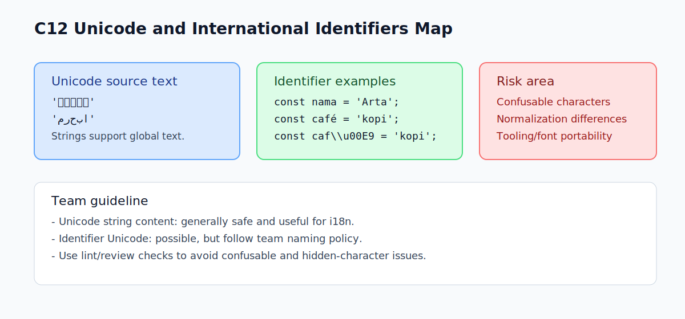

# C12 - Unicode dan Identifiers Internasional

## Tujuan

Bab ini bertujuan memahami peran Unicode pada source text dan identifier.

## Kenapa Bab Ini Penting

JavaScript source code berbasis Unicode, bukan ASCII saja.

Artinya:

- string bisa memuat banyak karakter internasional
- identifier juga bisa memakai karakter non-Latin tertentu
- ada risiko kebingungan visual jika karakter tampak mirip

## Konsep Inti

### 1. Source Text JavaScript dan Unicode

Kamu bisa menulis teks internasional langsung di string:

```js
const greeting = 'Halo';
const japanese = '\u3053\u3093\u306B\u3061\u306F'; // こんにちは
const arabic = '\u0645\u0631\u062D\u0628\u0627';   // مرحبا
```

Ini valid karena JavaScript mendukung Unicode pada source text.

### 2. Identifier Non-ASCII

Dalam banyak kasus, identifier boleh memakai karakter Unicode yang valid secara aturan bahasa.

```js
const nama = 'Arta';
const caf\u00E9 = 'kopi';
```

Meski valid, untuk kolaborasi lintas tim biasanya disarankan tetap konsisten dengan kebijakan penamaan yang disepakati.

### 3. Unicode Escape untuk Identifier

Identifier juga bisa ditulis via Unicode escape:

```js
const caf\u00E9 = 'kopi';
console.log(caf\u00E9);
```

Pendekatan ini jarang dipakai pada kode umum, tetapi penting dipahami sebagai bagian lexical grammar.

## Edge Cases Penting

### 1. Karakter Mirip Secara Visual (Confusable)

Dua identifier bisa terlihat mirip, tetapi sebenarnya berbeda karakter Unicode.

Ini dapat membingungkan saat code review.

### 2. Normalisasi Karakter

Karakter beraksen bisa direpresentasikan dengan lebih dari satu bentuk Unicode.

Dalam konteks string processing, hasil perbandingan bisa tidak sesuai ekspektasi jika normalisasi tidak diperhatikan.

### 3. Portabilitas dan Tooling

Tidak semua tooling/terminal/font menampilkan seluruh karakter Unicode secara konsisten.

Akibatnya, kode tampak benar di satu lingkungan tetapi membingungkan di lingkungan lain.

## Praktik yang Direkomendasikan

- gunakan Unicode bebas pada konten string jika memang diperlukan
- untuk identifier, ikuti konvensi tim agar konsisten
- hindari nama identifier yang secara visual membingungkan
- gunakan linting/review policy untuk mencegah karakter confusable berisiko

## Kesalahan Umum

- mengira JavaScript hanya mendukung ASCII
- memakai identifier Unicode tanpa kebijakan tim sehingga konsistensi turun
- tidak sadar ada dua karakter berbeda yang tampak hampir sama

## Checkpoint Cepat

1. Kenapa JavaScript disebut berbasis Unicode pada source text?
2. Apakah identifier non-ASCII selalu ide yang baik di semua proyek?
3. Apa risiko confusable characters dalam code review?
4. Kapan Unicode di string sangat berguna?

## Analogi

- Intuisi Singkat: Unicode identifiers memungkinkan penamaan variabel lintas bahasa/skrip.
- Analogi: Seperti formulir global yang menerima nama dari banyak alfabet.
- Batas Analogi: Fleksibel tapi perlu konsistensi tim agar keterbacaan dan tooling tetap stabil.

## Ringkasan

- JavaScript mendukung Unicode pada source text.
- Identifier non-ASCII bisa valid, tetapi perlu kebijakan penggunaan yang jelas.
- Risiko utama ada pada keterbacaan tim dan karakter yang tampak mirip.
- Gunakan Unicode secara sadar: kuat untuk i18n, tetap hati-hati untuk maintainability.

## Visual Map



## Contoh Runnable

- Lihat contoh: `../examples/C12-unicode-identifiers-internasional/example.js`
- Panduan: `../examples/C12-unicode-identifiers-internasional/README.md`
