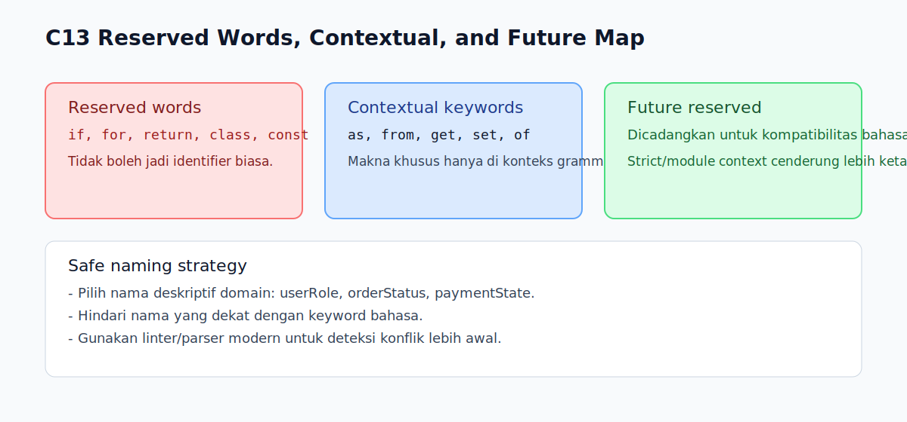

# C13 - Reserved Words Contextual dan Future

## Tujuan

Bab ini bertujuan memahami contextual keywords dan kata cadangan masa depan.

## Kenapa Bab Ini Penting

Pada tahap awal, pembaca biasanya hanya kenal reserved words umum seperti `if`, `for`, atau `return`.

Namun di JavaScript modern ada kata yang:

- selalu terlarang sebagai identifier
- hanya punya makna khusus pada konteks tertentu (contextual)
- dicadangkan untuk kompatibilitas masa depan

Memahami ini membantu menghindari bug sintaks dan konflik nama.

## Konsep Inti

### 1. Reserved Words Klasik

Kata ini tidak boleh dipakai sebagai identifier biasa.

Contoh:

- `if`
- `for`
- `return`
- `class`
- `const`

```js
// const for = 1; // SyntaxError
```

### 2. Contextual Keywords

Beberapa kata berperan sebagai keyword hanya di konteks grammar tertentu.

Contoh yang sering ditemui:

- `as` (pada import/export tertentu)
- `from` (pada import/export)
- `get` / `set` (pada object literal/class context)
- `of` (pada `for...of`)

Di luar konteks tersebut, sebagian kata bisa saja tidak bersifat terlarang mutlak.

### 3. Future Reserved Words

Ada kata yang dicadangkan untuk kebutuhan bahasa ke depan atau mode tertentu.

Implikasi praktis:

- kode lama bisa bentrok saat bahasa berkembang
- strict mode/module context biasanya lebih ketat

## Edge Cases Penting

### 1. Perbedaan Script vs Module

Beberapa aturan keyword bisa terasa lebih ketat pada module context dibanding script non-strict lama.

Karena itu, kode modern sebaiknya diuji dalam konteks yang memang dipakai proyek (umumnya ES module).

### 2. Strict Mode

Identifier tertentu yang mungkin lolos di mode longgar bisa ditolak di strict mode.

Untuk materi fondasi ini, anggap strict mode sebagai baseline aman.

### 3. Naming Legacy

Nama variabel lama yang kebetulan mirip keyword baru berisiko jadi masalah saat refactor atau update toolchain.

## Praktik yang Direkomendasikan

- hindari memakai nama yang dekat dengan keyword bahasa
- gunakan naming deskriptif domain (mis. `userRole`, `orderStatus`)
- jalankan linter/parser modern agar konflik keyword terdeteksi cepat
- tetap konsisten di strict mode/module-first workflow

## Kesalahan Umum

- mengira semua kata "mirip keyword" selalu aman dipakai sebagai identifier
- mengabaikan perbedaan konteks grammar
- mempertahankan naming legacy yang rawan bentrok saat evolusi bahasa

## Checkpoint Cepat

1. Apa beda reserved word klasik dan contextual keyword?
2. Kenapa strict mode sering terasa lebih ketat terhadap identifier tertentu?
3. Mengapa penamaan variabel perlu memikirkan kompatibilitas masa depan?
4. Apa langkah praktis untuk mencegah konflik keyword?

## Ringkasan

- Tidak semua keyword berperilaku sama; ada yang selalu terlarang, ada yang kontekstual.
- JavaScript modern cenderung lebih ketat di strict/module context.
- Pilihan nama identifier yang aman dan deskriptif adalah strategi terbaik jangka panjang.

## Visual Map



## Contoh Runnable

- Lihat contoh: `../examples/C13-reserved-words-contextual-future/example.js`
- Panduan: `../examples/C13-reserved-words-contextual-future/README.md`
