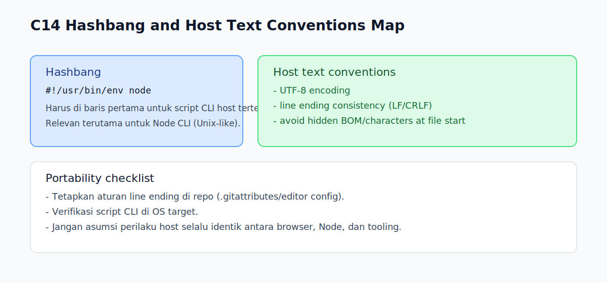

# C14 - Hashbang dan Host Text Conventions

## Tujuan

Bab ini bertujuan memahami hashbang dan konvensi source text lintas host environment.

## Kenapa Bab Ini Penting

Kode JavaScript tidak selalu berjalan di konteks yang sama.

Script CLI, browser, dan tooling build bisa punya ekspektasi berbeda terhadap source text.

Memahami hashbang dan konvensi teks membantu menghindari error yang muncul hanya di environment tertentu.

## Konsep Inti

### 1. Apa Itu Hashbang

Hashbang adalah baris awal script seperti:

```js
#!/usr/bin/env node
```

Baris ini umum dipakai untuk file JavaScript yang dieksekusi langsung sebagai CLI di sistem Unix-like.

### 2. Posisi Hashbang

Hashbang harus berada di baris pertama file agar dikenali sebagai interpreter hint oleh host tertentu.

Contoh:

```js
#!/usr/bin/env node
console.log('Hello from CLI');
```

### 3. Host Text Conventions

Selain sintaks JavaScript, ada konvensi teks lintas host yang memengaruhi eksekusi/portabilitas:

- encoding file (umumnya UTF-8)
- line ending (`LF` vs `CRLF`)
- keberadaan BOM di awal file

Konvensi ini bukan konsep logika program, tetapi berdampak pada kestabilan lintas environment.

## Edge Cases Penting

### 1. Hashbang Bukan Untuk Browser Script

Hashbang relevan untuk host yang mendukung eksekusi file script langsung (mis. Node CLI), bukan kebutuhan utama script browser.

### 2. BOM dan Baris Pertama

BOM atau karakter tak terlihat di awal file dapat mengganggu parsing/eksekusi pada tool tertentu.

Karena itu, konsistensi encoding sangat penting.

### 3. Line Ending Campur

Campuran `LF` dan `CRLF` bisa menimbulkan noise di diff, linting tidak stabil, atau perilaku tooling yang berbeda antar OS.

## Praktik yang Direkomendasikan

- untuk script CLI Node, gunakan hashbang standar `#!/usr/bin/env node`
- simpan source dengan UTF-8 konsisten
- tetapkan aturan line ending di repo (mis. via `.gitattributes`/editor config)
- hindari karakter tersembunyi di awal file

## Kesalahan Umum

- menaruh hashbang bukan di baris pertama
- mengira hashbang berpengaruh di semua host secara identik
- mengabaikan encoding/line-ending sehingga error hanya muncul di mesin tertentu

## Checkpoint Cepat

1. Kapan hashbang dibutuhkan?
2. Kenapa hashbang harus di baris pertama?
3. Apa risiko line ending campur dalam satu repository?
4. Kenapa encoding file termasuk topik penting meski bukan logika program?

## Analogi

- Intuisi Singkat: Hashbang dan host text conventions membantu kode dikenali lingkungan eksekusi.
- Analogi: Seperti label pengiriman yang memberi tahu kurir jalur pemrosesan paket.
- Batas Analogi: Perilakunya dipengaruhi host environment, tidak murni grammar bahasa saja.

## Ringkasan

- Hashbang adalah petunjuk interpreter untuk host tertentu, terutama script CLI.
- Konvensi source text (encoding, BOM, line ending) berpengaruh pada portabilitas.
- Menjaga konsistensi text conventions adalah bagian penting dari kualitas kode lintas environment.

## Visual Map



## Contoh Runnable

- Lihat contoh: `../examples/C14-hashbang-host-text-conventions/example.js`
- Panduan: `../examples/C14-hashbang-host-text-conventions/README.md`
