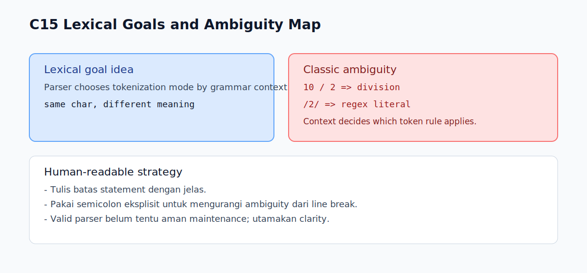

# C15 - Lexical Goals dan Ambiguity Dasar

## Tujuan

Bab ini bertujuan memahami konsep lexical goal symbols dan ambiguitas parsing dasar.

## Kenapa Bab Ini Penting

Di bab-bab sebelumnya kita sudah melihat bahwa karakter yang sama bisa bermakna berbeda tergantung konteks.

Contoh paling terkenal adalah karakter `/` yang bisa dibaca sebagai:

- operator division
- awal regex literal

Lexical goals membantu menjelaskan bagaimana parser memilih pembacaan yang benar.

## Konsep Inti

### 1. Apa Itu Lexical Goal (Intuisi Sederhana)

Lexical goal adalah "mode pembacaan token" yang dipakai parser berdasarkan konteks grammar saat ini.

Mental model sederhana:

- parser tidak membaca semua `/` dengan aturan yang sama
- parser melihat posisi sintaks saat ini
- dari posisi itu, parser menentukan apakah `/` adalah division atau regex literal

### 2. Ambiguity Bukan Bug, Tapi Bagian Desain Grammar

Ambiguitas tertentu di JavaScript memang ada di level lexical/parser.

Yang penting bagi pembaca:

- pahami pola yang ambigu
- tulis kode dengan style yang meminimalkan ambiguitas

### 3. Contoh Inti: Regex vs Division

```js
const a = 10 / 2;   // division
const re = /2/;     // regex literal
```

Karakter `/` sama, tetapi konteks parser berbeda.

## Edge Cases Penting

### 1. Setelah Expression Tertentu

Pada beberapa posisi setelah expression, parser lebih mungkin membaca `/` sebagai operator.

Pada posisi lain (mis. awal statement tertentu), parser dapat membaca `/.../` sebagai regex literal.

### 2. Interaksi Dengan ASI

Line break dan ASI bisa membuat batas statement tidak sejelas yang dibayangkan.

Akibatnya, pembacaan token di baris berikut bisa berubah dari ekspektasi awal.

### 3. Keterbacaan Kode

Kamu mungkin bisa menulis bentuk singkat yang valid, tetapi jika ambigu untuk manusia, itu tetap berisiko saat maintenance.

## Praktik yang Direkomendasikan

- utamakan kode yang jelas batas statement-nya
- gunakan semicolon eksplisit untuk mengurangi ambiguity dari line break
- hindari style "terlalu padat" yang membuat parser context sulit dibaca manusia
- jika regex kompleks, pisahkan ke variabel bernama jelas

## Kesalahan Umum

- mengira parser membaca token secara murni per-karakter tanpa konteks
- meremehkan efek line break pada pembacaan statement
- menulis kode minimalis yang valid tapi sulit dipahami tim

## Checkpoint Cepat

1. Kenapa `/` bisa berarti dua hal berbeda di JavaScript?
2. Apa hubungan lexical goal dengan konteks parser?
3. Kenapa semicolon eksplisit membantu mengurangi ambiguity?
4. Apa beda "valid secara parser" dan "aman secara maintainability"?

## Ringkasan

- Lexical goals adalah cara parser menentukan mode tokenisasi berdasarkan konteks grammar.
- Ambiguitas parsing (mis. regex vs division) adalah bagian nyata dari JavaScript.
- Strategi aman: tulis kode eksplisit, konsisten, dan mudah dibaca manusia.

## Visual Map



## Contoh Runnable

- Lihat contoh: `../examples/C15-lexical-goals-ambiguity-dasar/example.js`
- Panduan: `../examples/C15-lexical-goals-ambiguity-dasar/README.md`
