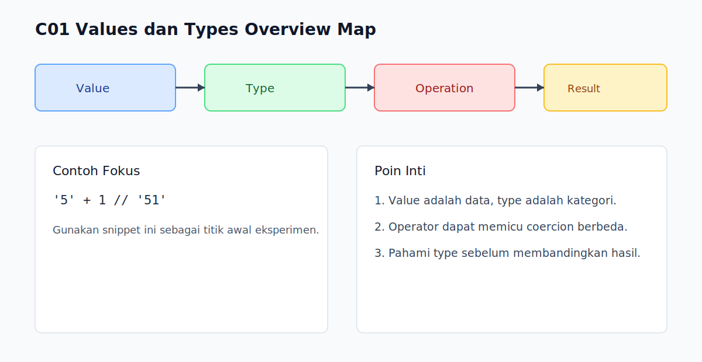

# C01 - Values dan Types Overview

## Tujuan

Bab ini bertujuan memberi peta besar bagaimana JavaScript memperlakukan value dan type sebelum masuk detail coercion.

## Kenapa Bab Ini Penting

Banyak bug dasar JavaScript berasal dari asumsi salah tentang tipe nilai.

Dengan memahami peta besar values/types sejak awal, pembaca lebih siap menghadapi equality, truthy/falsy, dan coercion di bab berikutnya.

## Konsep Inti

### 1. Value adalah Data, Type adalah Klasifikasi

Setiap nilai di JavaScript punya kategori tipe tertentu.

Contoh:

```js
const age = 21;          // number
const name = 'Arta';     // string
const active = true;     // boolean
const empty = null;      // null
const user = { id: 1 };  // object
```

### 2. Dua Kelompok Besar: Primitive vs Non-Primitive

Secara fondasi, nilai JavaScript bisa dikelompokkan menjadi:

- primitive values
- non-primitive values (object dan turunannya)

Pengelompokan ini penting untuk memahami cara nilai dibandingkan dan dipindahkan.

### 3. Type Bukan Sekadar Label, Tapi Mempengaruhi Perilaku

Type memengaruhi:

- cara operasi dijalankan
- cara konversi terjadi
- cara kondisi dievaluasi

Contoh:

```js
console.log('5' + 1); // '51'
console.log('5' - 1); // 4
```

Operator yang berbeda bisa memicu coercion yang berbeda.

## Praktik yang Direkomendasikan

- selalu cek tipe saat hasil operasi terasa aneh
- hindari asumsi implicit type conversion tanpa verifikasi
- pakai naming variabel yang mencerminkan jenis nilai

## Kesalahan Umum

- mengira semua nilai numerik dalam string setara dengan number
- menyamakan `null` dan `undefined`
- menganggap object dibandingkan berdasarkan isi secara otomatis

## Checkpoint Cepat

1. Apa beda value dan type?
2. Kenapa memahami primitive vs non-primitive penting?
3. Mengapa `'5' + 1` beda hasil dengan `'5' - 1`?

## Ringkasan

- Value adalah data yang diproses program, type adalah kategorinya.
- JavaScript punya dua kelompok besar nilai: primitive dan non-primitive.
- Type menentukan perilaku operasi dan coercion.

## Spec Coverage

Bab ini terutama selaras dengan section ECMAScript berikut:

- `6.1`
- `7.1`
- `7.2`

Referensi mapping penuh: `../docs/spec-mapping-56.md`.

## Visual Map



## Contoh Runnable

- Lihat contoh: `../examples/C01-values-types-overview/example.js`
- Panduan: `../examples/C01-values-types-overview/README.md`
