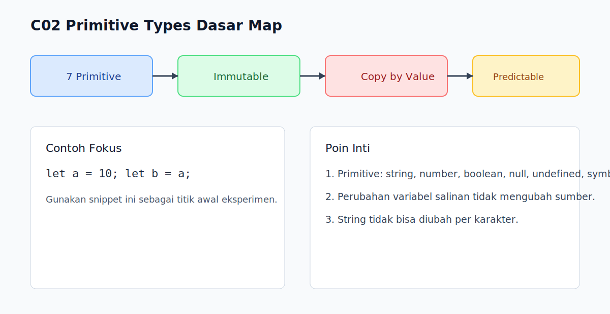

# C02 - Primitive Types Dasar

## Tujuan

Bab ini bertujuan memahami 7 primitive types JavaScript dan karakter perilaku dasarnya.

## Kenapa Bab Ini Penting

Sebagian besar operasi coercion terjadi pada primitive values.

Kalau fondasi primitive belum kuat, pembaca akan kesulitan membaca hasil `==`, `+`, kondisi `if`, dan bug terkait konversi tipe.

## Konsep Inti

### 1. JavaScript Punya 7 Primitive Types

Primitive yang perlu diingat:

- `string`
- `number`
- `boolean`
- `null`
- `undefined`
- `symbol`
- `bigint`

```js
const text = 'Halo';
const total = 42;
const isReady = true;
const emptyValue = null;
let notAssigned;
const id = Symbol('id');
const veryLarge = 9007199254740993n;
```

### 2. Primitive Bersifat Immutable

Nilai primitive tidak bisa diubah "di tempat".

```js
let name = 'Arta';
name[0] = 'B';

console.log(name); // tetap 'Arta'
```

Perubahan string di JavaScript selalu menghasilkan nilai baru, bukan memodifikasi nilai lama.

### 3. Primitive Disalin Sebagai Nilai

Saat di-assign ke variabel lain, primitive disalin berdasarkan nilai.

```js
let a = 10;
let b = a;

b = 20;
console.log(a); // 10
console.log(b); // 20
```

Perubahan di `b` tidak memengaruhi `a`.

## Praktik yang Direkomendasikan

- Kenali primitive yang jarang dipakai (`symbol`, `bigint`) agar tidak kaget saat membaca codebase besar.
- Gunakan `const` sebagai default agar perubahan nilai lebih terkontrol.
- Bedakan nilai "kosong" (`null`) dan nilai "belum diisi" (`undefined`) sejak awal desain data.

## Kesalahan Umum

- Menganggap `null` adalah object biasa.
- Mengira string dapat diubah per karakter seperti array.
- Mencampur `number` dan `bigint` tanpa konversi eksplisit.

## Checkpoint Cepat

1. Sebutkan 7 primitive types JavaScript.
2. Kenapa perubahan `b` tidak memengaruhi `a` pada assignment primitive?
3. Kenapa operasi `1n + 1` melempar error?

## Ringkasan

- JavaScript memiliki 7 primitive types.
- Primitive bersifat immutable.
- Assignment primitive menyalin nilai, bukan berbagi referensi.

## Visual Map



## Contoh Runnable

- Lihat contoh: `../examples/C02-primitive-types-dasar/example.js`
- Panduan: `../examples/C02-primitive-types-dasar/README.md`


