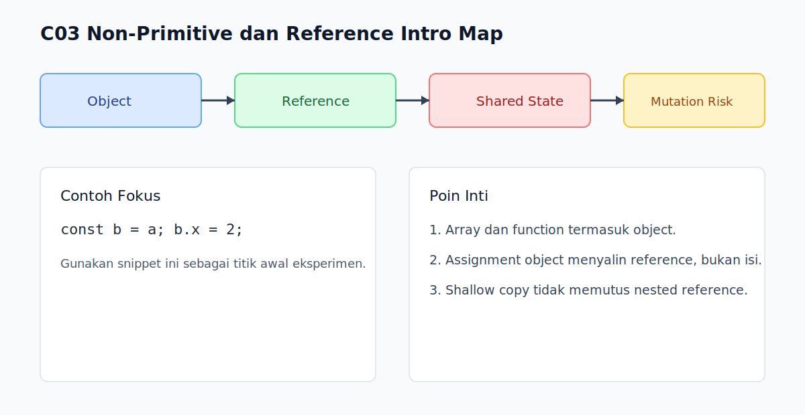

# C03 - Non-Primitive dan Reference Intro

## Tujuan

Bab ini bertujuan memahami nilai non-primitive (object) dan konsep reference dasar.

## Kenapa Bab Ini Penting

Banyak bug state terjadi karena object dibagikan sebagai referensi antar variabel atau fungsi.

Memahami perilaku reference sejak awal membantu menghindari mutasi tak sengaja.

## Konsep Inti

### 1. Non-Primitive Utama adalah Object

Di JavaScript, array, function, dan object literal berada dalam keluarga object.

```js
const user = { name: 'Arta' }; // object
const tags = ['js', 'web'];    // array (juga object)
function greet() {}            // function (juga object)
```

### 2. Assignment Object Menyalin Reference

```js
const original = { score: 10 };
const alias = original;

alias.score = 20;
console.log(original.score); // 20
```

`alias` dan `original` menunjuk object yang sama.

### 3. Perbandingan Object Menggunakan Reference

```js
const a = { id: 1 };
const b = { id: 1 };
const c = a;

console.log(a === b); // false
console.log(a === c); // true
```

Dua object dengan isi identik tetap berbeda jika referensinya berbeda.

## Praktik yang Direkomendasikan

- Lakukan copy eksplisit saat perlu isolasi data (`{ ...obj }`, `Array.from(arr)`).
- Hindari mutasi langsung pada object input fungsi kecuali memang sengaja.
- Gunakan nama variabel yang memperjelas apakah data "shared" atau "local copy".

## Kesalahan Umum

- Mengira `const` membuat isi object immutable.
- Mengira `===` pada object membandingkan struktur isi.
- Tidak sadar nested object masih berbagi referensi saat shallow copy.

## Checkpoint Cepat

1. Kenapa `const a = {}; const b = a;` membuat perubahan `b` terlihat di `a`?
2. Kenapa dua object literal dengan isi sama bisa `false` saat dibandingkan?
3. Apa beda copy referensi vs copy nilai?

## Ringkasan

- Non-primitive di JavaScript bekerja berbasis reference.
- Assignment object berbagi referensi yang sama.
- Equality object bergantung pada referensi, bukan isi.

## Visual Map



## Contoh Runnable

- Lihat contoh: `../examples/C03-non-primitive-dan-reference-intro/example.js`
- Panduan: `../examples/C03-non-primitive-dan-reference-intro/README.md`


