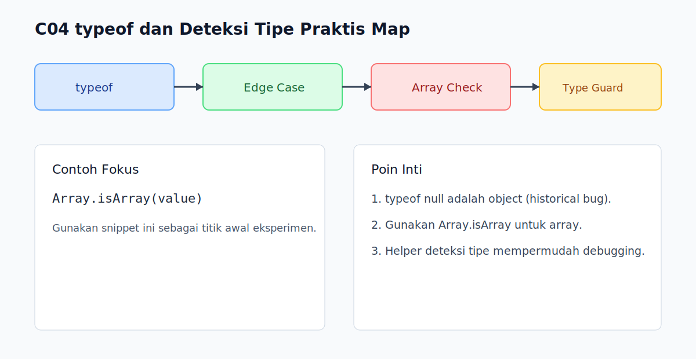

# C04 - typeof dan Deteksi Tipe Praktis

## Tujuan

Bab ini bertujuan memakai `typeof` secara tepat dan mengetahui batasannya dalam deteksi tipe.

## Kenapa Bab Ini Penting

`typeof` adalah alat deteksi tipe paling cepat dipakai saat debugging.

Namun ada edge case historis yang sering menipu, terutama pada `null` dan array.

## Konsep Inti

### 1. `typeof` Cocok untuk Primitive Dasar

```js
console.log(typeof 'hello');   // string
console.log(typeof 42);        // number
console.log(typeof true);      // boolean
console.log(typeof undefined); // undefined
console.log(typeof 1n);        // bigint
console.log(typeof Symbol());  // symbol
```

### 2. `typeof null` adalah `"object"`

```js
console.log(typeof null); // object
```

Ini bug historis di JavaScript dan perlu diingat sebagai pengecualian.

### 3. Array Butuh Deteksi Khusus

```js
const list = [1, 2, 3];

console.log(typeof list);          // object
console.log(Array.isArray(list));  // true
```

Gunakan `Array.isArray()` untuk mendeteksi array.

### 4. Deteksi Praktis Kombinasi

Pola sederhana yang aman:

```js
function detectType(value) {
  if (value === null) return 'null';
  if (Array.isArray(value)) return 'array';
  return typeof value;
}
```

## Praktik yang Direkomendasikan

- Pakai `typeof` untuk guard primitive.
- Tambahkan cabang khusus untuk `null` dan array.
- Buat helper util deteksi tipe jika dipakai berulang.

## Kesalahan Umum

- Menganggap `typeof null` menunjukkan tipe sebenarnya.
- Mendeteksi array dengan `typeof value === 'array'`.
- Memakai deteksi tipe terlalu kompleks tanpa kebutuhan nyata.

## Checkpoint Cepat

1. Kenapa `typeof null` sering jadi jebakan?
2. Cara paling tepat mendeteksi array apa?
3. Kapan cukup `typeof`, kapan perlu helper tambahan?

## Ringkasan

- `typeof` efektif untuk banyak primitive.
- `null` dan array butuh perlakuan khusus.
- Deteksi tipe praktis sebaiknya sederhana, konsisten, dan eksplisit.

## Visual Map



## Contoh Runnable

- Lihat contoh: `../examples/C04-typeof-dan-deteksi-tipe-praktis/example.js`
- Panduan: `../examples/C04-typeof-dan-deteksi-tipe-praktis/README.md`


